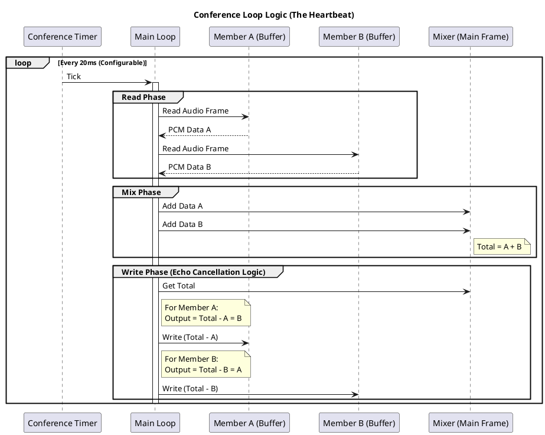

# 基于 FreeSWITCH v1.10.12 源码分析 - Conferencing：Conference Management

## 1. 开篇：多人会议的“修罗场”

你好，我是 AtomsCat。

如果说点对点通话是 VoIP 的“新手村”，那么多方会议（Conferencing）绝对是“修罗场”。

很多兄弟在做会议系统时，最开始觉得很简单：“不就是把几个人的声音混在一起发给每个人吗？” 于是兴冲冲地用 FFmpeg 或者简单的混音算法写了个 Demo，结果上线就炸了：
*   **延迟爆炸**：几个人说话，声音像是在山谷里回荡，延迟高达几秒。
*   **CPU 飙升**：才进来 10 个人，服务器 CPU 直接 100%，风扇转得像直升机。
*   **音质感人**：杂音、爆音、回声，听起来像是在用对讲机吵架。

FreeSWITCH 的 `mod_conference` 模块，是业界公认的 MCU（Multipoint Control Unit）标杆实现。它不仅是一个简单的混音器，更是一个功能完备的**会议操作系统**。它处理了时钟同步、回声消除（逻辑层）、视频画面合成（Layout）、成员权限管理等无数个坑。

今天，我们就扒开 `mod_conference` 的源码，看看这个庞然大物是如何在毫秒级的时间内，指挥千军万马的音频流，让它们井井有条的。

---

## 2. 正文解析：会议的“心脏”与“大脑”

### 2.1 核心原理：同步与混音

`mod_conference` 的核心并不是简单的“加法”，而是**时钟同步（Clock Synchronization）**。

在 `src/mod/applications/mod_conference/mod_conference.c` 中，`conference_thread_run` 函数是整个会议的“心脏”。它不仅仅是一个死循环，它是一个由**定时器驱动**的精密仪器。

#### 核心逻辑拆解：

1.  **全局时钟**：会议室有一个全局的 Timer（定时器）。所有成员的音频处理，都必须在这个 Timer 的节拍下进行。
2.  **收集（Read）**：在每个 Tick（通常是 20ms），遍历所有成员，从他们的 Buffer 中读取一帧音频。
3.  **混音（Mix）**：将所有“正在说话”成员的音频数据（PCM）进行线性叠加（Summation）。
4.  **分发（Write）**：对于每一个成员，计算 `Final_Audio = Total_Mixed_Audio - My_Audio`。为什么要减去自己？因为你不希望在电话里听到自己的回声（虽然物理回声消除是端点的事，但逻辑上必须剔除）。
5.  **视频处理**：如果是视频会议，还需要处理 Video Layout，将多个画面拼凑成一个大画面（Canvas）。

### 2.2 源码实战分析

我们来看 `mod_conference.c` 中的关键代码片段（为了易读性，我做了精简）：

```c
/* src/mod/applications/mod_conference/mod_conference.c */

/* 会议主线程 */
void *SWITCH_THREAD_FUNC conference_thread_run(switch_thread_t *thread, void *obj)
{
    // ... 初始化定时器 ...
    if (switch_core_timer_init(&timer, conference->timer_name, conference->interval, samples, conference->pool) == SWITCH_STATUS_SUCCESS) {
        // ...
    }

    while (conference_globals.running && !conference_utils_test_flag(conference, CFLAG_DESTRUCT)) {
        // 1. 等待定时器 Tick (这是心脏跳动的关键！)
        if (switch_core_timer_next(&timer) != SWITCH_STATUS_SUCCESS) {
            break;
        }

        // 2. 读取所有成员的音频
        for (imember = conference->members; imember; imember = imember->next) {
            // 从成员的 audio_buffer 读取数据
            // ...
        }

        // 3. 混音逻辑：将所有人的声音加到 main_frame
        for (omember = conference->members; omember; omember = omember->next) {
            if (conference_utils_member_test_flag(omember, MFLAG_HAS_AUDIO)) {
                // 简单的线性叠加
                for (x = 0; x < omember->read / 2; x++) {
                    main_frame[x] += (int32_t) bptr[x];
                }
            }
        }

        // 4. 分发逻辑：每个人听到的 = 总声音 - 自己的声音
        for (omember = conference->members; omember; omember = omember->next) {
            // ...
            for (x = 0; x < bytes / 2 ; x++) {
                z = main_frame[x];
                // 减去自己
                if (conference_utils_member_test_flag(omember, MFLAG_HAS_AUDIO)) {
                    z -= (int32_t) bptr[x];
                }
                // 写入成员的输出 Buffer
                write_frame[x] = (int16_t) z;
            }
            // ...
        }
    }
    // ...
}
```

### 2.3 逻辑可视化

为了让你更直观地理解这个过程，我画了一个 PlantUML 图：



### 2.4 生产环境实战：Python 控制会议

在生产环境中，我们通常不会手动去敲命令，而是通过 ESL (Event Socket Library) 来动态控制会议。

以下是 6 个 Python 3 的实战例子，展示了如何通过 ESL 操控 `mod_conference`。

**前置准备**：你需要安装 `greenswitch` 或直接使用 `socket` 连接 ESL。这里为了通用性，演示基于 `ESL` 库（你需要 `pip install eventsocket` 或类似库，或者直接用 socket 封装）。为了代码简洁，我假设你已经有一个 `send_command` 函数。

#### 示例 1：列出会议成员 (List)
这是最基础的操作，用于监控会议状态。

```python
import ESL

def list_conference_members(esl_conn, conf_name):
    """
    列出指定会议室的所有成员
    """
    # 发送 API 命令: conference <name> list
    cmd = f"api conference {conf_name} list"
    e = esl_conn.api(cmd)
    
    if e:
        print(e.getBody())
    else:
        print("Failed to get member list")

# 运行结果说明：
# 输出将包含成员 ID、UUID、Caller-ID、Flags (hear/speak/video) 等信息。
# 例如: 1;User A;uuid-1;User A;1000;hear|speak|video
```

#### 示例 2：全员静音 (Mute All)
领导要讲话了，或者有人在大声吃薯片，你需要一键静音。

```python
def mute_all_members(esl_conn, conf_name):
    """
    静音会议室所有人（通常主持人除外，需要额外逻辑判断）
    """
    # 发送 API 命令: conference <name> mute all
    cmd = f"api conference {conf_name} mute all"
    e = esl_conn.api(cmd)
    
    print(f"Mute result: {e.getBody()}")

# 运行结果说明：
# FreeSWITCH 会返回 "OK Muted 5 members" 之类的消息。
# 此时所有成员的 Flags 中 'speak' 标记会被移除。
```

#### 示例 3：踢人 (Kick)
遇到捣乱的，或者会议结束需要清场。

```python
def kick_member(esl_conn, conf_name, member_id):
    """
    将指定 ID 的成员踢出会议
    """
    # 发送 API 命令: conference <name> kick <member_id>
    cmd = f"api conference {conf_name} kick {member_id}"
    e = esl_conn.api(cmd)
    
    print(f"Kick result: {e.getBody()}")

# 运行结果说明：
# 目标成员的通话会被挂断，会议室人数 -1。
# 返回 "OK Kicked 1 member"。
```

#### 示例 4：会议录音 (Record)
合规性要求或会议纪要需求。

```python
def start_conference_recording(esl_conn, conf_name, file_path):
    """
    开始录制会议
    """
    # 发送 API 命令: conference <name> record <path>
    cmd = f"api conference {conf_name} record {file_path}"
    e = esl_conn.api(cmd)
    
    print(f"Recording started: {e.getBody()}")

# 运行结果说明：
# FreeSWITCH 会启动一个录音线程，将混音后的音频写入文件。
# 返回 "OK Recording /tmp/conf_recording.wav"。
```

#### 示例 5：播放公告文件 (Play)
比如“会议将在 5 分钟后结束”。

```python
def play_announcement(esl_conn, conf_name, sound_file):
    """
    向会议室播放音频文件（所有人都能听到）
    """
    # 发送 API 命令: conference <name> play <file>
    cmd = f"api conference {conf_name} play {sound_file}"
    e = esl_conn.api(cmd)
    
    print(f"Playback status: {e.getBody()}")

# 运行结果说明：
# 音频文件会被混入会议流中。
# 返回 "OK Playing file"。
```

#### 示例 6：设置视频布局 (Video Layout)
这是 MCU 模式下的高级玩法，改变视频画面的排列方式。

```python
def set_video_layout(esl_conn, conf_name, layout_name):
    """
    更改视频会议布局，例如 '3x3', '1up_top_left'
    """
    # 发送 API 命令: conference <name> vid-layout <layout_name>
    cmd = f"api conference {conf_name} vid-layout {layout_name}"
    e = esl_conn.api(cmd)
    
    print(f"Layout change: {e.getBody()}")

# 运行结果说明：
# 视频画面会立即重组。
# 返回 "OK Change layout to 3x3"。
```

---

## 3. 思维拓展：架构师的“邪修”之道

### 3.1 性能瓶颈与“坑”
很多新手会问：“FreeSWITCH 单机能跑多少方会议？”
这是一个典型的**错误问题**。

*   **音频会议**：瓶颈在于 CPU 的混音计算。通常单机几百方没问题，但如果开启了高采样率（48kHz）或者复杂的编解码转码（Transcoding），性能会直线下降。
*   **视频会议（MCU 模式）**：这是真正的**性能黑洞**。`mod_conference` 在 MCU 模式下，需要解码每一路视频 -> 缩放/裁剪 -> 拼接到 Canvas -> 编码成新视频流。这个过程极其消耗 CPU 和 GPU。
    *   **踩坑记录**：不要试图在没有 GPU 加速的普通服务器上跑几十路 1080p 的 MCU 会议，你会死得很惨。
    *   **最佳实践**：对于视频，尽量使用 **SFU (Selective Forwarding Unit)** 模式（FreeSWITCH 也可以通过 `mod_sofia` 的 bypass media 或 `mod_conference` 的 video-mode=passthrough 来模拟部分 SFU 行为，但更推荐专业的 SFU 如 Janus 或 Mediasoup 配合使用）。

### 3.2 架构层面的考虑
如果你要设计一个支持万人的会议系统，单机 FreeSWITCH 肯定是不够的。

*   **级联（Cascading）**：这是传统电信会议的经典架构。将多个 FreeSWITCH 实例通过 SIP Trunk 连接起来。
    *   Server A (主会场) <--> Server B (分会场)
    *   Server A 只需要处理 Server B 发来的一路“混音后的音频”，大大减轻了压力。
*   **业务分离**：将信令控制（ESL）与媒体处理分离。不要让业务逻辑阻塞了 FreeSWITCH 的事件队列。

### 3.3 邪修思维：Ghost Member
在 `mod_conference` 中，有一个有趣的 Flag 叫 `MFLAG_GHOST`。
Ghost Member 是一个“幽灵成员”，它不占用音频通道，不说话也不听，但它在成员列表里。
**用途**：
*   **监控**：你可以创建一个 Ghost Member 来监听会议状态，而不干扰会议。
*   **占位**：有些会议需要“至少 3 人才开始录音”，你可以扔几个 Ghost 进去凑数。

---

## 4. 总结

`mod_conference` 是 FreeSWITCH 中最复杂但也最强大的模块之一。

**Takeaway (关键结论)**：
1.  **时钟是核心**：理解了 Timer 驱动的 Loop，就理解了会议的本质。
2.  **减法混音**：每个人听到的声音 = 总声音 - 自己的声音。
3.  **视频慎用 MCU**：除非你有强大的硬件转码能力，否则优先考虑 SFU 架构或降低分辨率。
4.  **ESL 是遥控器**：不要依赖静态 XML 配置，用 ESL 动态控制才是王道。

希望这篇文章能让你对 FreeSWITCH 的会议底层有更“透视”的理解。下次遇到会议延迟或杂音，别再盲目重启了，去看看 Timer 和 CPU 吧！

我是 AtomsCat，我们下期见。🐱

---
*注：本文基于 FreeSWITCH v1.10.12 源码分析，不同版本细节可能略有差异。*