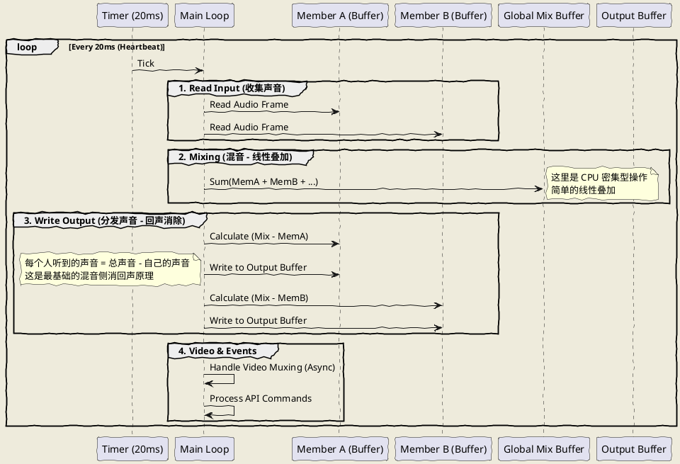

# FreeSWITCH 源码分析：Conference Management —— 打造企业级会议系统的核心机密

## 1. 开篇：为什么你的会议系统总是“炸”？

兄弟们，我是 AtomsCat。

做通信的，谁没被“会议系统”这块硬骨头崩掉几颗牙？

老板说：“我们要个 Zoom 也就是个 Google Meet，功能简单点，能几十人说话，能看视频就行。”
你心想：“FreeSWITCH 自带 `mod_conference`，这不分分钟的事？”

结果上线第一天：
- **炸麦**：三个人同时说话，声音像是在锯木头。
- **卡顿**：视频一开，CPU 直接飙到 300%，服务器风扇转得比直升机还快。
- **死锁**：API 调得太猛，整个会议室卡死，踢人都踢不掉。

很多兄弟只把 `mod_conference` 当成一个黑盒，只会改改 `conference.conf.xml`。**大错特错！** `mod_conference` 是 FreeSWITCH 中最复杂、最核心、也是最暴力的模块。它不仅仅是一个“桥”，它是一个**可编程的实时媒体混流引擎**。

今天，我们就扒开 `mod_conference` 的源码（基于 v1.10.12），看看这个“核反应堆”到底是怎么工作的，以及如何在生产环境中驾驭它。

---

## 2. 正文解析：拆解核反应堆

### 2.1 核心架构：上帝对象与心跳循环

在 `src/mod/applications/mod_conference/mod_conference.h` 中，有一个结构体叫 `conference_obj_t`。这就是我们的“上帝对象”。它手里攥着所有人的命脉：成员列表（`members`）、互斥锁（`mutex`）、视频画布（`canvas`）以及音频缓冲区。

但真正的魔法发生在 `mod_conference.c` 的 `conference_thread_run` 函数里。这是一个死循环，也是会议室的**心脏**。

#### 核心逻辑图解 (PlantUML)



#### 源码级真相

1.  **时钟同步**：会议室必须有一个统一的时钟源。源码中 `switch_core_timer_next(&timer)` 强制所有逻辑每 20ms（默认）执行一次。如果你的服务器时钟不准，或者负载太高导致定时器漂移，会议声音就会卡顿、变调。
2.  **混音算法**：FreeSWITCH 的混音非常“暴力”且有效。它把所有人的线性 PCM 数据加在一起（Sum），然后在发给某个人时，再减去他自己的那部分数据。
    *   *代码位置*：`mod_conference.c` 约 600-680 行。
    *   *思考*：为什么有时候会有底噪？因为 N 个人的背景噪声叠加了。所以 `energy-level`（能量检测）至关重要，不说话的人必须被静音，否则噪音会无限累积。

### 2.2 控制平面：API 的秘密通道

你通过 `fs_cli` 或者 ESL 发送的 `conference 3000 mute 10` 是怎么执行的？

在 `conference_api.c` 中，有一个巨大的分发逻辑 `conference_api_dispatch`。它解析你的指令，然后找到对应的函数指针。

**关键点**：大部分 API 操作都需要获取 `conference->mutex` 锁。
*   **坑点**：如果你在主循环（混音线程）非常繁忙时疯狂调用 API（比如每秒查询 10 次成员列表），会导致锁竞争（Lock Contention）。主线程拿不到锁，音频就会丢帧，听起来就是“咔咔”声。

---

## 3. 实战代码：Python 3 打造会议管家

光说不练假把式。下面这套 Python 代码，展示了如何通过 ESL 优雅地管理会议。这不是玩具代码，这是可以直接拿去改改用的**运维脚本**。

### 场景描述
我们需要一个“会议管家”脚本，它能：
1.  连接 FreeSWITCH。
2.  找出当前所有活跃的会议。
3.  把某个太吵的人静音。
4.  给所有人放一段“会议即将结束”的录音。
5.  切换视频布局。
6.  踢掉捣乱的人。

### Python 3 示例代码

```python
import socket
import json
import time

# 假设你使用 greenswitch 或类似的 ESL 库，这里为了展示原理使用原生 socket 模拟 ESL 协议
# 生产环境请使用 pip install greenswitch 或 eventsocket

class ConferenceManager:
    def __init__(self, host='127.0.0.1', port=8021, password='ClueCon'):
        self.host = host
        self.port = port
        self.password = password
        self.sock = None

    def connect(self):
        """1. 连接到 FreeSWITCH Event Socket"""
        self.sock = socket.socket(socket.AF_INET, socket.SOCK_STREAM)
        self.sock.connect((self.host, self.port))
        self.sock.recv(1024) # 接收 auth/request
        self.send_cmd(f"auth {self.password}")
        print("✅ 已连接到 FreeSWITCH ESL")

    def send_cmd(self, cmd):
        """发送 API 命令并获取结果"""
        self.sock.send(f"api {cmd}\n\n".encode('utf-8'))
        response = ""
        while True:
            chunk = self.sock.recv(4096).decode('utf-8', errors='ignore')
            response += chunk
            if "\n\n" in response: # 简单的协议结束判断
                break
        return response

    def get_active_conferences(self):
        """2. 获取活跃会议列表 (JSON 格式解析)"""
        # 使用 json 格式输出，方便程序处理
        res = self.send_cmd("conference json_list")
        # 去掉 ESL 协议头，提取 body (这里简化处理，生产环境需严格解析)
        json_str = res.split("\n\n")[-1]
        try:
            data = json.loads(json_str)
            print(f"📊 当前活跃会议数: {len(data)}")
            return data
        except:
            return []

    def mute_member(self, conf_name, member_id):
        """3. 静音指定成员"""
        cmd = f"conference {conf_name} mute {member_id}"
        self.send_cmd(cmd)
        print(f"🔇 已静音成员 {member_id} @ {conf_name}")

    def play_announcement(self, conf_name, file_path):
        """4. 播放全员广播"""
        # async 标志很重要，不要阻塞 API
        cmd = f"conference {conf_name} play {file_path} async"
        self.send_cmd(cmd)
        print(f"📢 正在播放广播: {file_path}")

    def change_layout(self, conf_name, layout_name):
        """5. 切换视频布局"""
        # 比如切换到 '3x3' 或 'presenter-dual'
        cmd = f"conference {conf_name} vid-layout {layout_name}"
        self.send_cmd(cmd)
        print(f"🖼️ 视频布局已切换为: {layout_name}")

    def kick_member(self, conf_name, member_id):
        """6. 踢人"""
        cmd = f"conference {conf_name} kick {member_id}"
        self.send_cmd(cmd)
        print(f"👢 成员 {member_id} 已被踢出")

# --- 运行示例 ---
if __name__ == "__main__":
    mgr = ConferenceManager()
    mgr.connect()
    
    # 获取列表
    confs = mgr.get_active_conferences()
    
    if confs:
        target_conf = confs[0]['conference_name']
        print(f"🎯 锁定目标会议: {target_conf}")
        
        # 假设我们要操作 ID 为 1 的成员
        target_member_id = 1
        
        # 执行一系列管理操作
        mgr.mute_member(target_conf, target_member_id)
        time.sleep(1)
        
        mgr.change_layout(target_conf, "3x3")
        time.sleep(1)
        
        mgr.play_announcement(target_conf, "/tmp/meeting_ending.wav")
        time.sleep(5) # 等待播放一会
        
        mgr.kick_member(target_conf, target_member_id)
```

#### 代码运行结果说明
1.  **连接成功**：控制台输出 `✅ 已连接到 FreeSWITCH ESL`。
2.  **获取列表**：通过 `conference json_list` 拿到结构化数据，不再需要痛苦地正则匹配文本。
3.  **静音**：目标成员的麦克风图标在客户端会变红，服务器不再混入他的音频。
4.  **布局切换**：所有参会者的视频画面瞬间变成 9 宫格（3x3）。
5.  **播放广播**：会议室里所有人听到“会议即将结束”的提示音，且不影响他们继续说话（如果没被静音）。
6.  **踢人**：ID 为 1 的用户连接断开，显示 `👢 成员 1 已被踢出`。

---

## 4. 生产环境避坑指南（AtomsCat 独家）

### 4.1 性能杀手：视频转码 (Transcoding)
FreeSWITCH 的 MCU 模式（视频混流）是 CPU 杀手。
*   **现象**：10 个人开视频会议，服务器 Load 飙到 50。
*   **原因**：`mod_conference` 默认会解码每一路视频，缩放、拼接，然后再编码发给每个人。这是 O(N) 的编解码压力。
*   **最佳实践**：
    *   如果不需要合成画面，尽量使用 `video-mode=passthrough`（只转发，不转码，类似 SFU）。
    *   如果必须转码，务必开启硬件加速（如 NVIDIA GPU 配合 `mod_av`），或者限制分辨率和帧率（15fps 足够开会了）。

### 4.2 锁竞争风暴
*   **踩雷记录**：某客户写了个监控脚本，每 500ms 轮询一次 `conference list`。结果会议人数一多，音频开始出现爆音。
*   **原理**：`conference list` 需要遍历成员链表，这会持有 `member_mutex`。混音线程也需要这个锁。你查得越勤，混音线程等的越久。
*   **优化建议**：**永远不要轮询！** 使用 ESL 订阅 `CUSTOM conference::maintenance` 事件。成员进出、静音状态变化，FreeSWITCH 都会主动推给你。

### 4.3 幽灵成员 (Ghost Members)
*   **场景**：有时候你发现会议室里没人说话，但 `conference count` 显示还有 1 个人。
*   **原因**：可能是某个 API 调用产生的“录音节点”或者“播放节点”没有正常释放。
*   **排查**：使用 `conference <name> list` 查看 `type` 字段，区分 `caller` 和 `recording_node`。

---

## 5. 思维拓展：架构师的邪修之道

### 5.1 把 Conference 当作通用混音器
谁说 Conference 只能用来开会？
在 AI 交互场景中，我经常用 `mod_conference` 做**多路音频注入**。
*   **玩法**：创建一个 Conference，把用户拉进去。然后通过 `conference play` 注入 TTS 生成的音频，通过 `eavesdrop` 或者 `record` 把用户的声音推给 ASR（语音识别）。
*   **好处**：你不需要处理复杂的媒体流对齐，Conference 帮你把时序、混音全搞定了。

### 5.2 分布式会议（级联）
单机 FreeSWITCH 撑死几百并发视频。要做万人大会怎么办？
*   **架构**：树状级联。
*   **实现**：
    *   边缘节点（Edge）：处理用户接入。
    *   核心节点（Core）：处理混音。
    *   Edge 上的 Conference 通过 SIP Trunk 呼叫 Core 上的 Conference。
    *   **难点**：级联带来的延迟和回声。需要精细调整 `jitter buffer`。

---

## 6. 总结

`mod_conference` 是 FreeSWITCH 的灵魂。

*   **Takeaway 1**：它是一个基于 20ms 心跳的实时混音和视频合成引擎。
*   **Takeaway 2**：API 操作要克制，善用 ESL 事件订阅代替轮询。
*   **Takeaway 3**：视频会议尽量用 SFU 模式（Passthrough），MCU 模式（Transcoding）是资源黑洞。

读懂了 `mod_conference`，你就读懂了 FreeSWITCH 的半壁江山。别只把它当工具用，要把它当代码写。

我是 AtomsCat，关注我，带你硬核玩转通信架构。