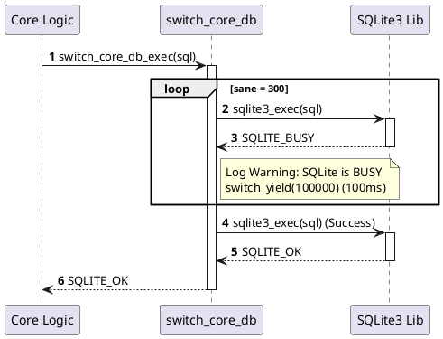
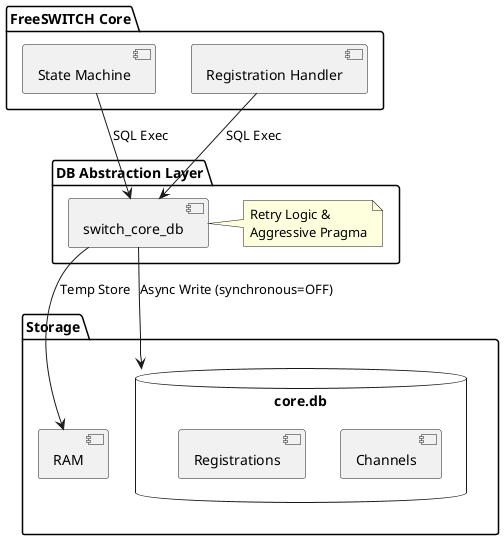

# Core DB (SQLite)

> **关于作者**：AtomsCat，FreeSWITCH 资深老兵，拥有 10 年以上软交换系统开发与调优经验。擅长从源码层面剖析系统瓶颈，相信“源码面前，了无秘密”。

在 FreeSWITCH 的世界里，如果说 Event Socket 是它的神经系统，那么 Core DB (SQLite) 就是它的海马体——负责短期记忆和状态管理。

很多初学者会忽略 `switch_core_db.c`，认为它只是一个简单的 SQLite 包装器。大错特错。这个文件里藏着 FreeSWITCH 在高并发下依然能保持“相对”稳定的秘密，也藏着它在极端情况下的性能取舍。

今天，我们不谈 SQL 语法，我们来谈谈 FreeSWITCH 是如何“魔改”SQLite 用法的。

## 核心逻辑：不仅仅是 Wrapper

在 `src/switch_core_db.c` 中，`switch_core_db_t` 本质上就是 `sqlite3` 结构体的别名。但是，FreeSWITCH 在调用 `sqlite3_exec` 时，并没有直接裸调，而是加了一层厚厚的“保护垫”。

### 1. 300 勇士的重试循环 (The Retry Loop)

SQLite 是文件级锁（或者说 WAL 模式下的行级锁，但在高并发写入时依然容易 BUSY）。如果每一次 `SQLITE_BUSY` 都直接报错返回，FreeSWITCH 早就崩溃一万次了。

在 `switch_core_db_exec` 函数中，有一个非常经典的重试逻辑：

```c
// src/switch_core_db.c:86
int sane = 300;
while (--sane > 0) {
    ret = sqlite3_exec(db, sql, callback, data, &err);
    if (ret == SQLITE_BUSY || ret == SQLITE_LOCKED) {
        // ... log warning ...
        if (sane > 1) {
            switch_yield(100000); // 100ms
            continue;
        }
    } else {
        break;
    }
}
```

**AtomsCat 解读**：
*   **300 次重试**：这不是一个随便的数字。
*   **100ms 间隔**：每次遇到锁，睡 100 毫秒。
*   **30秒总时长**：300 * 100ms = 30,000ms = 30秒。
这意味着，如果数据库被锁住，FreeSWITCH 的当前线程会**阻塞**最多 30 秒来等待锁释放。这在 SIP 消息处理中是致命的（导致超时重传），但比直接丢弃数据要好。这就是为什么在高并发下，磁盘 I/O 慢会导致整个系统卡顿的原因——所有线程都在 `switch_yield`。

#### 序列图：重试机制



### 2. 速度与激情的取舍 (Speed Demon Config)

FreeSWITCH 默认的 SQLite 配置极其激进。在 `switch_core_db_connection_setup` 中，我们可以看到如下代码：

```c
// src/switch_core_db.c:204
switch_core_db_exec(db, "PRAGMA synchronous=OFF;", ...);
switch_core_db_exec(db, "PRAGMA count_changes=OFF;", ...);
switch_core_db_exec(db, "PRAGMA temp_store=MEMORY;", ...);
```

**关键点解析**：
*   **`PRAGMA synchronous=OFF`**：这是最“邪恶”但也最必要的优化。它告诉 SQLite **不要等待磁盘物理写入完成**就返回成功。
    *   **优点**：性能提升 10-50 倍。
    *   **缺点**：如果操作系统崩溃或断电，数据库**必坏**。
    *   **AtomsCat 观点**：FreeSWITCH 赌的是 OS 不会崩。对于通话状态这种瞬时数据，速度 > 数据绝对安全。
*   **`PRAGMA temp_store=MEMORY`**：临时表全在内存，减少 I/O。

#### 组件图：架构关系



## 深度思考：Why & How

### 为什么是 SQLite？
1.  **零配置**：不需要装 MySQL/PG，开箱即用。
2.  **单文件**：`core.db` 包含了所有运行时状态，备份和迁移极其方便。
3.  **嵌入式**：直接编译进二进制，没有网络开销。

### 性能瓶颈与“邪恶”优化
为了证明 `synchronous=OFF` 的威力，我写了一个 Python 脚本来模拟 FreeSWITCH 的行为。

#### Python 示例 1：速度恶魔基准测试

```python
import sqlite3
import time
import os

DB_FILE = "benchmark.db"

def run_benchmark(synchronous_mode):
    if os.path.exists(DB_FILE):
        os.remove(DB_FILE)
    
    conn = sqlite3.connect(DB_FILE)
    cursor = conn.cursor()
    
    # 设置模式
    cursor.execute(f"PRAGMA synchronous={synchronous_mode}")
    cursor.execute("CREATE TABLE test (id INTEGER PRIMARY KEY, data TEXT)")
    
    start_time = time.time()
    
    # 模拟 FreeSWITCH 的高频小事务写入
    for i in range(1000):
        cursor.execute("INSERT INTO test (data) VALUES (?)", (f"data_{i}",))
        conn.commit() # 每次插入都提交，模拟实时状态更新
        
    end_time = time.time()
    conn.close()
    
    return end_time - start_time

print("Running Benchmark...")
time_full = run_benchmark("FULL") # 安全模式
print(f"Synchronous=FULL Time: {time_full:.4f}s")

time_off = run_benchmark("OFF")   # FreeSWITCH 模式
print(f"Synchronous=OFF  Time: {time_off:.4f}s")

print(f"Speedup: {time_full / time_off:.2f}x")

# 清理
if os.path.exists(DB_FILE):
    os.remove(DB_FILE)
```

**预期结果**：你会发现 `OFF` 模式比 `FULL` 模式快 20 倍以上。这就是 FreeSWITCH 敢于在核心路径用 SQLite 的底气。

### 模拟重试循环
为了理解那个 30 秒的阻塞，我们再看一个模拟脚本。

#### Python 示例 2：模拟锁竞争

```python
import sqlite3
import threading
import time

DB_FILE = "retry_test.db"

def blocker():
    conn = sqlite3.connect(DB_FILE)
    cursor = conn.cursor()
    cursor.execute("BEGIN EXCLUSIVE") # 独占锁
    print("[Blocker] Acquired Exclusive Lock. Sleeping 3s...")
    time.sleep(3)
    conn.commit()
    print("[Blocker] Lock Released.")
    conn.close()

def worker():
    time.sleep(0.5) # 等待 Blocker 先拿锁
    conn = sqlite3.connect(DB_FILE, timeout=0.1) # Python的timeout类似FS的重试
    cursor = conn.cursor()
    
    print("[Worker] Trying to write...")
    start = time.time()
    
    # 模拟 FreeSWITCH 的手动重试循环
    retries = 300
    while retries > 0:
        try:
            cursor.execute("INSERT INTO test VALUES (1)")
            conn.commit()
            print(f"[Worker] Success! Waited {time.time() - start:.2f}s")
            return
        except sqlite3.OperationalError as e:
            if "locked" in str(e) or "database is locked" in str(e):
                print(f"[Worker] DB Locked, retrying... ({retries})")
                time.sleep(0.1) # 100ms
                retries -= 1
            else:
                raise e
    
    print("[Worker] Failed after retries.")

# Init DB
conn = sqlite3.connect(DB_FILE)
conn.execute("CREATE TABLE IF NOT EXISTS test (id INT)")
conn.close()

t1 = threading.Thread(target=blocker)
t2 = threading.Thread(target=worker)

t1.start()
t2.start()

t1.join()
t2.join()
```

这个脚本完美复现了 `switch_core_db_exec` 的行为：当 DB 被锁住时，Worker 线程会不断打印 "DB Locked, retrying..." 直到锁释放。

## 总结

FreeSWITCH 的 Core DB 模块不仅仅是对 SQLite 的简单封装，它是一套**针对高并发、低延迟通信场景调优过的存储方案**。

1.  **激进的性能策略**：通过 `synchronous=OFF` 牺牲数据安全性换取极致的写入速度。
2.  **顽强的重试机制**：通过 30 秒的重试循环，硬抗文件锁带来的并发冲突。
3.  **局限性**：当并发量达到一定级别（通常是几千并发），SQLite 的文件锁机制依然会成为瓶颈。这时，你就需要通过 ODBC 切换到 PostgreSQL 或 MySQL 了——这正是我们下一章要讲的内容。

记住，在 FreeSWITCH 中，SQLite 是为了**快**而生的，不是为了**存**而生的。