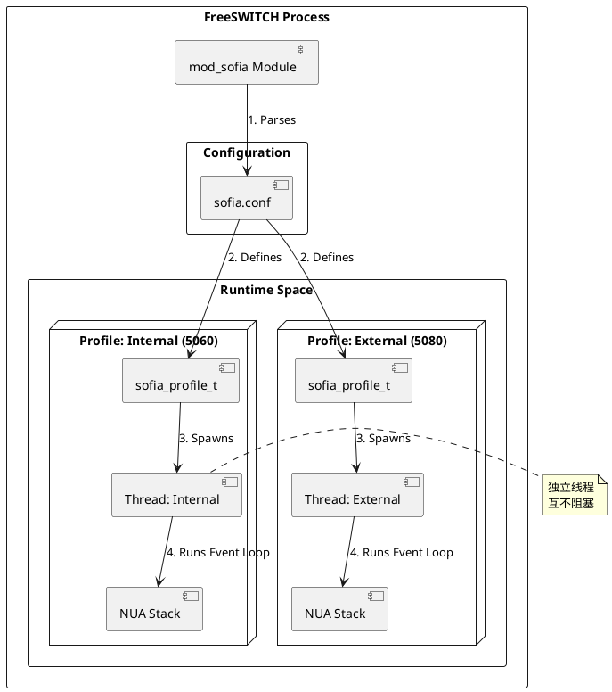

# Endpoint Initialization

> **AtomsCat 导读**：如果说 FreeSWITCH 是通信世界的瑞士军刀，那么 `mod_sofia` 就是那把最锋利、最复杂的主刀。SIP 协议本身的复杂性（RFC 3261 及其无数衍生标准）决定了 SIP 模块注定是庞大而精密的。今天，我们不谈枯燥的协议细节，而是深入 `mod_sofia` 的源码腹地，看看它是如何从零开始，一步步构建起处理成千上万并发通话的“血肉之躯”。

## 为什么是 mod_sofia？

在 FreeSWITCH 中，Endpoint 模块负责处理具体的信令协议。虽然有 `mod_skinny` (SCCP), `mod_verto` (WebRTC) 等兄弟，但 `mod_sofia` 凭借对 Sofia-SIP 库的完美封装，成为了 SIP 协议的事实标准。

它不仅仅是一个模块，更像是一个运行在 FreeSWITCH 内部的独立引擎。理解它的初始化过程，就是理解 FreeSWITCH 如何与外部世界建立连接的第一步。

## 核心逻辑：从配置到线程

`mod_sofia` 的初始化流程是一个典型的“配置驱动”模型。它的核心设计哲学是 **"One Profile, One Thread"（一个 Profile 一个线程）**。这意味着 `internal`（内网）和 `external`（外网）两个 Profile 是完全隔离的，互不干扰。

让我们跟踪代码的执行流：

### 1. 模块加载 (`mod_sofia_load`)
一切始于 `mod_sofia.c` 中的 `mod_sofia_load` 函数。这是 FreeSWITCH 加载模块的标准入口。
*   **初始化全局变量**：`mod_sofia_globals`，包括互斥锁、Hash 表（用于存储 Profile 和 Gateway）。
*   **注册接口**：向 Core 注册 API、Application 和 Chat 接口。
*   **加载配置**：调用 `config_sofia(SOFIA_CONFIG_LOAD, NULL)`，进入配置解析阶段。

### 2. 解析配置 (`config_sofia`)
`sofia.c` 中的 `config_sofia` 函数负责解析 `sofia.conf` XML 文件。
*   它遍历 `<profiles>` 标签下的每一个 `<profile>`。
*   对于每个 Profile，它分配 `sofia_profile_t` 结构体内存。
*   **参数映射**：将 XML 中的 `<param name="user-agent" value="..."/>` 等配置项，逐一映射到 C 结构体的字段中。这里有大量的 `if (!strcasecmp(var, "sip-ip"))` 判断逻辑。

### 3. 启动线程 (`launch_sofia_profile_thread`)
这是最关键的一步。当一个 Profile 配置解析完成且无误后，`config_sofia` 会调用 `launch_sofia_profile_thread`。
*   **线程属性**：设置线程栈大小 (`SWITCH_THREAD_STACKSIZE`) 和优先级。值得注意的是，它尝试将优先级设置为 `SWITCH_PRI_REALTIME`，以确保 SIP 信令处理的低延迟。
*   **创建线程**：调用 `switch_thread_create`，入口函数为 `sofia_profile_thread_run`。

### 4. 事件循环 (`sofia_profile_thread_run`)
进入新线程后，Profile 开始了它独立的生命周期：
*   **NUA 初始化**：调用 `nua_create` 创建 Sofia-SIP 的用户代理（User Agent）栈。
*   **主循环**：进入 `while` 循环，核心是调用 `su_root_step(profile->s_root, 1000)`。这是一个事件驱动的循环，负责处理网络 I/O、定时器和 SIP 状态机事件。

## Python 模拟实现

为了让大家对这个过程有“手感”，我写了一个 Python 脚本来模拟 `mod_sofia` 的初始化和线程模型。虽然 Python 的 `threading` 和 C 的 `pthread` 不同，但逻辑结构是一致的。

```python
import threading
import time
import random

# 模拟 Sofia Profile 结构体
class SofiaProfile:
    def __init__(self, name, port):
        self.name = name
        self.port = port
        self.running = False
        self.event_queue = []

    def process_events(self):
        # 模拟 su_root_step：处理事件队列
        if self.event_queue:
            event = self.event_queue.pop(0)
            print(f"[{self.name}] Processing event: {event}")
        else:
            # 空闲等待 (模拟 poll/select)
            time.sleep(0.1)

# 模拟 Profile 线程入口函数
def sofia_profile_thread_run(profile):
    print(f"[{profile.name}] Thread started on port {profile.port}")
    profile.running = True
    
    # 模拟 NUA 栈初始化
    print(f"[{profile.name}] NUA Stack Initialized")
    
    # 事件循环 (对应 su_root_run / su_root_step)
    while profile.running:
        try:
            profile.process_events()
            # 模拟随机接收 SIP 消息
            if random.random() < 0.05:
                profile.event_queue.append("INVITE sip:1000@" + profile.name)
        except Exception as e:
            print(f"[{profile.name}] Error: {e}")
            break
            
    print(f"[{profile.name}] Thread stopped")

# 模拟模块加载
def mod_sofia_load():
    print("[Main] mod_sofia loading...")
    
    # 模拟解析 sofia.conf
    config = [
        {"name": "internal", "port": 5060},
        {"name": "external", "port": 5080}
    ]
    
    threads = []
    profiles = []
    
    for cfg in config:
        profile = SofiaProfile(cfg["name"], cfg["port"])
        profiles.append(profile)
        
        # 对应 launch_sofia_profile_thread
        t = threading.Thread(target=sofia_profile_thread_run, args=(profile,))
        t.daemon = True
        t.start()
        threads.append(t)
        print(f"[Main] Launched thread for profile: {profile.name}")
        
    return profiles, threads

if __name__ == "__main__":
    profiles, threads = mod_sofia_load()
    
    # 运行模拟 5 秒
    time.sleep(5)
    
    print("[Main] Shutting down...")
    for p in profiles:
        p.running = False
        
    for t in threads:
        t.join()
```

## 架构可视化

为了更直观地理解这种架构，我们来看一张 PlantUML 图：



## 扩展与避坑指南 (Extensions & Gotchas)

在阅读源码时，有几个细节值得注意，这些往往是生产环境中遇到问题的根源：

1.  **Realtime Priority (实时优先级)**：
    代码中 `switch_threadattr_priority_set(thd_attr, SWITCH_PRI_REALTIME)` 试图将 SIP 线程设为实时优先级。在 Linux 上，这通常需要 `CAP_SYS_NICE` 权限。如果你的 FreeSWITCH 运行在非特权容器中，可能会看到相关的 Warning，虽然不致命，但在高负载下可能导致 SIP 处理抖动。

2.  **DB 连接是同步的**：
    在 `launch_sofia_profile_thread` 之前，如果配置了 ODBC (`odbc-dsn`)，模块会尝试连接数据库。如果数据库不可达，初始化过程可能会阻塞或失败（取决于具体的重试逻辑）。这就是为什么数据库故障会导致 FreeSWITCH 启动极慢的原因之一。

3.  **NAT 映射清理**：
    在线程退出的清理逻辑中 (`sofia_profile_thread_run` 的末尾)，代码会显式调用 `switch_nat_del_mapping`。这体现了 `mod_sofia` 对网络环境的敏感性——它不仅管生，还管埋，确保不留下陈旧的 NAT 映射。

4.  **证书自动生成 (Certificate Generation)**：
    在配置 TLS 或 WSS 时，如果指定的证书文件（如 `wss.pem` 或 `tls.pem`）不存在，`mod_sofia` 会调用 `switch_core_gen_certs` 自动生成自签名证书。这虽然方便了测试，但在生产环境中，这可能导致客户端（如浏览器或 SIP 话机）因证书不受信任而连接失败。务必检查 `tls-cert-dir` 目录下的证书是否是你预期的正式证书。

## 总结

`mod_sofia` 的初始化过程展示了 FreeSWITCH 强大的并发设计能力。通过将每个 SIP Profile 隔离在独立的线程和事件循环中，FreeSWITCH 实现了极高的稳定性和灵活性。即使 `external` Profile 因为公网攻击而过载，`internal` Profile 依然可以从容地处理内部分机通话。

理解了这一点，下次当你面对 `sofia status` 输出的一长串 Profile 列表时，你的脑海中浮现的不再是枯燥的字符，而是每一个 Profile 背后那个不知疲倦、独立运行的 Event Loop 引擎。