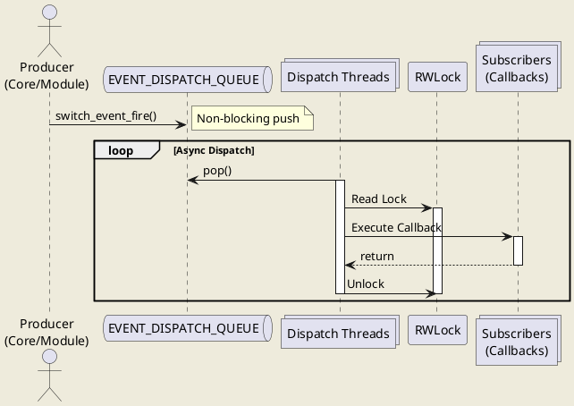
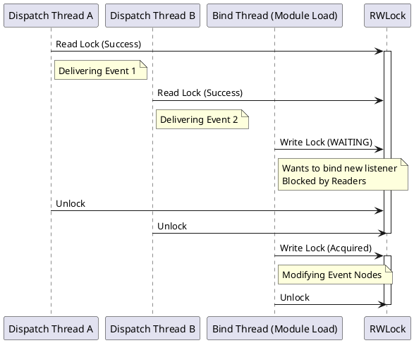

# Event Dispatching

作为一名长期在通信领域摸爬滚打的开发者，我一直把 FreeSWITCH 的事件系统（Event System）比作它的“神经系统”。它负责在核心（Core）、模块（Modules）和外部应用（ESL）之间传递信号。

你可能遇到过这样的场景：系统在高并发下突然“卡死”，或者某些事件莫名其妙地延迟到达。很多时候，这些问题的根源都在于我们对 FreeSWITCH 事件分发机制的误解。

今天，我们不谈虚的，直接深入源码 `switch_event.c`，特别是 `switch_event_fire_detailed` 函数，来一场“开颅手术”，看看这个神经系统到底是如何工作的。

## 核心逻辑：生产者-消费者模型的极致应用

FreeSWITCH 的事件分发核心是一个经典的**生产者-消费者（Producer-Consumer）**模型。

### 1. 生产者：`switch_event_fire_detailed`

当我们调用 `switch_event_fire` 时，实际上是在调用 `switch_event_fire_detailed`。它的核心任务不是立即处理事件，而是把事件“扔”进一个队列。

```c
// src/switch_event.c (简化逻辑)
if (runtime.events_use_dispatch) {
    // 检查是否需要扩容线程池
    check_dispatch(); 
    // 将事件推入队列
    switch_event_queue_dispatch_event(event);
} else {
    // 直接在当前线程投递（极少使用）
    switch_event_deliver_thread_pool(event);
}
```

这里有一个关键的数据结构：`EVENT_DISPATCH_QUEUE`。这是一个 FIFO 队列，所有的事件（除非你禁用了 dispatch）都会先暂存在这里。

### 2. 动态扩容机制

FreeSWITCH 非常聪明，它不会一开始就启动几十个线程来处理事件。它采用了一种动态扩容的策略。

在 `switch_event_queue_dispatch_event` 中，系统会检查当前队列的负载：

```c
// 如果队列长度超过了 (10000 * 当前线程数)
if (switch_queue_size(EVENT_DISPATCH_QUEUE) > (DISPATCH_QUEUE_LEN * DISPATCH_THREAD_COUNT)) {
    // 并且没有达到最大线程数限制
    if (SOFT_MAX_DISPATCH + 1 < MAX_DISPATCH) {
        // 启动新的分发线程！
        switch_event_launch_dispatch_threads(SOFT_MAX_DISPATCH + 1);
    }
}
```

这意味着，系统会根据压力自动增加“消费者”的数量，直到达到 CPU 核心数的一半左右（`MAX_DISPATCH` 的默认计算方式）。

### 3. 消费者：`switch_event_dispatch_thread`

这些后台线程的工作非常枯燥但重要：
1.  从 `EVENT_DISPATCH_QUEUE` 中 `pop` 出一个事件。
2.  调用 `switch_event_deliver` 进行投递。

### 4. 读写锁（RWLOCK）的妙用

在 `switch_event_deliver` 中，FreeSWITCH 遍历所有订阅了该事件的节点（Nodes），并执行回调函数。

这里有一个极其重要的细节：**读写锁（Read-Write Lock）**。

*   **投递时（Deliver）：** 获取 **读锁（Read Lock）**。这意味着多个线程可以同时投递事件，互不干扰。
*   **绑定时（Bind）：** 当有模块调用 `switch_event_bind` 想要订阅事件时，它需要获取 **写锁（Write Lock）**。

**潜在风险：** 如果你的回调函数执行时间过长，虽然它是读锁，不会阻塞其他投递线程，但如果此时有一个 `bind` 或 `unbind` 操作请求写锁，它会被阻塞，进而可能导致后续的读锁请求也被阻塞（取决于读写锁的实现策略），最终引发连锁反应。

## Python 模拟：用代码看懂原理

为了更直观地理解，我用 Python 3 写了一个模拟器。虽然 FreeSWITCH 是 C 写的，但逻辑是通用的。

### 1. 基础结构

```python
import threading
import time
import queue
import random

# 模拟 FreeSWITCH 的常量
DISPATCH_QUEUE_LEN = 10
MAX_DISPATCH = 5

class SwitchEvent:
    def __init__(self, name, body, subclass_name=None):
        self.name = name
        self.body = body
        self.subclass_name = subclass_name
        self.headers = {}

    def __repr__(self):
        return f"<Event {self.name} ({self.subclass_name}): {self.body}>"
```

### 2. 核心引擎

```python
class EventEngine:
    def __init__(self):
        self.queue = queue.Queue()
        self.dispatch_threads = []
        self.running = True
        self.lock = threading.RLock() # 简化为互斥锁模拟 RWLock 的保护作用
        self.bindings = {} # 存储订阅者

    def fire(self, event):
        """生产者：发射事件"""
        # 模拟动态扩容检查
        q_size = self.queue.qsize()
        thread_count = len(self.dispatch_threads)
        
        # 简单的扩容逻辑模拟
        if thread_count < MAX_DISPATCH and q_size > (thread_count * 2):
            self.launch_thread()

        self.queue.put(event)
        print(f"[Fire] {event} pushed. Queue size: {self.queue.qsize()}")

    def launch_thread(self):
        t = threading.Thread(target=self.dispatch_loop)
        t.daemon = True
        self.dispatch_threads.append(t)
        t.start()
        print(f"[System] Launched new dispatch thread. Total: {len(self.dispatch_threads)}")

    def dispatch_loop(self):
        """消费者：分发循环"""
        while self.running:
            try:
                event = self.queue.get(timeout=1)
                self.deliver(event)
                self.queue.task_done()
            except queue.Empty:
                continue

    def bind(self, event_name, callback, subclass_name=None):
        """订阅事件 (支持子类匹配)"""
        with self.lock: # 写锁
            key = (event_name, subclass_name)
            if key not in self.bindings:
                self.bindings[key] = []
            self.bindings[key].append(callback)
            print(f"[Bind] Subscribed to {event_name} subclass={subclass_name}")

    def deliver(self, event):
        """投递逻辑 (包含子类匹配优化)"""
        # 模拟读锁保护
        with self.lock:
            # 1. 查找精确匹配 (Event + Subclass)
            key_specific = (event.name, event.subclass_name)
            if key_specific in self.bindings:
                for cb in self.bindings[key_specific]:
                    cb(event)
            
            # 2. 查找通用匹配 (Event only)
            if event.subclass_name is not None:
                key_general = (event.name, None)
                if key_general in self.bindings:
                    for cb in self.bindings[key_general]:
                        cb(event)
```

### 3. 运行模拟

```python
def slow_consumer(event):
    """模拟一个处理很慢的订阅者"""
    print(f"  -> Processing {event.body}...")
    time.sleep(0.5) # 模拟耗时操作
    print(f"  -> Done {event.body}")

if __name__ == "__main__":
    engine = EventEngine()
    
    # 初始启动一个线程
    engine.launch_thread()

    # 订阅事件
    engine.bind("HEARTBEAT", slow_consumer)
    # 订阅特定子类事件
    engine.bind("CUSTOM", lambda e: print(f"  [CUSTOM] Got {e.subclass_name}"), subclass_name="sofia::register")

    # 模拟高并发产生事件
    print("--- Starting Load Test ---")
    for i in range(20):
        # 普通事件
        evt = SwitchEvent("HEARTBEAT", f"seq-{i}")
        engine.fire(evt)
        
        # 自定义子类事件
        if i % 5 == 0:
            custom_evt = SwitchEvent("CUSTOM", f"data-{i}", subclass_name="sofia::register")
            engine.fire(custom_evt)

        time.sleep(0.1)

    # 等待队列处理完
    time.sleep(5)
    engine.running = False
```

在这个模拟中，你会看到当 `slow_consumer` 阻塞处理时，队列积压，进而触发 `launch_thread`，系统自动增加处理线程来消化积压的事件。这就是 FreeSWITCH 应对突发流量的机制。

## 图解架构

### 1. 事件处理流水线



### 2. 锁的交互模型



## 避坑指南与最佳实践

### 1. 内存所有权陷阱
在 C 语言层面，`switch_event_fire` 会接管事件指针的所有权。
**Gotcha:** 一旦你 fire 了事件，就**不要**再去访问或释放它了。FreeSWITCH 会在分发完成后自动销毁它（或者放入回收队列）。如果你 fire 之后还去 `free` 它，会导致 Double Free 崩溃。

### 2. 严禁在回调中阻塞
这是最重要的一点。虽然有多线程分发，但线程数是有限的（`MAX_DISPATCH`）。
如果你在事件回调中执行耗时的数据库查询或 HTTP 请求，你会迅速耗尽所有分发线程。
**最佳实践：** 如果需要耗时处理，请将数据复制一份，推送到你自己的工作队列中异步处理。

### 3. 慎用 `SWITCH_EVENT_ALL`
订阅所有事件（`SWITCH_EVENT_ALL`）对性能影响巨大。因为每次任何事件发生，系统都要获取读锁并遍历你的回调。在高并发系统中，这会显著增加 CPU 缓存失效和锁竞争。

### 4. 事件回收（Event Recycling）
源码中可以看到 `#ifdef SWITCH_EVENT_RECYCLE`。FreeSWITCH 试图重用事件对象结构体来减少 `malloc`/`free` 的开销。这在高频事件（如 `HEARTBEAT` 或 `AUDIO_DATA`）场景下对降低内存碎片非常有帮助。

## 总结

FreeSWITCH 的事件分发机制是一个设计精良的**动态扩容生产者-消费者系统**。它利用队列缓冲突发流量，利用读写锁保证并发安全。

作为开发者，理解这一机制能让我们写出更健壮的代码：
1.  **快进快出**：回调函数不要阻塞。
2.  **按需订阅**：不要贪心订阅所有事件。
3.  **敬畏指针**：理解事件生命周期，避免内存错误。

掌握了这些，你就掌握了 FreeSWITCH 的“脉搏”。