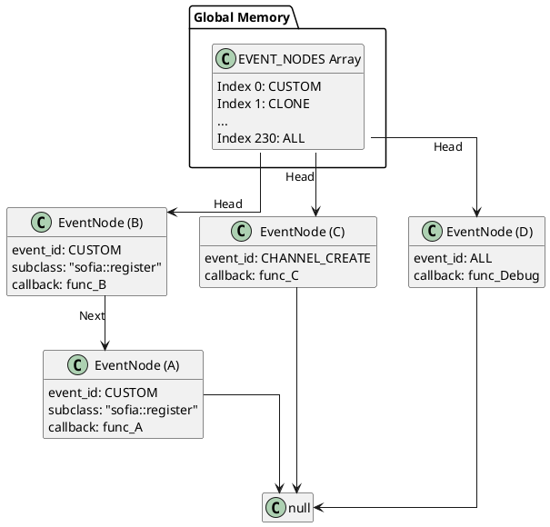
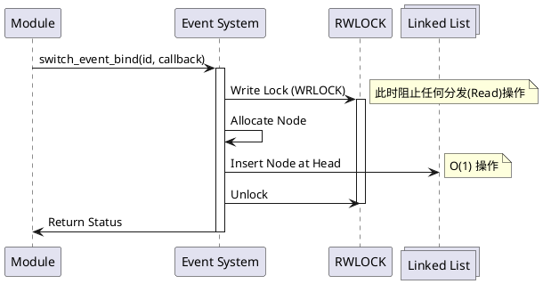

# Event Subscription

作为一名 FreeSWITCH 开发者，如果说 Event Dispatching 是系统的“心脏”，负责将血液（事件）输送到全身，那么 **Event Subscription（事件订阅）** 就是系统的“耳朵”。

在这篇文章中，我将带你深入 FreeSWITCH 的源码深处，通过分析 `switch_event_bind_removable` 函数（这是 `switch_event_bind` 的核心实现），来揭示事件订阅机制的底层秘密。我们将探讨它是如何通过精妙的数据结构和锁机制，在保证高性能的同时实现灵活的事件监听的。

## 核心逻辑：不仅仅是回调

很多初学者认为订阅事件只是简单地注册一个回调函数。但在高并发的通信系统中，事情远没有那么简单。我们需要考虑：
1.  如何快速找到订阅了特定事件的所有回调？
2.  当成千上万个事件并发产生时，如何保证订阅列表的线程安全？
3.  如何避免“惊群效应”或性能瓶颈？

FreeSWITCH 的答案隐藏在 `src/switch_event.c` 中。

### 1. 数据结构：数组 + 链表

FreeSWITCH 使用了一个全局数组 `EVENT_NODES` 来存储所有的订阅信息。

```c
static switch_event_node_t *EVENT_NODES[SWITCH_EVENT_ALL + 1] = { NULL };
```

这是一个非常经典的设计：
*   **数组索引**：对应 `event_id`（枚举类型）。这使得查找特定类型的订阅列表的时间复杂度为 O(1)。
*   **链表**：数组的每个元素是一个链表的头指针。因为同一个事件类型（如 `CHANNEL_CREATE`）可能被多个模块订阅，所以我们需要一个链表来串联所有的订阅节点 (`switch_event_node_t`)。

### 2. 读写锁（RWLOCK）的艺术

在 `switch_event_bind_removable` 函数中，最引人注目的就是锁的使用。

```c
// src/switch_event.c

switch_thread_rwlock_wrlock(RWLOCK);
switch_mutex_lock(BLOCK);
/* <LOCKED> ... 修改链表 ... */
switch_mutex_unlock(BLOCK);
switch_thread_rwlock_unlock(RWLOCK);
```

这里使用了 **读写锁 (Read-Write Lock)**。
*   **写锁 (Write Lock)**：当我们需要 **绑定 (Bind)** 或 **解绑 (Unbind)** 事件时，我们需要修改链表结构，这时必须加写锁。写锁是独占的，意味着此时不能有其他线程进行读或写。
*   **读锁 (Read Lock)**：当事件分发线程 (`switch_event_deliver`) 遍历链表并触发回调时，它只需要加读锁。读锁是共享的，这意味着多个线程可以同时分发事件，互不干扰。

这种设计极大地提高了系统的并发能力，因为在绝大多数情况下，我们是在“读”（分发事件），而不是在“写”（绑定/解绑）。

### 3. `SWITCH_EVENT_ALL` 的特殊性

你可能注意到数组的大小是 `SWITCH_EVENT_ALL + 1`。`SWITCH_EVENT_ALL` 是一个特殊的枚举值。当有人订阅了这个事件时，FreeSWITCH 会在分发 **任何** 事件时都额外检查这个链表。这就是为什么我们在生产环境中要极度小心使用 `SWITCH_EVENT_ALL` —— 它相当于把消防栓打开，水流（事件）会无差别地喷涌而出。

## Python 模拟实现

为了更直观地理解 C 代码的逻辑，我用 Python 3 编写了一个模拟器。这能帮助你摆脱指针的干扰，看清算法本质。

### 示例 1: 订阅节点结构

首先，我们定义订阅节点。在 C 中它是 `struct switch_event_node`。

```python
class EventNode:
    def __init__(self, event_id, subclass_name, callback, user_data):
        self.id = id(self)  # 模拟指针地址
        self.event_id = event_id
        self.subclass_name = subclass_name
        self.callback = callback
        self.user_data = user_data
        self.next = None  # 链表指针
```

### 示例 2: 绑定逻辑 (Bind)

这是 `switch_event_bind_removable` 的 Python 简化版。注意我们是如何模拟写锁和头插法（Head Insertion）的。

```python
import threading

# 全局存储：索引是 event_id
EVENT_NODES = {} 
# 读写锁模拟
RWLOCK = threading.Lock() # Python 的 Lock 既互斥也能模拟写锁独占

def switch_event_bind_removable(event_id, subclass_name, callback, user_data):
    node = EventNode(event_id, subclass_name, callback, user_data)
    
    # 获取写锁
    with RWLOCK:
        # 获取当前链表头
        head = EVENT_NODES.get(event_id)
        
        # 头插法：新节点的 next 指向旧头
        node.next = head
        
        # 更新数组，新节点成为新头
        EVENT_NODES[event_id] = node
        
        print(f"[Bind] Event {event_id} bound. Node ID: {node.id}")
        
    return node
```

### 示例 3: 解绑逻辑 (Unbind)

解绑就是从链表中删除节点。

```python
def switch_event_unbind(node):
    if not node:
        return
        
    event_id = node.event_id
    
    with RWLOCK:
        current = EVENT_NODES.get(event_id)
        prev = None
        
        while current:
            if current == node:
                if prev:
                    prev.next = current.next
                else:
                    # 删除的是头节点
                    EVENT_NODES[event_id] = current.next
                print(f"[Unbind] Node {node.id} removed.")
                return
            prev = current
            current = current.next
```

### 示例 4: "Firehose" 模式与分发

这里展示了分发逻辑如何处理普通事件和 `SWITCH_EVENT_ALL`。

```python
SWITCH_EVENT_ALL = 9999

def switch_event_deliver(event):
    # 模拟读锁（在 Python 中通常不需要显式读锁，除非为了演示）
    # 这里我们假设 RWLOCK 允许并发读
    
    # 1. 分发给特定事件的订阅者
    dispatch_queue = []
    
    # 查找特定 ID 的链表
    node = EVENT_NODES.get(event.event_id)
    while node:
        if matches(event, node): # 检查 subclass 等匹配逻辑
            dispatch_queue.append(node)
        node = node.next
        
    # 2. 检查 SWITCH_EVENT_ALL (Firehose)
    node_all = EVENT_NODES.get(SWITCH_EVENT_ALL)
    while node_all:
        if matches(event, node_all):
            dispatch_queue.append(node_all)
        node_all = node_all.next
        
    # 执行回调
    for node in dispatch_queue:
        node.callback(event)

def matches(event, node):
    # 简化的匹配逻辑
    if node.subclass_name and event.subclass_name != node.subclass_name:
        return False
    return True
```

### 示例 5: 优化的子类绑定 (Optimized Subclass Binding)

这是最佳实践的关键。与其在回调中过滤，不如在绑定时就告诉系统你只关心什么。

```python
# ❌ 低效做法：订阅所有 CUSTOM 事件，然后在回调里过滤
def slow_callback(event):
    if event.subclass_name != "sofia::register":
        return # 浪费了函数调用开销
    process(event)

switch_event_bind_removable(SWITCH_EVENT_CUSTOM, None, slow_callback, None)

# ✅ 高效做法：只订阅特定子类
def fast_callback(event):
    # 此时能进来的肯定是 sofia::register
    process(event)

# 核心会在分发链表遍历时直接跳过不匹配的节点，根本不会调用 fast_callback
switch_event_bind_removable(SWITCH_EVENT_CUSTOM, "sofia::register", fast_callback, None)
```

## 架构图解

### 数据结构视图

下面的 PlantUML 图展示了 `EVENT_NODES` 数组如何通过链表管理不同类型的订阅。



### 绑定生命周期



## Extensions：深入理解 Bind 与 Unbind

在核心逻辑之外，还有两个函数值得我们关注，它们构成了事件订阅的完整生命周期。

### 1. `switch_event_bind` vs `switch_event_bind_removable`

你可能会在代码中看到 `switch_event_bind`。实际上，它只是 `switch_event_bind_removable` 的一个简单封装：

```c
// src/switch_event.c
SWITCH_DECLARE(switch_status_t) switch_event_bind(const char *id, switch_event_types_t event, const char *subclass_name,
                                                  switch_event_callback_t callback, void *user_data)
{
    return switch_event_bind_removable(id, event, subclass_name, callback, user_data, NULL);
}
```

注意最后一个参数是 `NULL`。这意味着使用 `switch_event_bind` 时，你**拿不到**生成的 `node` 指针。这在简单的场景下（比如模块整个生命周期都监听）没问题，但如果你需要动态地取消订阅，就必须使用 `switch_event_bind_removable` 来获取句柄。

### 2. `switch_event_unbind` 的实现

解绑操作 `switch_event_unbind` 同样需要获取写锁。它遍历对应 `event_id` 的链表，通过指针地址比较 (`np == n`) 来找到并删除节点。

```c
// src/switch_event.c 简化逻辑
switch_thread_rwlock_wrlock(RWLOCK);
switch_mutex_lock(BLOCK);
// ... 遍历链表 ...
if (np == n) {
    // ... 从链表中移除 ...
    FREE(n);
}
// ... 解锁 ...
```

这就是为什么保存 `node` 指针如此重要——它是你取消订阅的唯一凭证。

## 最佳实践与避坑指南

作为一名在一线摸爬滚打的开发者，以下是我总结的几条血泪经验：

1.  **永远记得 Unbind**：
    `switch_event_bind_removable` 的最后一个参数是一个输出参数 (`switch_event_node_t **node`)。请务必保存这个指针，并在模块卸载或不再需要监听时调用 `switch_event_unbind(&node)`。否则，FreeSWITCH 会继续尝试调用你的回调函数，而此时你的模块内存可能已经被释放，导致 **Segfault (段错误)** 崩溃。

2.  **回调函数要快**：
    事件分发是在 FreeSWITCH 的核心线程或分发队列线程中进行的。如果你的回调函数执行耗时的数据库查询或 HTTP 请求，你会阻塞整个事件处理管道。
    *   **错误做法**：在回调中 `sleep` 或同步 `curl`。
    *   **正确做法**：将事件数据 push 到你自己的队列中，由你的工作线程异步处理。

3.  **性能隐患：线性搜索 O(N)**：
    正如你在数据结构图中看到的，每个事件 ID 对应一个链表。当分发事件时，FreeSWITCH 必须遍历整个链表 (`O(N)`)。
    如果某个事件（如 `CHANNEL_EXECUTE`）被成千上万个模块订阅，这个链表会变得很长，遍历它会消耗显著的 CPU 周期。虽然这种情况很少见，但在设计大规模系统时必须铭记在心。

4.  **善用 Subclass 过滤**：
    如果你只关心 `sofia` 模块的事件，不要订阅 `SWITCH_EVENT_CUSTOM` 然后在回调里判断 `if (subclass != "sofia") return;`。
    应该在 bind 时直接指定 `subclass_name` 为 `sofia`。FreeSWITCH 核心会在分发前帮你做字符串匹配，这比在解释型语言（如 Lua/Python 脚本）中过滤要快得多。

5.  **警惕 `SWITCH_EVENT_ALL`**：
    除非你在写调试工具或日志记录器，否则尽量避免订阅 `SWITCH_EVENT_ALL`。在高负载系统中，每秒可能产生数千个事件，订阅 ALL 会导致你的回调函数被疯狂调用，瞬间吃光 CPU。

## 总结

FreeSWITCH 的事件订阅机制虽然是用 C 语言实现的，但其设计思想非常清晰：**以空间换时间（数组索引），以读写锁换并发（RWLOCK）**。理解了 `switch_event_bind_removable` 的内部构造，你就能写出更高效、更稳定的 FreeSWITCH 扩展模块。记住，你是系统的“耳朵”，请只听你需要听的声音。