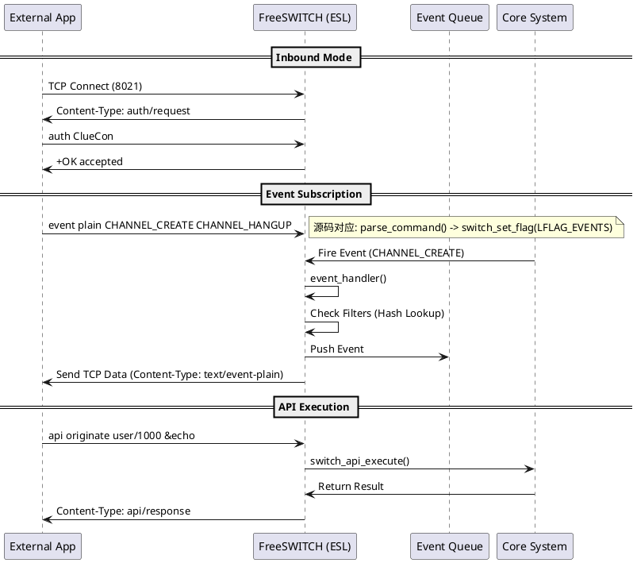

# FreeSWITCH 源码分析：External Control —— 掌控 Event Socket Library (ESL) 的上帝之手

## 1. 开篇：别再用 CLI 裸奔了

兄弟们，我是 AtomsCat。

如果你还在用 `fs_cli` 手敲命令管理生产环境的 FreeSWITCH，或者用 shell 脚本去解析 `fs_cli -x` 的输出，请立刻停止这种“裸奔”行为。

FreeSWITCH 最强大的地方不在于它能打通电话，而在于它极其开放的**可编程性**。而 Event Socket Library (ESL) 就是暴露给外部世界的神经接口。它允许你用 Python、Go、Java 等任何语言，像操作木偶一样操控 FreeSWITCH。

但是，很多人对 ESL 的理解仅停留在“发个命令，收个回包”。
*   为什么你的 ESL 程序跑着跑着就断了？
*   为什么 `event plain all` 会把服务器搞崩？
*   Inbound 和 Outbound 模式到底该选谁？

今天，我们深入 `mod_event_socket.c` 源码（v1.10.12），扒开 ESL 的协议底层，看看这个“上帝之手”到底是怎么长出来的。

---

## 2. 正文解析：TCP 流上的舞蹈

### 2.1 核心架构：Inbound vs Outbound

在 `mod_event_socket.c` 中，你会发现它其实分裂成了两部分人格：

1.  **Inbound Mode (服务端模式)**：
    *   **入口**：`mod_event_socket_runtime` 函数。
    *   **逻辑**：FreeSWITCH 开启一个 TCP 端口（默认 8021），等待你的程序来连接。
    *   **用途**：管理、监控、发起呼叫。你是主动方，FS 是被动方。

2.  **Outbound Mode (客户端模式)**：
    *   **入口**：`socket_function` 函数（对应 Dialplan 中的 `socket` app）。
    *   **逻辑**：当电话进来时，FreeSWITCH 主动连接你指定的 IP:Port。
    *   **用途**：复杂的呼叫流程控制（IVR、机器人）。FS 是主动方，你的程序是被动方。

#### 核心逻辑图解 (PlantUML)



### 2.2 源码级真相：事件分发的性能瓶颈

在 `mod_event_socket.c` 的 `event_handler` 函数中，隐藏着 ESL 性能的关键秘密。

每当 FreeSWITCH 内部产生一个事件（比如电话挂断），`event_handler` 就会被触发。它会遍历**所有**连接上来的 ESL 客户端（Listeners）。

```c
// 伪代码逻辑
void event_handler(switch_event_t *event) {
    for (l = listen_list.listeners; l; l = l->next) {
        // 1. 检查是否订阅了该类型事件
        if (!l->event_list[event->event_id]) continue;
        
        // 2. 检查过滤器 (Filter)
        if (l->filters) {
            // 遍历所有 header 进行正则匹配或字符串匹配
            // 这里是 CPU 密集区！
        }
        
        // 3. 复制事件并推入队列
        switch_event_dup(&clone, event);
        switch_queue_trypush(l->event_queue, clone);
    }
}
```

**深度洞察**：
*   **锁竞争**：`globals.listener_mutex` 是一把大锁。如果你的 ESL 客户端连接数过多（比如几百个），或者处理过慢导致队列满，整个 FreeSWITCH 的事件分发线程就会被拖慢。
*   **内存拷贝**：每个发给客户端的事件都是 `switch_event_dup` 出来的副本。如果你订阅了 `ALL`，每秒几千个事件的内存分配和释放，GC 压力极大。

---

## 3. 实战代码：Python 3 打造高可用 ESL 客户端

不要用 `eventsocket` 库的默认示例，那是玩具。生产环境需要处理断连重连、异步指令和事件过滤。

### 场景描述
我们需要一个 ESL 客户端，它能：
1.  自动重连 FreeSWITCH。
2.  监听所有通话的建立和挂断。
3.  异步发起 API 命令，不阻塞主循环。
4.  **只**接收我们关心的事件，绝不浪费带宽。

### Python 3 示例代码

```python
import socket
import threading
import time
import uuid

class ESLClient:
    def __init__(self, host='127.0.0.1', port=8021, password='ClueCon'):
        self.host = host
        self.port = port
        self.password = password
        self.sock = None
        self.connected = False
        self.lock = threading.Lock()

    def connect(self):
        """1. 带有重试机制的连接"""
        while not self.connected:
            try:
                print(f"🔌 尝试连接 {self.host}:{self.port}...")
                self.sock = socket.socket(socket.AF_INET, socket.SOCK_STREAM)
                self.sock.settimeout(5) # 设置超时
                self.sock.connect((self.host, self.port))
                self.sock.settimeout(None) # 恢复阻塞模式
                
                # 鉴权流程
                self._send("auth " + self.password)
                if "+OK" in self._recv_header():
                    print("✅ 鉴权成功")
                    self.connected = True
                    self._on_connect()
                    # 开启读取线程
                    t = threading.Thread(target=self._read_loop, daemon=True)
                    t.start()
                else:
                    print("❌ 鉴权失败")
                    self.sock.close()
                    time.sleep(3)
            except Exception as e:
                print(f"⚠️ 连接失败: {e}, 3秒后重试")
                time.sleep(3)

    def _on_connect(self):
        """2. 连接成功后的初始化：关键在于过滤！"""
        # 告诉 FS 输出 JSON 格式，解析更方便
        self._send("event json CHANNEL_CREATE CHANNEL_HANGUP")
        # 过滤：只关心来自 192.168 网段的呼叫 (示例)
        # self._send("filter Variable_sip_network_ip 192.168") 
        print("📡 已订阅事件: CHANNEL_CREATE, CHANNEL_HANGUP")

    def _send(self, cmd):
        if self.sock:
            self.sock.send((cmd + "\n\n").encode('utf-8'))

    def _recv_header(self):
        """简单的协议头读取 (生产环境建议使用 buffer 缓冲处理)"""
        data = b""
        while b"\n\n" not in data:
            chunk = self.sock.recv(1)
            if not chunk: raise ConnectionError("Socket closed")
            data += chunk
        return data.decode('utf-8')

    def _read_loop(self):
        """3. 主读取循环"""
        try:
            while self.connected:
                # 读取 Header
                headers_raw = self._recv_header()
                headers = dict(h.split(': ', 1) for h in headers_raw.strip().split('\n') if ': ' in h)
                
                content_length = int(headers.get('Content-Length', 0))
                content_type = headers.get('Content-Type', '')

                # 读取 Body
                body = b""
                while len(body) < content_length:
                    body += self.sock.recv(content_length - len(body))
                
                # 处理逻辑
                if content_type == 'text/event-json':
                    self._handle_event(body.decode('utf-8'))
                elif content_type == 'api/response':
                    print(f"📝 API 响应: {body.decode('utf-8').strip()}")
                elif content_type == 'text/disconnect-notice':
                    print("⚠️ 收到断开通知")
                    self.connected = False
                    
        except Exception as e:
            print(f"❌ 连接断开: {e}")
            self.connected = False
            self.sock.close()
            # 触发重连逻辑 (在主线程或其他地方处理)

    def _handle_event(self, json_data):
        """4. 事件处理逻辑"""
        import json
        try:
            event = json.loads(json_data)
            evt_name = event.get("Event-Name")
            uuid = event.get("Unique-ID")
            print(f"🔔 收到事件: {evt_name} | UUID: {uuid}")
            
            if evt_name == "CHANNEL_CREATE":
                # 5. 生产场景：收到呼叫后，异步执行一些操作
                print(f"   📞 新来电: {event.get('Caller-Caller-ID-Number')}")
        except:
            pass

    def bgapi(self, cmd):
        """6. 异步 API 调用"""
        job_id = str(uuid.uuid4())
        print(f"🚀 发送异步命令: {cmd}")
        self._send(f"bgapi {cmd}")
        # 注意：bgapi 的结果会通过 BACKGROUND_JOB 事件返回，需要在 _handle_event 中处理

if __name__ == "__main__":
    client = ESLClient()
    # 在独立线程运行连接，模拟守护进程
    t = threading.Thread(target=client.connect)
    t.start()
    
    while True:
        time.sleep(1)
        if client.connected:
            # 模拟定时发送心跳或指令
            # client.bgapi("status")
            pass
```

#### 代码运行结果说明
1.  **自动重连**：如果 FreeSWITCH 没启动，脚本会每 3 秒重试一次，直到连接成功。
2.  **鉴权与订阅**：连接后自动发送 `auth` 和 `event json ...`。
3.  **事件监听**：当有电话呼入时，控制台会实时打印 `🔔 收到事件: CHANNEL_CREATE`。
4.  **协议解析**：手动解析了 ESL 的 `Header\n\nBody` 格式，这是理解 ESL 协议的基础。

---

## 4. 生产环境避坑指南（AtomsCat 独家）

### 4.1 死亡陷阱：`event plain all`
*   **踩坑记录**：新手最爱干的事就是连接上 ESL 后发送 `event plain all`。
*   **后果**：FreeSWITCH 内部每秒可能产生数千个事件（HEARTBEAT, RE_SCHEDULE, CHANNEL_EXECUTE...）。你的 Python 脚本处理不过来，TCP 缓冲区塞满。FreeSWITCH 的 `event_handler` 线程在尝试 `push` 到你的队列时会阻塞或报错，最终导致 FS 性能雪崩。
*   **最佳实践**：**按需订阅**。只订阅你需要的 `CHANNEL_HANGUP`、`DTMF` 等。如果必须订阅很多，请使用 `filter` 命令在服务端过滤。

### 4.2 阻塞式 API 的代价
*   **现象**：你在 ESL 中发送 `api originate ...`，结果整个程序卡住了 30 秒，直到对方接听。
*   **原因**：`api` 命令是阻塞的，它会等待命令执行完毕才返回。
*   **最佳实践**：**永远使用 `bgapi`**。`bgapi` 会立即返回一个 Job-UUID，执行结果会通过 `BACKGROUND_JOB` 事件异步推给你。这是构建高并发系统的基石。

### 4.3 僵尸连接
*   **场景**：你的 Python 脚本崩溃了，但 TCP 连接没断。FreeSWITCH 还在傻傻地往这个 socket 发事件。
*   **源码分析**：`mod_event_socket` 有一个 `MAX_QUEUE_LEN` (100000) 和 `MAX_MISSED` (500)。如果你的客户端不读数据，队列满了，FS 会强制断开连接并打印 `Killing listener`。
*   **建议**：监控 FreeSWITCH 日志中的 `Killing listener` 警告，这通常意味着你的消费者处理能力不足。

---

## 5. 思维拓展：架构师的邪修之道

### 5.1 ESL 中间人攻击（Man-in-the-Middle）
Outbound 模式下，FreeSWITCH 连接你的脚本。你可以做一个“中间人”代理。
*   **玩法**：FS -> 你的 Python 脚本 -> 真实的业务逻辑。
*   **用途**：在脚本里拦截 `CHANNEL_CREATE`，动态修改 `Caller-ID` 或者注入 SIP Header，然后再把控制权交给业务逻辑。这在多租户隐号系统中非常有用。

### 5.2 替代方案对比：RabbitMQ (mod_amqp)
既然 ESL 这么麻烦，为什么不用 MQ？
*   **ESL 优势**：原生、零依赖、双向控制（既能收事件也能发命令）。
*   **mod_amqp 优势**：解耦、持久化、广播。
*   **架构建议**：
    *   **控制流**（发命令）：用 ESL。因为你需要即时的响应（比如 `uuid_kill`）。
    *   **数据流**（收话单）：用 `mod_amqp` 或 `mod_json_cdr`。把话单推到 MQ 里慢慢处理，别让 ESL 承担数据存储的重任。

---

## 6. 总结

ESL 是 FreeSWITCH 的任督二脉。

*   **Takeaway 1**：Inbound 适合做管理台，Outbound 适合做业务 IVR。
*   **Takeaway 2**：**Filter, Filter, Filter!** 在服务端过滤事件是性能优化的核心。
*   **Takeaway 3**：使用 `bgapi` 代替 `api`，拥抱异步编程。

读懂了 `mod_event_socket`，你就拥有了对 FreeSWITCH 的绝对控制权。现在，去重构你的代码，把那些 `os.system('fs_cli ...')` 统统删掉！

我是 AtomsCat，关注我，带你硬核玩转通信架构。