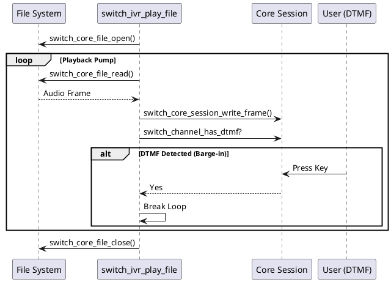
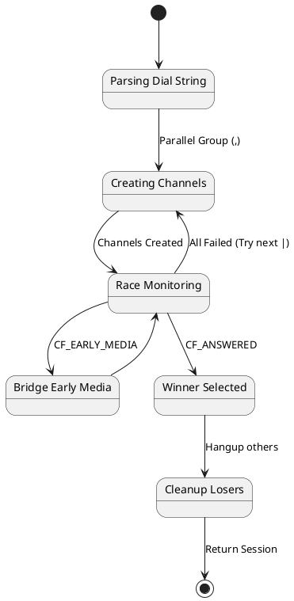

# FreeSWITCH 源码分析：IVR 核心操作 (IVR Operations)

> **作者**: AtomsCat  
> **身份**: 后端架构师 / FreeSWITCH 资深玩家  
> **标签**: #FreeSWITCH #源码分析 #IVR #VoIP #架构设计

---

## 1. 前言：IVR —— 系统的“门面”

在 VoIP 系统中，IVR (Interactive Voice Response) 是用户最先接触到的“门面”。无论是简单的“欢迎致电”，还是复杂的银行语音导航，背后都依赖于 FreeSWITCH 强大的 IVR 状态机。

很多开发者觉得 IVR 很简单：写个 Lua 脚本 `session:streamFile("welcome.wav")` 不就完事了吗？

**Too young, too simple.**

当你深入 C 层源码，你会发现这看似简单的操作背后，隐藏着复杂的**流泵 (Stream Pump)** 模型和**竞态管理 (Race Management)** 机制。为什么你的 IVR 在高并发下会卡顿？为什么 `originate` 有时会莫名其妙地挂断？为什么 Early Media 总是处理不好？

今天，我们不谈配置，直接扒开 `src/switch_ivr_play_say.c` 和 `src/switch_ivr_originate.c` 的源码，看看 FreeSWITCH 是如何处理这些核心操作的。

---

## 2. 核心逻辑一：Playback Pump (播放泵)

IVR 的最基本动作是播放音频。在 Lua 中是 `session:streamFile`，在 C 层面，核心入口是 `switch_ivr_play_file`。

### 2.1 "泵" 模型 (The Pump Model)

FreeSWITCH 的媒体处理核心是一个无限循环，我称之为“播放泵”。它的工作原理非常像一个水泵：从文件句柄吸入数据（音频帧），然后推送到 Session（RTP流）。

在 `src/switch_ivr_play_say.c` 中，`switch_ivr_play_file` 函数的核心逻辑如下（伪代码简化）：

```c
// src/switch_ivr_play_say.c

SWITCH_DECLARE(switch_status_t) switch_ivr_play_file(switch_core_session_t *session, ...) {
    // 1. 打开文件句柄
    switch_core_file_open(&fh, file, ...);

    // 2. 播放主循环 (The Pump)
    for (;;) {
        // A. 检查是否暂停
        if (switch_channel_test_flag(channel, CF_PAUSE)) {
            switch_yield(20000);
            continue;
        }

        // B. 读取音频帧 (Read from File)
        switch_core_file_read(&fh, abuf, &len);
        if (len == 0) break; // 文件播完了

        // C. 写入 Session (Write to Network)
        switch_core_session_write_frame(session, &write_frame, ...);

        // D. 检查 DTMF (Barge-in 核心)
        if (switch_channel_has_dtmf(channel)) {
            // 用户按键了！打断播放
            break; 
        }
    }
}
```

### 2.2 关键特性：Barge-in (打断)

所谓的 "Barge-in"（允许用户按键打断语音），在源码层面就是循环中的一步检查。

*   **同步性**：FS 是**边读边播边查**。这意味着如果你的磁盘 I/O 慢了，或者 CPU 负载高导致调度延迟，用户按键的反应就会变慢。
*   **DTMF 队列**：`switch_channel_has_dtmf` 检查的是通道的 DTMF 队列。如果底层 SIP 协议栈收到了 RFC2833 包，会推入这个队列，等待 IVR 循环去消费它。

### 2.3 Playback Sequence



---

## 3. 核心逻辑二：The Originate Race (竞态管理)

如果说 Playback 是“独角戏”，那么 `originate` 就是一场“赛马”。

`switch_ivr_originate` (位于 `src/switch_ivr_originate.c`) 是 FreeSWITCH 中最复杂的函数之一。它的任务是：解析拨号字符串，向一个或多个目标发起呼叫，并管理这场“比赛”直到产生赢家。

### 3.1 拨号字符串解析：串行 vs 并行

FS 的拨号字符串支持两种逻辑：
*   **串行 (Serial, `|`)**: `user/1001|user/1002`。先呼叫 1001，失败后再呼叫 1002。
*   **并行 (Parallel, `,`)**: `user/1001,user/1002`。同时呼叫 1001 和 1002，谁先接听谁赢。

源码中，这是一个嵌套循环结构：

```c
// src/switch_ivr_originate.c

// 外层循环：处理 '|' (串行)
for (r = 0; r < or_argc; r++) {
    
    // 内层逻辑：处理 ',' (并行)
    // 创建所有并行通道
    for (i = 0; i < and_argc; i++) {
        switch_core_session_outgoing_channel(...);
    }

    // 状态监控循环 (Race Monitor)
    while (active_channels > 0) {
        // 检查每个通道的状态
        check_channel_status(...);
        
        // 如果有人接听 (CF_ANSWERED)
        if (winner) {
            goto done;
        }
    }
}
```

### 3.2 竞态裁判 (The Referee)

`check_channel_status` 函数是这场比赛的裁判。它负责：
1.  **检测赢家**：如果某个通道状态变为 `CS_EXCHANGE_MEDIA` 或 `CF_ANSWERED`，判定为赢家。
2.  **处决输家**：一旦产生赢家，其他所有并发通道会被挂断，挂断原因通常是 `SWITCH_CAUSE_LOSE_RACE` (竞态失败)。
3.  **处理 Early Media**：如果开启了 `bridge_early_media`，裁判需要负责在赢家产生前，就把音频数据从 B Leg 搬运到 A Leg。

### 3.3 Originate State Machine



---

## 4. 踩坑与最佳实践 (Engineering Practice)

作为架构师，理解源码是为了避坑。以下是基于源码分析总结的“生产事故”高发区。

### 4.1 坑一：Codec 协商的噩梦

在 `originate` 过程中，A Leg 和 B Leg 可能使用不同的 Codec。
*   **源码洞察**：`switch_ivr_originate` 会调用 `inherit_codec`。如果设置了 `absolute_codec_string`，FS 会强制使用该编码。
*   **最佳实践**：
    *   尽量在 Dial String 中显式指定 Codec，例如 `{absolute_codec_string=PCMA}user/1001`，避免无谓的转码消耗 CPU。
    *   如果做透传 (Passthrough)，确保 `inherit_codec=true`。

### 4.2 坑二：Early Media 的处理

很多时候，外呼听到的是“正在呼叫中”的彩铃，这就是 Early Media。
*   **源码洞察**：`switch_ivr_originate` 默认行为是 `ignore_early_media=false`。这意味着一旦收到 183 Session Progress，FS 就会认为通道“通了”，但此时并未 Answer。
*   **生产事故**：如果你的计费系统依赖 `originate` 返回成功就开始计费，那么用户听到彩铃时就已经被扣费了！
*   **最佳实践**：
    *   对于计费业务，务必设置 `ignore_early_media=true`，强制要求收到 200 OK (Answer) 才算成功。
    *   如果需要让主叫听到彩铃（如回铃音），使用 `bridge_early_media=true`。

### 4.3 Python 实战示例

#### 示例 1: 健壮的 IVR 菜单 (带 Barge-in)

```python
import freeswitch

def handler(session, args):
    session.answer()
    session.set_tts_params("flite", "kal")
    
    # 源码原理：利用 Playback Pump 的 DTMF 检查机制
    # min_digits=1, max_digits=1 确保按键即停
    digits = session.playAndGetDigits(
        1, 1, 3, 3000, "#", 
        "phrase:main_menu", 
        "phrase:invalid_option", 
        "\\d+"
    )
    
    if digits == "1":
        session.execute("transfer", "1000 XML default")
    elif digits == "2":
        session.execute("transfer", "2000 XML default")
```

#### 示例 2: 智能外呼 (处理竞态与 Early Media)

```python
import freeswitch

def outbound_handler(session, args):
    # 源码原理：利用 Originate Race Manager
    # {ignore_early_media=true} 确保只有接通才返回
    # {originate_timeout=30} 设置竞态超时
    # user/1001,user/1002 并行呼叫
    
    dial_str = "{ignore_early_media=true,originate_timeout=30}user/1001,user/1002"
    
    new_session = freeswitch.Session(dial_str, session)
    
    if new_session.ready():
        freeswitch.consoleLog("info", "Call Connected!\n")
        # 桥接双方
        freeswitch.bridge(session, new_session)
    else:
        freeswitch.consoleLog("err", "Originate Failed: %s\n" % new_session.cause())
```

---

## 5. 总结

FreeSWITCH 的 IVR 操作并非黑盒。
*   **Playback** 是一个高效的 I/O 泵，利用循环检测实现交互。
*   **Originate** 是一个复杂的竞态管理器，处理着并行呼叫、媒体协商和状态同步。

理解了 `switch_ivr_play_say.c` 和 `src/switch_ivr_originate.c`，你就掌握了 FreeSWITCH 呼叫控制的半壁江山。下次遇到 IVR 问题，不妨直接去源码里找答案，那里才是真理的源头。