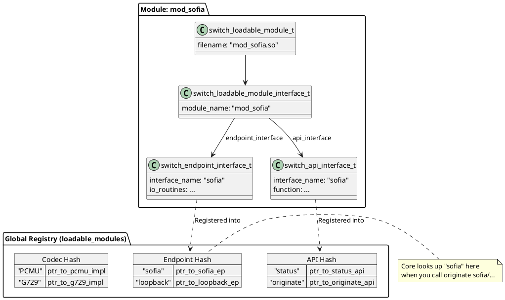

# Interface Registration

## 1. 开篇：代码加载只是第一步

在上一篇《Module Loading》中，我们分析了 FreeSWITCH 如何通过 `dlopen` 将 `.so` 或 `.dll` 文件加载到内存，并定位到了入口函数 `switch_module_load`。

但是，把代码加载进内存，FreeSWITCH 核心就能用它了吗？
**不能。**

这就好比你把一个绝世高手的电话号码存进了手机通讯录（加载），但你还没备注他是“修电脑的”还是“职业杀手”（注册）。如果核心不知道 `mod_sofia` 是用来处理 SIP 的，不知道 `mod_conference` 是用来开会的，那这些模块就只是一堆占着内存的二进制数据而已。

`switch_loadable_module_process` 函数，就是 FreeSWITCH 的**户籍民警**。它的工作是：**盘点**模块带来的所有家当（接口），**分类**登记造册，并**广播**通知全系统：“新功能上线了”。

## 2. Core Logic: switch_loadable_module_process

这个函数位于 `src/switch_loadable_module.c`，是模块生命周期中最繁忙的阶段。

### 2.1 全局注册表：loadable_modules

在分析函数之前，必须先看一眼 FreeSWITCH 的“户籍大本营” —— `loadable_modules` 全局静态结构体。

```c
// src/switch_loadable_module.c

struct switch_loadable_module_container {
    switch_hash_t *module_hash;          // 模块本身
    switch_hash_t *endpoint_hash;        // Endpoint (如 sofia, loopback)
    switch_hash_t *codec_hash;           // Codec (如 PCMU, OPUS)
    switch_hash_t *dialplan_hash;        // Dialplan (如 XML, enum)
    switch_hash_t *application_hash;     // App (如 bridge, playback)
    switch_hash_t *api_hash;             // API (如 status, reloadxml)
    // ... 还有十几个 hash 表 ...
    switch_mutex_t *mutex;               // 全局大锁
};
```

这就是 FreeSWITCH 的核心资产目录。所有的功能查找（比如 Dialplan 里写 `<action application="bridge".../>`），本质上都是去 `application_hash` 里查表。

### 2.2 暴力遍历与分类登记

`switch_loadable_module_process` 的逻辑非常直接，就是一连串的 `if` 判断。它遍历 `switch_loadable_module_interface_t` 结构体中所有可能的接口链表。

以 **Endpoint** 接口的处理为例（代码经过简化）：

```c
// src/switch_loadable_module.c

if (new_module->module_interface->endpoint_interface) {
    const switch_endpoint_interface_t *ptr;
    // 遍历链表，一个模块可以注册多个 Endpoint
    for (ptr = new_module->module_interface->endpoint_interface; ptr; ptr = ptr->next) {
        if (!ptr->interface_name) {
            // 没名字？报错！
            switch_log_printf(..., SWITCH_LOG_CRIT, "Failed to load endpoint interface...\n");
        } else {
            // 1. 打印日志
            switch_log_printf(..., "Adding Endpoint '%s'\n", ptr->interface_name);
            
            // 2. 插入全局 Hash 表
            switch_core_hash_insert(loadable_modules.endpoint_hash, ptr->interface_name, (const void *) ptr);
            
            // 3. 发送事件通知
            if (switch_event_create(&event, SWITCH_EVENT_MODULE_LOAD) == SWITCH_STATUS_SUCCESS) {
                switch_event_add_header_string(event, SWITCH_STACK_BOTTOM, "type", "endpoint");
                switch_event_add_header_string(event, SWITCH_STACK_BOTTOM, "name", ptr->interface_name);
                switch_event_fire(&event);
            }
        }
    }
}
```

这个模式对 API、Application、Dialplan 等几乎一模一样。

### 2.3 Codec 的特殊待遇

Codec（编解码器）的注册比其他接口复杂。因为一个 Codec 接口（如 G.711）可能包含多个**实现**（Implementation），比如不同的采样率（8k, 16k）、不同的打包周期（20ms, 30ms）。

```c
// src/switch_loadable_module.c

if (new_module->module_interface->codec_interface) {
    // ... 遍历 codec_interface ...
    for (impl = ptr->implementations; impl; impl = impl->next) {
        // 检查 IANA 名称和 buffer 大小
        if (!impl->iananame) { ... }
        
        // 注册到 codec_hash
        // 注意：这里用的是 iananame (如 "PCMU") 作为 Key
        // 如果多个模块提供同一个 Codec，这里会形成一个链表（Chain）
        switch_core_hash_insert(loadable_modules.codec_hash, impl->iananame, (const void *) node);
    }
}
```

**架构师视角**：这里体现了 FreeSWITCH 的灵活性。它允许同名 Codec 存在多个实现，系统在协商时会根据优先级和匹配度选择最合适的。

## 3. Python Examples

为了彻底理解这个过程，我们用 Python 模拟一个简化版的接口注册系统。

```python
import logging
from typing import Dict, List, Any
from dataclasses import dataclass, field

# 配置日志
logging.basicConfig(level=logging.INFO, format='%(levelname)s: %(message)s')

# --- 模拟 FreeSWITCH 的数据结构 ---

@dataclass
class Interface:
    name: str
    type: str

@dataclass
class EndpointInterface(Interface):
    type: str = "endpoint"
    # 模拟函数指针
    io_routines: Any = None 

@dataclass
class ApiInterface(Interface):
    type: str = "api"
    description: str = ""
    syntax: str = ""
    function: Any = None

@dataclass
class ModuleInterface:
    module_name: str
    endpoints: List[EndpointInterface] = field(default_factory=list)
    apis: List[ApiInterface] = field(default_factory=list)

@dataclass
class LoadableModule:
    filename: str
    interface: ModuleInterface

# --- 全局注册容器 ---

class ModuleContainer:
    def __init__(self):
        self.modules: Dict[str, LoadableModule] = {}
        self.endpoints: Dict[str, EndpointInterface] = {}
        self.apis: Dict[str, ApiInterface] = {}

    def fire_event(self, event_type: str, headers: Dict[str, str]):
        """模拟事件发送"""
        print(f"⚡ EVENT [{event_type}]: {headers}")

# 全局实例
loadable_modules = ModuleContainer()

# --- 核心逻辑：switch_loadable_module_process ---

def switch_loadable_module_process(module: LoadableModule):
    """
    模拟 FreeSWITCH 的模块处理函数
    """
    logging.info(f"Processing module: {module.interface.module_name}")
    
    # 1. 注册模块本身
    loadable_modules.modules[module.filename] = module
    
    # 2. 处理 Endpoints
    for ep in module.interface.endpoints:
        if not ep.name:
            logging.error(f"Endpoint in {module.filename} has no name!")
            continue
            
        if ep.name in loadable_modules.endpoints:
            logging.warning(f"Endpoint {ep.name} already exists! Overwriting.")
            
        logging.info(f"Adding Endpoint '{ep.name}'")
        loadable_modules.endpoints[ep.name] = ep
        
        # 发送事件
        loadable_modules.fire_event("MODULE_LOAD", {
            "type": "endpoint",
            "name": ep.name,
            "module": module.interface.module_name
        })

    # 3. 处理 APIs
    for api in module.interface.apis:
        if not api.name:
            logging.error(f"API in {module.filename} has no name!")
            continue
            
        logging.info(f"Adding API Function '{api.name}'")
        loadable_modules.apis[api.name] = api
        
        # 发送事件
        loadable_modules.fire_event("MODULE_LOAD", {
            "type": "api",
            "name": api.name,
            "description": api.description
        })

# --- 测试用例 ---

if __name__ == "__main__":
    # 模拟 mod_sofia
    sofia_iface = ModuleInterface(module_name="mod_sofia")
    sofia_iface.endpoints.append(EndpointInterface(name="sofia"))
    sofia_iface.apis.append(ApiInterface(name="sofia", description="Sofia SIP Status", syntax="sofia status"))
    
    mod_sofia = LoadableModule(filename="mod_sofia.so", interface=sofia_iface)
    
    # 模拟 mod_conference
    conf_iface = ModuleInterface(module_name="mod_conference")
    conf_iface.apis.append(ApiInterface(name="conference", description="Conference Control", syntax="conference list"))
    
    mod_conf = LoadableModule(filename="mod_conference.so", interface=conf_iface)
    
    # 执行注册
    print("--- Loading mod_sofia ---")
    switch_loadable_module_process(mod_sofia)
    
    print("\n--- Loading mod_conference ---")
    switch_loadable_module_process(mod_conf)
    
    print("\n--- Registry State ---")
    print(f"Endpoints: {list(loadable_modules.endpoints.keys())}")
    print(f"APIs: {list(loadable_modules.apis.keys())}")
```

### 运行结果说明

这段代码清晰地展示了：
1.  **结构化存储**：不同的接口被分发到不同的字典（Hash表）中。
2.  **事件驱动**：每注册一个接口，都会触发事件。这解释了为什么你在 `fs_cli` 里能实时看到模块加载的日志，以及为什么 `ESL` 客户端能监控到模块变动。
3.  **命名空间**：接口名称（如 "sofia"）是全局唯一的 Key。如果两个模块注册了同名接口，后加载的会覆盖先加载的（或者报错，取决于具体实现，FreeSWITCH 通常是覆盖或链式处理）。

## 4. PlantUML

我们用 PlantUML 来展示这个“注册”过程的层级关系。



## 5. Extensions: 进阶与黑魔法

既然所有的接口都是注册在全局 Hash 表里的，这就给“高级玩家”留下了操作空间。

1.  **接口劫持**：如果你写了一个模块，在 `mod_sofia` 之后加载，并且注册了一个也叫 `sofia` 的 Endpoint，你就可以劫持所有的 SIP 呼叫流程。当然，FreeSWITCH 会打印警告，但这在做一些特殊的热修复或调试工具时非常有用。
2.  **动态卸载/重载**：`switch_loadable_module_unprocess`（process 的逆操作）会从 Hash 表中删除这些指针。如果你在卸载时没有处理好引用计数（Ref Count），而此时正好有一个 Session 正在使用这个 Endpoint，那么恭喜你 —— **Segfault (Core Dump)**。
    *   *踩坑记录*：在生产环境中，尽量避免动态 `unload` 涉及核心业务的模块（如 `mod_sofia`, `mod_java` 等）。虽然 FreeSWITCH 尽力做了读写锁保护，但高并发下的模块卸载依然是高危操作。

## 6. Conclusion

`switch_loadable_module_process` 是 FreeSWITCH 启动过程中最关键的“握手”环节。

*   **它不生产代码**：代码都在模块里。
*   **它只做搬运工**：把模块里的接口指针，搬运到核心的 Hash 表里。
*   **它是连接器**：让 Core 能够通过字符串（"sofia", "bridge"）找到对应的 C 函数指针。

理解了这个过程，你就理解了为什么 FreeSWITCH 的配置文件（如 `dialplan`）可以完全解耦于底层实现 —— 因为中间有一个强大的**动态注册表**在做支撑。