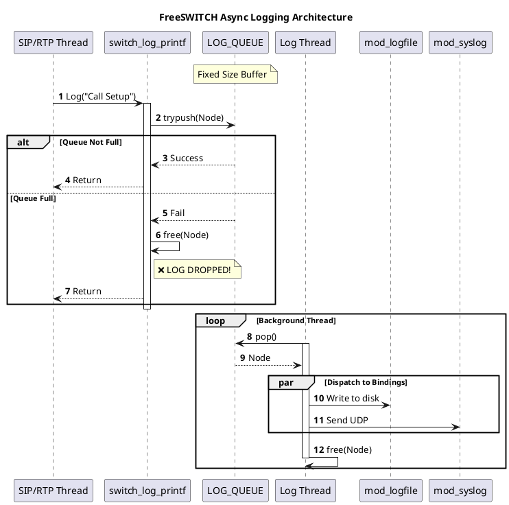

# Log Management

## 1. 开篇：沉默的黑匣子

在生产环境中，日志是唯一的救命稻草。

当 FreeSWITCH 崩溃、通话中断、或者语音质量变差时，我们本能的反应是：“查日志！”。但是，你是否遇到过这样的诡异情况：
*   系统高负载时，关键报错日志竟然**凭空消失**了？
*   开启 Debug 级别日志后，系统性能**断崖式下跌**？
*   日志文件疯狂滚动，磁盘 I/O 飙升到 100%？

这不仅仅是配置问题，这是对 FreeSWITCH 日志系统底层机制的误解。

今天，我们深入 `src/switch_log.c`，揭开这个“黑匣子”的内部构造。我们将发现，FreeSWITCH 为了性能做了一个大胆的决定——**异步丢包机制**。

**核心观点：FreeSWITCH 的日志系统是一个基于内存队列的异步生产者-消费者模型。当生产速度超过消费速度时，它会毫不留情地丢弃日志。**

---

## 2. 正文解析：异步队列的艺术与代价

### 2.1 核心原理：生产者-消费者模型

FreeSWITCH 的日志系统并不是你调用 `switch_log_printf` 时直接写文件的。如果那样做，每一次磁盘 I/O 都会阻塞业务线程，导致通话卡顿。

相反，它采用了一个经典的异步架构：

1.  **生产者 (Producer)**：业务线程调用 `switch_log_printf`。
2.  **缓冲区 (Buffer)**：一个固定大小的内存队列 `LOG_QUEUE`。
3.  **消费者 (Consumer)**：一个后台线程 `log_thread`，负责从队列取数据，并分发给各个 Logger（如 Console, File, Syslog）。

### 2.2 源码实锤：日志是怎么“丢”的？

在 `src/switch_log.c` 的 `switch_log_meta_vprintf` 函数中，有这样一段关键代码：

```c
// 尝试将日志节点推入队列
if (switch_queue_trypush(LOG_QUEUE, node) != SWITCH_STATUS_SUCCESS) {
    // 如果队列满了，直接释放内存！日志丢弃！
    switch_log_node_free(&node);
}
```

注意这里使用的是 `switch_queue_trypush`（非阻塞尝试），而不是 `switch_queue_push`（阻塞等待）。

这意味着：**如果后台写日志的速度跟不上前台打印日志的速度，队列一旦填满，新的日志就会被直接丢弃，连个响声都没有。**

这就是高负载下“日志消失”谜题的答案。

### 2.3 Python 模拟：复现“丢日志”现场

为了让你亲眼看到这个过程，我写了一个 Python 脚本来模拟 FreeSWITCH 的日志核心逻辑。

#### 示例代码：异步日志模拟器

```python
import threading
import queue
import time
import random

# 模拟 FreeSWITCH 的 LOG_QUEUE (容量设小一点以便观察)
LOG_QUEUE_SIZE = 10
log_queue = queue.Queue(maxsize=LOG_QUEUE_SIZE)
running = True
dropped_logs = 0

# 消费者线程 (模拟 log_thread)
def log_consumer():
    while running or not log_queue.empty():
        try:
            # 模拟写磁盘的耗时 (慢消费者)
            msg = log_queue.get(timeout=0.1)
            time.sleep(0.1) 
            print(f"📝 [DISK] Wrote: {msg}")
        except queue.Empty:
            continue

# 生产者线程 (模拟业务逻辑)
def business_logic(thread_id):
    global dropped_logs
    for i in range(20):
        msg = f"Thread-{thread_id} Log-{i}"
        try:
            # 模拟 switch_queue_trypush (非阻塞)
            log_queue.put_nowait(msg)
            print(f"✅ [APP] Generated: {msg}")
        except queue.Full:
            # 队列满，丢弃！
            dropped_logs += 1
            print(f"❌ [DROP] Queue Full! Dropped: {msg}")
        
        # 模拟业务处理速度 (快生产者)
        time.sleep(0.01)

# 启动消费者
consumer = threading.Thread(target=log_consumer)
consumer.start()

# 启动多个生产者
producers = []
for i in range(3):
    t = threading.Thread(target=business_logic, args=(i,))
    producers.append(t)
    t.start()

for t in producers:
    t.join()

running = False
consumer.join()

print(f"\n📊 Summary: Total Dropped Logs: {dropped_logs}")
```

**运行结果说明：**
你会看到大量的 `❌ [DROP] Queue Full!`。因为生产者（业务线程）生成日志的速度（0.01s/条）远快于消费者（写磁盘）的速度（0.1s/条），队列瞬间爆满，后续日志全部丢失。

### 2.4 工程实践：如何避免日志灾难？

1.  **控制日志级别**：生产环境严禁开启 `DEBUG` 级别，除非你在调试特定问题。`INFO` 或 `NOTICE` 是常态。
2.  **优化磁盘 I/O**：
    *   不要把日志写在 NFS 或慢速云盘上。
    *   使用 `mod_syslog` 将日志发送到远程高性能日志服务器（如 ELK），减轻本地磁盘压力。
3.  **调整队列大小**：虽然源码中 `SWITCH_CORE_QUEUE_LEN` 通常是硬编码或编译时确定的，但了解这个限制能让你在架构设计时更谨慎。
4.  **使用 Filter**：利用 `mod_logfile` 的 mappings 功能，只将关键模块的日志写入文件，过滤掉无用的噪音。

---

## 3. 思维拓展：架构师的视角

### 3.1 为什么不阻塞？

你可能会问：“为什么不让 `switch_log_printf` 阻塞等待队列有空位呢？这样就不丢日志了。”

**架构师思维**：
如果日志队列阻塞了业务线程，那么当磁盘 I/O 变慢时（例如日志轮转 gzip 压缩时），所有的 SIP 信令处理、媒体转发都会被卡住。
**通话中断 vs 日志丢失**，FreeSWITCH 选择了后者。这是一个典型的 **Availability over Consistency** (可用性优先于一致性) 的设计权衡。

### 3.2 邪修玩法：内存盘 (RAM Disk)

如果你既想要详细的 Debug 日志，又不想丢包，还不想卡顿，怎么办？

**邪修方案**：
将日志目录挂载到 **RAM Disk** (内存盘)。
`mount -t tmpfs -o size=512m tmpfs /usr/local/freeswitch/log`

*   **优点**：写速度极快，几乎不可能阻塞队列。
*   **缺点**：断电即失。
*   **适用场景**：高并发压测、短时间故障复现。

### 3.3 PlantUML 架构图解



---

## 4. 总结

FreeSWITCH 的日志系统是一个为了**实时性**而牺牲了**完整性**的设计。

**Takeaway (带走这几句话)：**

1.  **日志是会丢的**：不要指望在高负载下通过日志还原 100% 的现场。
2.  **瓶颈在磁盘**：日志线程的消费速度取决于最慢的那个 Logger。
3.  **异步是把双刃剑**：它保护了业务线程不被 I/O 拖死，但也带来了丢数据的风险。

理解了这一点，下次再看到日志“断片”时，你就知道该去检查磁盘 I/O，而不是怀疑人生了。