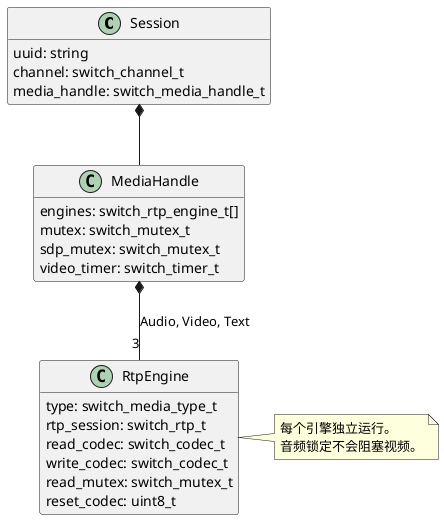
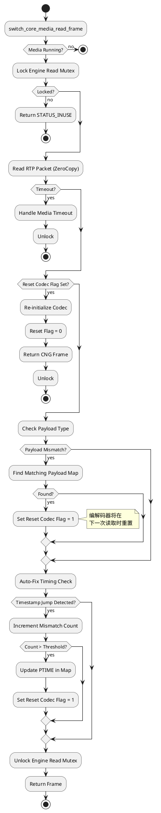

# Media Orchestration

作为 FreeSWITCH 开发者，我们常把媒体层视为黑盒：SDP 进去，RTP 流动，音频出来。但在构建复杂应用（特别是涉及视频、实时文本或不稳定网络）时，理解 FreeSWITCH *如何* 编排这些流至关重要。

在本文中，我们将深入 `src/switch_core_media.c` 的一线。我们将剖析 "Media Handle" (`smh`)——会话媒体的中枢神经系统，并梳理维持通话存活的关键读取循环。

## 指挥家：`switch_media_handle_t`

在 FreeSWITCH 早期，媒体状态有些分散。如今，一切都封装在 `switch_media_handle_t`（代码中常称为 `smh`）中。把 `smh` 想象成乐队指挥。它不演奏乐器（那是 `switch_rtp_engine_t` 的工作），但它告诉它们何时开始、停止以及使用什么乐谱（编解码器）。

当会话建立时，`switch_media_handle_create` 被调用。这是媒体的“大爆炸”时刻。

### 1. 大脑初始化 (`switch_media_handle_create`)

位于 `switch_core_media.c` 约 1991 行，此函数执行几个关键任务：

*   **引擎分配 (Engine Allocation):** 它初始化三个核心引擎：`AUDIO`（音频）、`VIDEO`（视频）和 `TEXT`（文本）。是的，FreeSWITCH 将实时文本 (T.140) 视为与音频和视频并列的一等公民。
*   **SSRC 生成:** 它生成 RTP 的同步源 (SSRC) 标识符。有趣的是，视频 SSRC 通常源自音频 SSRC 时间种子，以确保唯一性但又有所区别。
*   **互斥锁初始化 (Mutex Initialization):** 它设置了一套互斥锁。最重要的是 `read_mutex` 和 `write_mutex` 数组。这是一个关键的架构决策：**FreeSWITCH 允许并行读取音频和视频**。音频线程不会阻塞视频线程。

### 2. 脉搏：`switch_core_media_read_frame`

如果 `smh` 是大脑，那么 `switch_core_media_read_frame`（约 2763 行）就是心跳。会话的 IO 循环重复调用此函数以获取下一个媒体块。

它不仅仅是一个简单的 `recv()` 调用。它是一个复杂的状态机，处理：
1.  **并发 (Concurrency):** 锁定特定引擎的读取互斥锁。
2.  **RTP I/O:** 通过 `switch_rtp_zerocopy_read_frame` 获取原始数据包。
3.  **编解码器状态 (Codec State):** 检测远端是否更改了编解码器（负载类型不匹配）。
4.  **时序启发式 (Timing Heuristics):** 著名的 "Auto-Fix Timing" 逻辑。

## 模拟核心逻辑 (Python)

由于 C 语言可能比较晦涩，让我们用 Python 可视化这些结构和流程。这不是绑定代码，而是对 `switch_core_media.c` 内部发生情况的概念模拟。

### 示例 1: Media Handle 结构

这是 `smh` 及其引擎的结构。注意关注点的分离。

```python
import time
import threading
from enum import Enum

class MediaType(Enum):
    AUDIO = 0
    VIDEO = 1
    TEXT = 2

class RtpEngine:
    def __init__(self, media_type):
        self.type = media_type
        self.rtp_session = None # 实际的 socket 包装器
        self.ssrc = 0
        self.payload_map = {}   # PT -> Codec 映射
        self.cur_payload_map = None
        self.reset_codec = 0    # 触发编解码器重置的标志
        self.read_mutex = threading.Lock()
        self.last_ts = 0
        self.mismatch_count = 0

class MediaHandle:
    def __init__(self, session):
        self.session = session
        self.engines = {}
        self.mutex = threading.Lock()
        
        # 初始化引擎
        for mtype in MediaType:
            self.engines[mtype] = RtpEngine(mtype)
            
    def create(self):
        # 模拟 switch_media_handle_create
        print(f"Initializing Media Handle for Session {self.session.id}")
        
        # 生成 SSRC (简化版)
        self.engines[MediaType.AUDIO].ssrc = int(time.time())
        self.engines[MediaType.VIDEO].ssrc = int(time.time()) + 1000
        
        print(f"Audio SSRC: {self.engines[MediaType.AUDIO].ssrc}")
        print(f"Video SSRC: {self.engines[MediaType.VIDEO].ssrc}")

# 用法
smh = MediaHandle(session={"id": "uuid-1234"})
smh.create()
```

### 示例 2: 读取循环与自动修复时序

`read_frame` 最迷人的部分是它如何处理“糟糕”的音频流。如果发送方声称发送 20ms 的数据包，但每 10ms 发送一次（反之亦然），FreeSWITCH 会尝试检测并修复此问题。

```python
def switch_core_media_read_frame(smh, media_type):
    engine = smh.engines[media_type]
    
    # 1. 锁定: 确保我们是唯一读取此引擎的线程
    if not engine.read_mutex.acquire(blocking=False):
        return "STATUS_INUSE" # 另一个线程正在读取 (例如录音)

    try:
        # 2. 读取: 获取原始 RTP
        frame = engine.rtp_session.read() 
        
        if not frame:
            return "STATUS_FALSE"

        # 3. 编解码器重置逻辑
        # 如果之前的迭代标记了重置，现在执行
        if engine.reset_codec > 0:
            print(f"Resetting {media_type.name} codec...")
            # switch_core_media_set_codec(...)
            engine.reset_codec = 0
            return "CNG" # 重置时返回舒适噪音 (Comfort Noise)

        # 4. 负载检查
        # 电话是否在未通知的情况下从 PCMU (0) 切换到了 PCMA (8)？
        if frame.payload_type != engine.cur_payload_map.pt:
            print(f"Payload mismatch! Got {frame.payload_type}, expected {engine.cur_payload_map.pt}")
            # 搜索新的映射
            new_map = find_payload_map(engine, frame.payload_type)
            if new_map:
                engine.cur_payload_map = new_map
                engine.reset_codec = 1 # 在下一次循环触发重置
            
        # 5. 自动修复时序 (简化版)
        # 检测时间戳是否跳跃异常
        if media_type == MediaType.AUDIO:
            calculated_ptime = (frame.timestamp - engine.last_ts) / 8 # 假设 8khz
            
            if calculated_ptime != engine.cur_payload_map.ptime:
                engine.mismatch_count += 1
                if engine.mismatch_count > 5:
                    print(f"Fixing PTIME: Advertised {engine.cur_payload_map.ptime}, Actual {calculated_ptime}")
                    engine.cur_payload_map.ptime = calculated_ptime
                    engine.reset_codec = 1
            else:
                engine.mismatch_count = 0
                
            engine.last_ts = frame.timestamp

        return frame

    finally:
        engine.read_mutex.release()
```

## 可视化架构

### Media Handle 层级

此图展示了 Session 如何拥有 Media Handle，而 Media Handle 又如何拥有特定的 Engines。这种分离使得 FreeSWITCH 能够清晰地处理多模态通信（例如，带有文本聊天的视频通话）。



### 读取帧流程图

`read_frame` 内部的决策树对于理解延迟和抖动处理至关重要。



## 扩展与最佳实践

### 1. "Codec Flapping" 陷阱
我见过这样的场景：远端端点在两种负载类型之间快速交替。因为 `read_frame` 会在不匹配时设置 `reset_codec = 1`，这会导致 FreeSWITCH 重复拆除并重新初始化编解码器。这非常消耗 CPU。
*   **缓解措施:** 如果你处理的是有缺陷的端点，请确保你的 SDP 协商是严格的（`scrooge` 参数）。

### 2. 互斥锁粒度
每个引擎分离 `read_frame` 是性能上的胜利。在旧系统中，全局媒体锁意味着处理大型视频关键帧可能会导致音频抖动。在 `switch_core_media.c` 中，即使视频线程正在处理巨大的 I 帧，音频线程也可以飞速通过 `read_frame`。

### 3. 抖动缓冲区集成
`read_frame` 函数也是抖动缓冲区 (JB) 挂钩的地方。如果 JB 处于活动状态，`switch_rtp_zerocopy_read_frame` 会从 JB 队列中拉取，而不是直接从套接字拉取。`check_jb_sync` 函数（2459 行）专门尝试基于 FPS 保持音频和视频 JB 对齐，这对于唇形同步至关重要。

## 结论

`switch_core_media.c` 是一个庞然大物，但它组织得很好。通过将状态封装在 `smh` 中并分离引擎，FreeSWITCH 实现了现代高清媒体所需的并行性。理解 `read_frame` 循环——特别是它如何处理负载不匹配和时序异常——是调试那些在 SIP 日志中没有留下痕迹的“怪异音频”问题的关键。