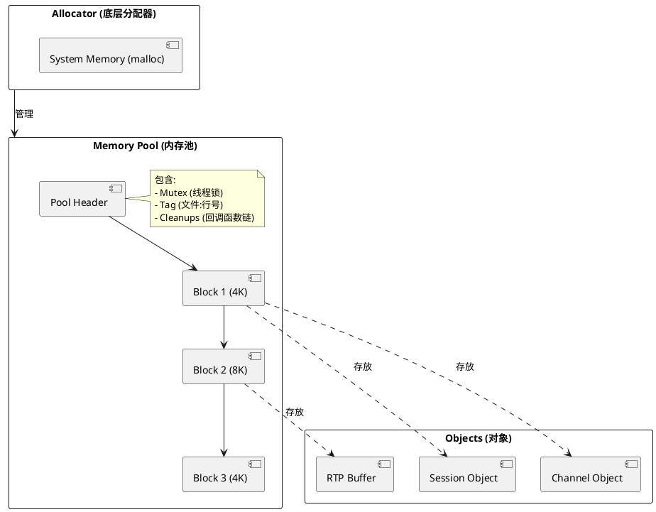
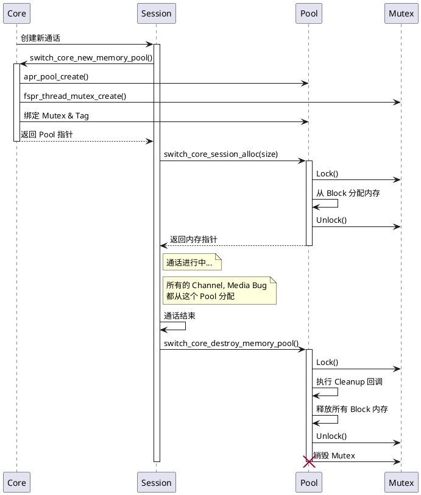

# Memory Management

> **关于作者**：我是 AtomsCat，一名长期在通信领域摸爬滚打的开发者。在 FreeSWITCH 的代码海洋里，我见过太多的 Core Dump 和内存泄漏。今天，我想带大家钻进 FreeSWITCH 的“引擎室”，看看它是如何管理内存的。

## 1. 引言：为什么你的 FreeSWITCH 会崩？

做 C/C++ 开发，最头疼的莫过于内存管理。忘了 `free` 就是泄漏，多 `free` 一次就是 Double Free，用完了还访问就是 Use After Free。在高并发的通信系统中，这些问题会被无限放大。

FreeSWITCH 作为一个高并发软交换，如果每个 Session、每个 Channel 都手动 `malloc/free`，那代码将变得极其脆弱且难以维护。

**FreeSWITCH 的核心解法是：站在巨人的肩膀上（APR 内存池）+ 独特的锁机制。**

本文将通过分析 `src/switch_core_memory.c` 中的核心函数 `switch_core_perform_new_memory_pool`，带你深入理解这套机制。

## 2. 核心逻辑：`switch_core_perform_new_memory_pool`

在 FreeSWITCH 中，你几乎看不到直接的 `malloc`。所有的内存分配都发生在“内存池（Memory Pool）”中。

### 2.1 概念：APR 内存池 (APR Pools)

FreeSWITCH 底层依赖 APR (Apache Portable Runtime) 库。APR 内存池的核心思想是：**按业务生命周期管理内存**。

*   **层级结构**：内存池是树状的。销毁父节点，所有子节点自动销毁。
*   **统一释放**：你只需要在池子里“申请”内存，不需要“释放”单个对象。当 Session 结束时，销毁整个池子，所有相关的内存瞬间释放。

### 2.2 机制：每个池子一把锁 (Per-Pool Mutex)

这是 FreeSWITCH 对 APR 的重要增强。在 `switch_core_perform_new_memory_pool` 函数中，我们可以看到如下逻辑（简化版）：

1.  **创建分配器 (Allocator)**：这是内存分配的底层对象 (`fspr_allocator_create`)。
2.  **创建池子 (Pool)**：基于分配器创建 (`fspr_pool_create_ex`)。
3.  **创建互斥锁 (Mutex)**：`fspr_thread_mutex_create` 创建一个嵌套锁。
4.  **绑定锁**：将这把锁绑定到分配器和池子上 (`fspr_pool_mutex_set`)。

**为什么要这样做？**
APR 默认的内存池在多线程下是不安全的（或者需要全局锁）。FreeSWITCH 为**每个**内存池创建了一把独立的锁。这意味着：
*   Session A 的内存操作不会阻塞 Session B。
*   极大地提高了并发性能。

### 2.3 调试：给池子打标签 (Tagging)

代码中还有一行不起眼但极重要的逻辑：

```c
tmp = switch_core_sprintf(*pool, "%s:%d", file, line);
fspr_pool_tag(*pool, tmp);
```

它把创建池子的**文件名和行号**作为标签打在了池子上。当你遇到内存泄漏，打印出所有未释放的池子时，一眼就能看出是哪里创建的池子没被回收。

## 3. 代码模拟 (Python)

为了让大家更直观地理解 C 语言的实现，我用 Python 模拟了这套机制。

### 3.1 痛苦的根源：朴素的内存管理

如果没有内存池，我们需要手动管理每个对象：

```python
class NaiveObject:
    def __init__(self, name):
        self.name = name
        print(f"Allocated {self.name}")

    def close(self):
        print(f"Freed {self.name}")

# 开发者必须记得手动释放
obj1 = NaiveObject("Session A")
obj2 = NaiveObject("Channel 1")
# ... 假如这里抛出了异常，或者逻辑复杂 ...
obj1.close()
# 哎呀，忘了 obj2.close() -> 内存泄漏！
```

### 3.2 救星：模拟 APR 内存池

我们创建一个 `MemoryPool` 类，它自动管理注册在其中的对象。

```python
import threading

class MemoryPool:
    def __init__(self, tag):
        self.tag = tag
        self.allocations = []
        self.children = []
        # 模拟 Per-Pool Mutex
        self.mutex = threading.Lock()
        print(f"[{self.tag}] Pool Created")

    def alloc(self, obj):
        """模拟从池中分配内存"""
        with self.mutex: # 线程安全
            self.allocations.append(obj)
            print(f"[{self.tag}] Allocated object")
            return obj

    def create_sub_pool(self, sub_tag):
        """模拟层级结构"""
        with self.mutex:
            sub_pool = MemoryPool(f"{self.tag}/{sub_tag}")
            self.children.append(sub_pool)
            return sub_pool

    def destroy(self):
        """销毁池子：先销毁子池，再销毁对象"""
        with self.mutex:
            print(f"[{self.tag}] Destroying pool...")
            # 1. 递归销毁子池
            for child in self.children:
                child.destroy()
            self.children.clear()
            
            # 2. 释放本池内存
            for obj in self.allocations:
                # 假设 obj 有个 close 方法模拟释放
                if hasattr(obj, 'close'):
                    obj.close()
            self.allocations.clear()
            print(f"[{self.tag}] Pool Destroyed")

# 使用示例
root_pool = MemoryPool("Core")
session_pool = root_pool.create_sub_pool("Session-UUID-1234")

# 在 Session 池中分配对象
db_conn = session_pool.alloc(NaiveObject("DB Connection"))
media_buffer = session_pool.alloc(NaiveObject("RTP Buffer"))

# Session 结束，只需要销毁 Session 池
# 所有的对象（DB连接、Buffer）都会被自动释放
session_pool.destroy()

# Root 池还在
```

### 3.3 调试神器：Tagging 模拟

在 FreeSWITCH 中，`switch_core_new_memory_pool` 是一个宏，它会自动传入 `__FILE__` 和 `__LINE__`。

```python
import inspect

def new_memory_pool():
    # 获取调用者的栈帧，模拟 __FILE__ 和 __LINE__
    frame = inspect.currentframe().f_back
    filename = frame.f_code.co_filename
    lineno = frame.f_lineno
    
    tag = f"{filename}:{lineno}"
    return MemoryPool(tag)

def some_business_logic():
    # 这里的 pool 会自动带上 "script.py:88" 这样的标签
    pool = new_memory_pool() 
    return pool
```

## 4. 架构可视化

### 4.1 内存池结构



### 4.2 Session 池的生命周期



## 5. 扩展话题 (Extensions)

除了基础的内存池管理，FreeSWITCH 还有一些高级机制值得注意。

### 5.1 内存池回收 (Pool Recycling)

在 `switch_core_memory.c` 中，你会看到 `pool_recycle_queue` 相关的代码。这是一个可选特性（通过 `SWITCH_POOL_RECYCLE` 宏控制）。
*   **默认行为**：FreeSWITCH 默认**不开启**回收。每次创建池子都向系统申请新的内存，销毁时归还给系统。这是为了保证 `PER_POOL_LOCK` 的独立性和安全性。
*   **回收模式**：如果开启回收，销毁的池子会被放入队列，下次创建时直接复用。这能减少系统调用的开销，但增加了锁管理的复杂性。

### 5.2 永久内存 (Permanent Alloc)

并非所有内存都随 Session 销毁。对于全局配置、模块加载等长生命周期对象，FreeSWITCH 提供了 `switch_core_perform_permanent_alloc`。
*   这些内存分配在 `memory_manager.memory_pool`（全局核心池）中。
*   **注意**：这些内存直到 FreeSWITCH 进程退出才会被释放。滥用会导致进程内存持续增长。

## 6. 最佳实践与避坑指南

作为开发者，在编写 FreeSWITCH 模块时，请务必遵守以下规则：

1.  **永远不要直接使用 `malloc/free`**：除非你非常清楚自己在做什么，并且这块内存的生命周期不属于任何 Session。
2.  **优先使用 Session Pool**：如果你在处理一个通话，使用 `switch_core_session_alloc(session, size)`。这样你永远不用担心内存泄漏，通话挂断，内存自清。
3.  **不要手动销毁 Session Pool**：Session 的状态机（State Machine）会负责销毁它。你手动销毁会导致 Use After Free 崩溃。
4.  **利用 Tag 查泄漏**：开启 `DEBUG_ALLOC` 宏或使用 `switch_core_memory_pool_tag` 自定义标签，在排查内存暴涨时，通过 `show memory` (如果支持) 或 GDB 查看池子标签是救命稻草。

## 7. 总结

FreeSWITCH 的内存管理不仅仅是简单的 `malloc` 封装。它通过 **APR 内存池** 解决了内存碎片和生命周期管理问题，通过 **Per-Pool Mutex** 解决了高并发下的锁竞争问题，又通过 **Tagging** 机制提供了调试便利。

理解了 `switch_core_perform_new_memory_pool`，你就理解了 FreeSWITCH 稳定运行的基石。下次写模块时，记得：**Trust the Pool**。