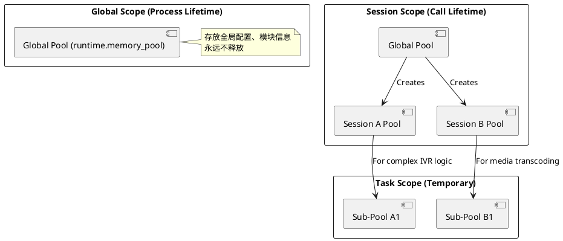

# FreeSWITCH 源码分析：内存管理 (Memory Management)

**Author:** AtomsCat  
**Date:** 2025-01-21  
**Tags:** FreeSWITCH, C, Memory Management, APR, Performance

---

## 1. 引言：内存泄漏是 VoIP 的噩梦

做过 C/C++ 后端开发的都知道，内存管理是万恶之源。特别是在 VoIP 领域，一个长连接（Long-running）的服务器，哪怕每个通话只泄漏 1KB 内存，在高并发（CPS 100+）和长时间运行（Uptime > 30 days）的场景下，也足以导致 OOM (Out of Memory) 甚至 Crash。

FreeSWITCH (FS) 作为一款工业级的软交换引擎，它的稳定性有目共睹。你很少在 FS 的代码里看到满屏的 `malloc` 和 `free`。取而代之的，是无处不在的 **Pool（内存池）**。

FS 的内存管理构建在 **APR (Apache Portable Runtime)** 的内存池之上，但它不仅仅是简单的封装，还引入了一套独特的 **回收机制 (Recycling Mechanism)**。

为什么这么做？
1.  **性能 (Performance):** 也就是 Arena Allocation。一次性向 OS 申请一大块内存，然后在内部切分。避免了频繁的 `malloc/free` 系统调用带来的上下文切换开销。
2.  **安全 (Safety):** 也就是 Bulk Cleanup。你不需要记住释放每一个指针。当一个 Session 结束时，直接销毁整个 Pool，所有关联的内存瞬间释放。

---

## 2. 核心逻辑一：Pool 的森林 (The Forest of Pools)

很多初学者以为 FS 只有一个全局的内存池，这是错误的。FS 的内存模型是一个 **"Forest of Pools"（池的森林）**。

### 2.1 层级结构

1.  **Global Pool (`runtime.memory_pool`):**
    *   **生命周期:** 与 FS 进程同生共死。
    *   **用途:** 存放全局配置、模块加载信息、核心结构体。
    *   **注意:** 这里的内存 **永远不会释放**，直到进程退出。往这里塞东西要极其小心。

2.  **Session Pool (`session->pool`):**
    *   **生命周期:** 伴随一次通话（Call）的开始与结束。
    *   **用途:** 存放 Channel 变量、媒体数据缓冲区、协议栈状态。
    *   **机制:** 当通话挂断 (`BYE`)，Session 销毁，这个 Pool 被整体回收。

3.  **Sub-Pools (子池):**
    *   **生命周期:** 灵活控制，通常用于 Session 内部的某个临时复杂任务（比如一次复杂的 IVR 菜单解析）。
    *   **用途:** 任务做完即焚，不占用 Session 的长期内存。

### 2.2 结构图解



---

## 3. 核心逻辑二：回收机制 (The Recycling Mechanism)

在 `src/switch_core_memory.c` 中，FS 实现了一套比标准 APR 更激进的回收策略。

### 3.1 并不是真的 "Free"

当你看到 `switch_core_perform_destroy_memory_pool` 时，你以为它把内存还给了操作系统？**错。**

FS 维护了一个 **回收队列 (`pool_recycle_queue`)** 和一个 **后台线程 (`pool_thread`)**。

1.  **申请时 (`new_memory_pool`):**
    *   FS 首先检查 `pool_recycle_queue` 里有没有现成的空闲 Pool。
    *   如果有，直接拿来用（Reset 指针即可）。
    *   如果没有，才向 OS 申请新的内存块。

2.  **销毁时 (`destroy_memory_pool`):**
    *   Pool 不会被立即 `free`。
    *   它被推入 `pool_queue`。
    *   后台的 `pool_thread` 会异步地清理这个 Pool 的内容（`apr_pool_clear`），然后把它扔进 `pool_recycle_queue` 供下次使用。

### 3.2 代码佐证

让我们看看 `src/switch_core_memory.c` 的关键片段：

```c
// 申请 Pool
SWITCH_DECLARE(switch_status_t) switch_core_perform_new_memory_pool(...) {
    // 尝试从回收队列获取
    if (switch_queue_trypop(memory_manager.pool_recycle_queue, &pop) == SWITCH_STATUS_SUCCESS && pop) {
        *pool = (switch_memory_pool_t *) pop;
    } else {
        // 队列空了，才真正创建新的 APR Pool
        apr_pool_create(...);
    }
}
```

**Benefit:** 在高并发场景下（例如每秒 500 个呼叫建立与释放），这种机制极大地减少了 `mmap` 和 `sbrk` 系统调用的频率，降低了内核态的开销，让 CPU 能跑更多的业务逻辑。

---

## 4. 工程实践：避坑指南 (The "Meat")

理解了原理，我们来看看在开发 FreeSWITCH 模块（C/C++）或脚本（Lua/Python）时，如何避免踩坑。

### 4.1 核心心智模型：沙盒 (The Sandbox)

把内存池想象成一个 **沙盒**。
*   你需要沙子（内存）时，直接从大桶里铲。
*   你不需要一粒一粒地把沙子捡回去。
*   游戏结束（Session End）时，直接把整个沙盒倒掉。

### 4.2 经典陷阱

#### Pitfall 1: The Global Leak (全局泄漏)
最常见的错误是在处理 Session 逻辑时，使用了 Global Pool 分配内存。

*   **错误姿势:** `switch_core_alloc(runtime.memory_pool, size)` 用于 Session 数据。
*   **后果:** 每次通话结束，这块内存都不会释放。运行一周后，服务器内存耗尽。

#### Pitfall 2: The Long-Running Session (长连接泄漏)
考虑一个持续 24 小时的电话会议。如果你一直在 `session->pool` 上分配临时字符串或小对象，而不使用 Sub-Pool。

*   **现象:** 虽然 Session 结束会释放，但在 24 小时内，内存占用会持续上涨，直到 OOM。
*   **解法:** 对于长连接中的临时操作（如处理一次 HTTP 请求），使用 `switch_core_new_memory_pool` 创建临时池，用完即毁。

### 4.3 Python 伪代码演示

虽然 FS 核心是 C，但用 Python 伪代码更能直观展示这种 **Scope（作用域）** 的概念。

**Example 1: 正确用法 (Session Scope)**

```python
class SessionHandler:
    def on_call_start(self, session):
        # 1. 从 Session 的 Pool 中分配内存
        # 当 session 挂断时，user_data 会自动消失
        user_data = session.pool.alloc(1024) 
        user_data.write("Caller ID: 1001")
        
        # 2. 业务逻辑...
        pass

    def on_call_end(self, session):
        # 不需要手动 free(user_data)
        # Session Pool 销毁会自动带走它
        pass
```

**Example 2: 错误用法 (Global Scope Leak)**

```python
# 全局列表 (模拟 Global Pool)
global_cache = []

class SessionHandler:
    def on_call_start(self, session):
        # 错误！将 Session 级的数据放到了全局生命周期中
        # 即使电话挂断，这个 append 的数据依然存在
        global_cache.append({
            "uuid": session.uuid,
            "timestamp": now()
        })
        
    def on_call_end(self, session):
        # 如果忘记在这里 remove，就是典型的内存泄漏
        pass
```

---

## 5. 总结

FreeSWITCH 的内存管理哲学是 **"为并发而生，为稳定而活"**。

1.  **Forest of Pools:** 清晰的生命周期隔离（Global vs Session）。
2.  **Recycling:** 极致的性能优化，减少系统调用。

作为开发者，只要你遵循 **"谁的生命周期，就用谁的 Pool"** 这一原则，FreeSWITCH 就能像磐石一样稳定运行。不要试图去 fight 这个模型，去拥抱它。