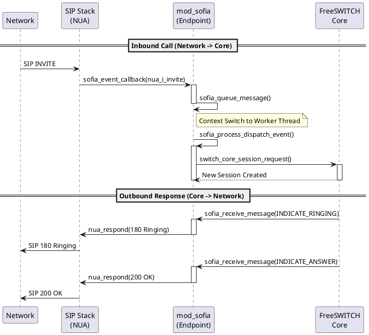

# Message Handling

在 FreeSWITCH 的世界里，存在着两个截然不同的“平行宇宙”：
1.  **抽象核心层 (Core Layer)**：这里讲的是“通用语言”。它只知道“振铃”、“应答”、“挂断”，而不关心你是用 SIP、H.323 还是 WebRTC 实现的。
2.  **具体协议层 (Protocol Layer)**：这里讲的是“方言”。对于 `mod_sofia` 来说，就是 SIP 协议的 `INVITE`、`200 OK`、`BYE`。

`mod_sofia` 的核心职责之一，就是充当这两个世界之间的**翻译官**和**调度员**。本文将深入剖析这一机制的实现。

## 1. 核心逻辑：双向流动的“翻译”

消息处理是双向的，我们需要分别看“从核心到网络”和“从网络到核心”这两条路径。

### 1.1 Core -> Network: 翻译官 (`sofia_receive_message`)

当 FreeSWITCH 核心决定要“振铃”或“挂断”时，它会向 Endpoint 发送一个通用的 `switch_core_session_message_t` 消息。`mod_sofia` 通过 `sofia_receive_message` 函数接收这些消息，并将它们“翻译”成 SIP 协议的操作。

*   **文件位置**: `src/mod/endpoints/mod_sofia/mod_sofia.c`
*   **关键函数**: `sofia_receive_message`

```c
// 伪代码逻辑展示
switch_status_t sofia_receive_message(switch_core_session_t *session, switch_core_session_message_t *msg) {
    // 获取私有数据
    private_object_t *tech_pvt = switch_core_session_get_private(session);

    switch (msg->message_id) {
        case SWITCH_MESSAGE_INDICATE_RINGING:
            // 核心说：振铃 -> 翻译为 SIP 180 Ringing
            nua_respond(tech_pvt->nh, SIP_180_RINGING, TAG_END());
            break;

        case SWITCH_MESSAGE_INDICATE_ANSWER:
            // 核心说：应答 -> 翻译为 SIP 200 OK
            nua_respond(tech_pvt->nh, SIP_200_OK, TAG_END());
            break;

        case SWITCH_MESSAGE_INDICATE_HANGUP:
            // 核心说：挂断 -> 翻译为 SIP BYE
            nua_bye(tech_pvt->nh, TAG_END());
            break;
            
        // ... 处理几十种其他消息 ...
    }
}
```

**设计洞察**：这种 Switch-Case 结构虽然看起来简单粗暴，但它极其有效地隔离了关注点。核心层不需要知道 SIP 的状态机，只需要发送意图（Intent）。

### 1.2 Network -> Core: 调度员 (`sofia_event_callback`)

当网络侧收到 SIP 数据包时，Sofia-SIP 协议栈会触发回调。这里的处理流程比发送方向更复杂，因为它涉及到了**线程模型的切换**。

SIP 栈的回调通常在协议栈的线程中运行，为了不阻塞协议栈处理其他数据包，`mod_sofia` 采用了“**入队-处理**”的异步模型。

*   **文件位置**: `src/mod/endpoints/mod_sofia/sofia.c`
*   **入口函数**: `sofia_event_callback` (协议栈回调)
*   **处理函数**: `our_sofia_event_callback` (业务逻辑处理)

**处理流程：**

1.  **接收 (Receive)**: `sofia_event_callback` 被调用。
2.  **打包 (Pack)**: 将事件参数打包成 `sofia_dispatch_event_t` 结构。
3.  **入队 (Queue)**: 调用 `sofia_queue_message` 将事件推入 `msg_queue`。
4.  **消费 (Consume)**: `sofia_msg_thread_run` 线程循环从队列取出事件。
5.  **分发 (Dispatch)**: 调用 `our_sofia_event_callback` 进行实际处理。

```c
// src/mod/endpoints/mod_sofia/sofia.c

// 实际的业务逻辑处理
static void our_sofia_event_callback(...) {
    switch (event) {
        case nua_i_invite:
            // 收到 INVITE -> 请求核心创建新 Session
            // 这是呼叫进入 FreeSWITCH 的第一步
            session = switch_core_session_request(sofia_endpoint_interface, ...);
            sofia_glue_new_pvt(session); // 创建私有数据
            break;

        case nua_i_bye:
            // 收到 BYE -> 通知核心挂断
            switch_channel_hangup(channel, SWITCH_CAUSE_NORMAL_CLEARING);
            break;
            
        case nua_r_ok: // 收到 200 OK
            // 对方应答了 -> 通知核心
            sofia_set_flag(tech_pvt, TFLAG_ANS);
            break;
    }
}
```

## 2. Python 仿真：理解翻译循环

为了更直观地理解这个过程，我们编写了一个 Python 脚本来模拟这个“翻译”和“分发”的循环。

```python
import queue
import threading
from enum import Enum, auto

# --- 定义两个世界的语言 ---
class SwitchMessage(Enum): # 核心语言
    INDICATE_RINGING = auto()
    INDICATE_ANSWER = auto()

class NuaEvent(Enum): # SIP 语言
    nua_i_invite = auto()
    nua_r_ok = auto()

# --- 翻译官与调度员 ---
class ModSofia:
    def __init__(self):
        self.event_queue = queue.Queue()
        # 启动工作线程处理网络事件
        threading.Thread(target=self.dispatch_loop, daemon=True).start()

    # Core -> Network (翻译)
    def receive_message(self, msg_type):
        print(f"[Core->SIP] Translating {msg_type.name}...")
        if msg_type == SwitchMessage.INDICATE_RINGING:
            print("   -> Calling nua_respond(180 Ringing)")

    # Network -> Core (入队)
    def on_sip_event(self, event_type):
        print(f"[Network->Core] Received {event_type.name}, queuing...")
        self.event_queue.put(event_type)

    # Worker Thread (分发)
    def dispatch_loop(self):
        while True:
            event = self.event_queue.get()
            self.process_event(event)

    def process_event(self, event):
        print(f"   [Worker] Processing {event.name}...")
        if event == NuaEvent.nua_i_invite:
            print("   -> Creating new FreeSWITCH Session")

# --- 运行模拟 ---
mod = ModSofia()
# 模拟网络事件
mod.on_sip_event(NuaEvent.nua_i_invite)
# 模拟核心消息
mod.receive_message(SwitchMessage.INDICATE_RINGING)
```

## 3. 流程可视化 (Sequence Diagram)

下面的时序图展示了一个典型的呼叫建立过程中，消息如何在 Core 和 SIP Stack 之间流转。



## 4. 关键细节与“坑” (Gotchas)

在分析源码时，有几个细节值得特别注意：

1.  **`sofia_mutex` (死锁之源)**:
    *   `mod_sofia` 极其依赖 `tech_pvt->sofia_mutex` 来保护会话状态。
    *   **Gotcha**: 在回调函数中，千万不要在持有锁的情况下调用可能阻塞或回调回来的核心函数，这曾是早期版本死锁的主要原因。

2.  **Glare (竞争条件)**:
    *   当两端同时发起 Re-INVITE 时，会发生 Glare。`mod_sofia` 需要处理 `491 Request Pending`，这在 `sofia_handle_sip_i_invite` 中有专门的逻辑。

3.  **队列溢出**:
    *   `sofia_event_callback` 中有一个检查：`if (switch_queue_size(...) > critical)`。如果处理线程太慢（比如数据库查询卡住），队列满了，新的 SIP 消息会被直接丢弃或拒绝（503 Service Unavailable）。这就是为什么**绝对不能在 SIP 处理线程中做耗时操作**。

## 5. 扩展场景 (Extensions)

除了基本的呼叫控制，`mod_sofia` 的消息处理机制还支持多种扩展场景，开发者经常需要利用这些特性来实现业务逻辑。

### 5.1 自定义 SIP 头域 (Custom Headers)

在 `Core -> Network` 的方向上，我们经常需要添加自定义的 SIP 头域（例如 `X-Call-ID`）。`mod_sofia` 会在处理 `SWITCH_MESSAGE_INDICATE_RINGING` 或 `ANSWER` 时，检查 Channel 的变量。

*   **机制**: 遍历所有以 `sip_h_` 开头的变量。
*   **实现**: 在 `sofia_receive_message` 内部，会调用 `sofia_glue_set_extra_headers`，将这些变量转化为 SIP Header 添加到响应中。

### 5.2 SIP MESSAGE (即时消息)

对于 SIP `MESSAGE` 请求（通常用于短信或聊天），处理流程略有不同。它不一定关联到一个活跃的 Session（通话）。

*   **Chat Plan**: 接收到的 `MESSAGE` 会触发 `chat` 类型的事件，并进入 `chatplan` 进行路由，而不是标准的 `dialplan`。
*   **事件**: `SWITCH_EVENT_CUSTOM` (subclass: `sofia::info`)。

## 6. 总结

`mod_sofia` 的消息处理机制是 FreeSWITCH 高并发能力的基石。它通过：
1.  **抽象化**：将复杂的 SIP 状态机隐藏在简单的 Core 消息接口之后。
2.  **异步化**：通过队列机制，将协议栈的高速 I/O 与业务逻辑的复杂处理解耦。

理解了这一层，你就理解了 FreeSWITCH 如何在保持核心纯净的同时，驾驭复杂的通信协议。