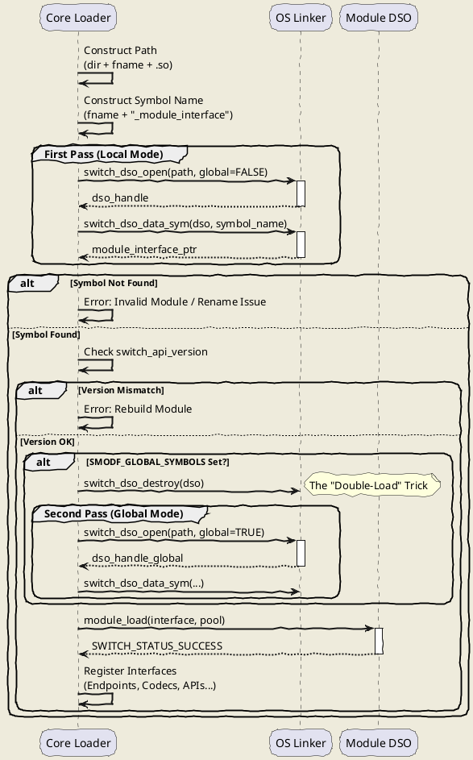
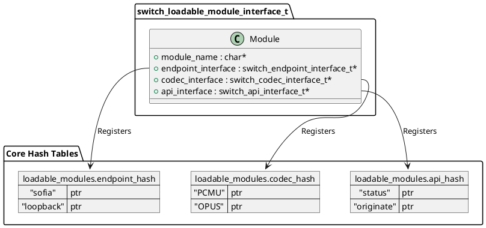

# Module Loading

FreeSWITCH 的模块化架构是其强大生命力的源泉。其核心（Core）保持精简，而绝大部分业务功能——从 SIP 协议栈 (`mod_sofia`) 到音频编解码 (`mod_opus`)，再到 Lua 脚本支持 (`mod_lua`)——都是通过**动态链接库 (DSO)** 加载的。

这种设计赋予了系统极高的灵活性，但也给深入定制带来了挑战。当你试图编写私有模块，或者在版本升级时遭遇 "Symbol not found"、"Module load routine returned an error" 时，理解底层的加载机制至关重要。

本文将深入 `switch_loadable_module.c` 的核心逻辑，剖析 `switch_loadable_module_load_module_ex` 函数，揭示 FreeSWITCH 是如何将一个 `.so` 或 `.dll` 文件转化为系统原生能力的。

## 核心逻辑：从文件到功能

FreeSWITCH 的模块加载机制建立在操作系统 DSO 技术之上，但引入了一套严格的**约定（Convention）**和**二次加载（Double-Load）**机制。

### 1. 约定优于配置：符号命名

FreeSWITCH 不依赖复杂的 Manifest 文件或注解来寻找入口点，而是使用基于文件名的**符号命名约定**。

当加载器处理 `mod_example.so` 时，它会根据文件名构造一个特定的符号名来寻找模块接口结构体 (`switch_loadable_module_interface_t`)。

在 `src/switch_loadable_module.c` 中，逻辑如下：

```c
// 伪代码逻辑
// filename = "mod_example"
struct_name = switch_core_sprintf(pool, "%s_module_interface", filename);
// 结果: "mod_example_module_interface"
```

**关键点：** 这意味着文件名与代码中的符号名必须严格匹配。如果你将 `mod_example.so` 重命名为 `mod_test.so`，加载器会去寻找 `mod_test_module_interface`。如果你的 C 代码中定义的仍然是 `mod_example_module_interface`，加载将直接失败。这是新手开发模块时最常见的陷阱。

### 2. "Double-Load" 机制：全局符号的黑魔法

这是 FreeSWITCH 模块加载中最具技术含量的部分。

通常，`dlopen` (Linux) 或 `LoadLibrary` (Windows) 只需调用一次。但 FreeSWITCH 的某些核心模块（如 `mod_spandsp`, `mod_sofia`）需要向其他模块导出 API，这就要求它们的符号必须在全局范围内可见（`RTLD_GLOBAL`）。

为了兼顾安全性和灵活性，FreeSWITCH 采用了一种“试探性加载”策略：

1.  **初次加载 (Local Mode)**: 使用默认标志打开 DSO。
2.  **检查接口**: 读取模块接口结构体。
3.  **判断标志**: 检查 `flags` 是否包含 `SMODF_GLOBAL_SYMBOLS`。
4.  **二次加载 (Global Mode)**: 如果包含该标志，**关闭**当前 DSO 句柄，然后使用全局符号标志（`RTLD_GLOBAL`）**重新打开**它。

代码片段佐证：

```c
// src/switch_loadable_module.c
if (!load_global && interface_struct_handle && switch_test_flag(interface_struct_handle, SMODF_GLOBAL_SYMBOLS)) {
    load_global = SWITCH_TRUE;
    switch_dso_destroy(&dso); // 销毁局部句柄
    interface_struct_handle = NULL;
    dso = switch_dso_open(path, load_global, &derr); // 全局模式重载
    // ... 重新获取符号 ...
}
```

### 3. 安全气囊：ABI 版本检查

为了防止二进制不兼容导致的内存崩溃（Segfault），加载器会严格检查 `SWITCH_API_VERSION`。

```c
if (interface_struct_handle->switch_api_version != SWITCH_API_VERSION) {
    // 拒绝加载，防止核心崩溃
    err = "Trying to load an out of date module, please rebuild the module.";
}
```

## 代码模拟 (Python)

为了更直观地理解这一过程，我们使用 Python 模拟核心加载器的行为。注意观察 `Double-Load` 的触发逻辑。

### 示例 1: 模拟模块接口与 DSO

```python
from typing import Optional, Callable

# 模拟 FreeSWITCH 当前的 API 版本
CURRENT_API_VERSION = 5
# 模拟全局符号标志位
SMODF_GLOBAL_SYMBOLS = (1 << 0)

class ModuleInterface:
    """模拟 C 语言中的 switch_loadable_module_interface_t"""
    def __init__(self, name: str, api_version: int, flags: int = 0):
        self.module_name = name
        self.switch_api_version = api_version
        self.flags = flags
        self.load_func = self.default_load

    def default_load(self) -> str:
        print(f"   [{self.module_name}] >> Initializing module runtime...")
        return "SWITCH_STATUS_SUCCESS"

class MockDSO:
    """模拟操作系统的动态链接库行为"""
    def __init__(self, filename: str, global_mode: bool = False):
        self.filename = filename
        self.global_mode = global_mode
        mode_str = "RTLD_GLOBAL" if global_mode else "RTLD_LOCAL"
        print(f"-> OS: dlopen({filename}, {mode_str})")

    def get_symbol(self, symbol_name: str) -> Optional[ModuleInterface]:
        # 模拟符号查找规则：符号名必须匹配文件名
        expected_symbol = f"{self.filename}_module_interface"
        
        if symbol_name != expected_symbol:
            return None

        # 根据文件名返回不同的模拟接口
        if self.filename == "mod_global_lib":
            return ModuleInterface("mod_global_lib", CURRENT_API_VERSION, SMODF_GLOBAL_SYMBOLS)
        elif self.filename == "mod_legacy":
            return ModuleInterface("mod_legacy", CURRENT_API_VERSION - 1) # 版本过旧
        else:
            return ModuleInterface(self.filename, CURRENT_API_VERSION)

    def close(self):
        print(f"<- OS: dlclose({self.filename})")
```

### 示例 2: 加载器核心逻辑

```python
def load_module(filename: str):
    print(f"\n=== Core: Loading Module [{filename}] ===")
    
    # 1. 构造符号名 (Convention)
    symbol_name = f"{filename}_module_interface"
    
    # 2. 第一次打开 (Local Mode)
    dso = MockDSO(filename, global_mode=False)
    interface = dso.get_symbol(symbol_name)
    
    if not interface:
        print("Error: Symbol not found! Filename/Symbol mismatch.")
        dso.close()
        return

    # 3. ABI 版本检查
    if interface.switch_api_version != CURRENT_API_VERSION:
        print(f"Error: Version mismatch! Core={CURRENT_API_VERSION}, Module={interface.switch_api_version}")
        dso.close()
        return

    # 4. Double-Load Check
    if (interface.flags & SMODF_GLOBAL_SYMBOLS):
        print("Info: Module requests GLOBAL SYMBOLS. Triggering reload...")
        dso.close() # 关闭旧句柄
        dso = MockDSO(filename, global_mode=True) # 全局模式重开
        # 重新获取接口指针 (地址可能变化)
        interface = dso.get_symbol(symbol_name)

    # 5. 执行模块的 Load 函数
    status = interface.load_func()
    print(f"Result: {status}")

# --- 测试场景 ---
if __name__ == "__main__":
    load_module("mod_normal")      # 正常加载
    load_module("mod_global_lib")  # 触发 Double-Load
    load_module("mod_legacy")      # 触发版本检查失败
```

## 流程可视化

### 模块加载时序图

下面的时序图清晰地展示了 `switch_loadable_module_load_file` 的完整生命周期，包括二次加载的分支。



### 接口注册层级

加载成功仅仅是开始，模块随后会将具体的功能实现注册到 Core 的哈希表中。



## 扩展思考与最佳实践

### 1. 文件重命名的代价
如前所述，符号名与文件名强绑定。如果你必须重命名模块文件（例如为了版本管理 `mod_sofia_v2.so`），你必须同时修改源文件中的 `SWITCH_MODULE_DEFINITION` 宏并重新编译。**不要直接修改文件名。**

### 2. 启动性能优化
模块加载是串行的。虽然单个模块加载很快，但加载数百个模块会显著拖慢启动速度。
**建议：** 审查 `modules.conf.xml`，注释掉所有未使用的模块。这不仅能加快启动速度，还能减少内存占用和潜在的安全攻击面。

### 3. "Fail Fast" 架构：Critical 模块
在 `switch_loadable_module_init` 中，FreeSWITCH 允许将模块标记为 `critical`。

```xml
<!-- modules.conf.xml -->
<load module="mod_sofia" critical="true"/>
```

如果 `mod_sofia` 加载失败，FreeSWITCH 进程将直接 `abort()`。这是一种防御性编程的最佳实践：如果核心通信能力缺失，让进程“带病运行”往往比直接崩溃更危险（可能导致无法接通却无报警）。让进程崩溃并由守护进程（systemd/supervisord）捕获并重启，是更可靠的恢复策略。

## 总结

FreeSWITCH 的模块加载机制展示了 C 语言工程的精妙之处。通过**约定优于配置**简化开发，通过**动态升级**（Double-Load）支持复杂依赖，再通过**严格的 ABI 检查**保障稳定性。

理解这些底层机制，能让你在开发自定义模块或排查加载故障时，拥有透视代码的“X光眼”。