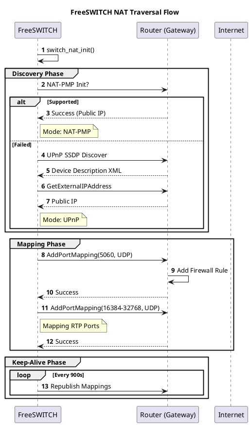

# NAT Mapping

## 1. 开篇：VoIP 的头号公敌

如果说网络延迟是 VoIP 的隐形杀手，那么 **NAT (Network Address Translation)** 就是挡在门口的拦路虎。

你是否经历过：
*   电话接通了，但听不到声音（单通）？
*   分机注册上了，但过一会儿就掉线？
*   外网呼入死活进不来？

这些问题的根源，90% 都指向同一个凶手——NAT。

为了解决这个问题，FreeSWITCH 内置了一套自动穿透机制。它试图通过 UPnP 或 NAT-PMP 协议，自动跟你的路由器“谈判”，让路由器把端口映射打开。

今天，我们深入 `src/switch_nat.c`，看看 FreeSWITCH 是如何在这个充满敌意的网络环境中，为自己打通一条生路的。

**核心观点：FreeSWITCH 的 NAT 模块是一个自动化的端口映射机器人。它利用 UPnP/NAT-PMP 协议，试图将内网的 SIP/RTP 端口暴露给公网，从而解决单通问题。**

---

## 2. 正文解析：自动打洞的艺术

### 2.1 核心原理：UPnP 与 NAT-PMP

FreeSWITCH 的 NAT 模块并不依赖 STUN/TURN（那是 ICE 的事），它主要依赖两种局域网协议：

1.  **UPnP (Universal Plug and Play)**：基于 XML/SOAP，广泛用于家用路由器。
2.  **NAT-PMP (NAT Port Mapping Protocol)**：苹果提出的协议，基于二进制，更简单高效。

在 `switch_nat_init` 函数中，FreeSWITCH 会按顺序尝试：
1.  先试 **NAT-PMP** (`init_pmp`)。
2.  如果失败，再试 **UPnP** (`init_upnp`)。

一旦发现支持的网关，它就会做两件事：
1.  **获取公网 IP**：通过协议查询路由器的 WAN 口 IP。
2.  **添加映射**：调用 `switch_nat_add_mapping`，告诉路由器：“请把公网的 5060 端口转发给我的 5060 端口”。

### 2.2 源码实锤：它是如何“谈判”的？

在 `src/switch_nat.c` 中，`switch_nat_add_mapping_upnp` 函数揭示了真相：

```c
// 构造一个 SOAP 请求，调用路由器的 AddPortMapping 方法
r = UPNP_AddPortMapping(
    nat_globals.urls.controlURL, 
    nat_globals.data.servicetype, 
    port_str,       // 公网端口
    port_str,       // 内网端口
    nat_globals.pvt_addr, // 内网 IP
    "FreeSWITCH",   // 描述
    "UDP",          // 协议
    0               // 租期 (0表示永久，但通常路由器会忽略)
);
```

这本质上就是一个 HTTP POST 请求。如果你的路由器开启了 UPnP 功能，它就会乖乖执行这条命令。

### 2.3 Python 模拟：假装自己是 FreeSWITCH

为了让你看清这个过程，我写了一个 Python 脚本，模拟 FreeSWITCH 向路由器发送 UPnP 映射请求。

#### 示例代码：UPnP 端口映射模拟器

```python
import socket
import requests
import xml.etree.ElementTree as ET

# 1. SSDP 发现 (寻找路由器)
def discover_router():
    ssdp_request = (
        'M-SEARCH * HTTP/1.1\r\n'
        'HOST: 239.255.255.250:1900\r\n'
        'MAN: "ssdp:discover"\r\n'
        'MX: 2\r\n'
        'ST: urn:schemas-upnp-org:device:InternetGatewayDevice:1\r\n'
        '\r\n'
    ).encode('utf-8')

    sock = socket.socket(socket.AF_INET, socket.SOCK_DGRAM)
    sock.settimeout(3)
    sock.sendto(ssdp_request, ('239.255.255.250', 1900))

    try:
        data, addr = sock.recvfrom(1024)
        print(f"✅ Found Router at {addr[0]}")
        return data.decode('utf-8')
    except socket.timeout:
        print("❌ No UPnP Router found.")
        return None

# 2. 添加端口映射 (SOAP 请求)
def add_port_mapping(control_url, service_type, internal_ip, port):
    soap_body = f"""<?xml version="1.0"?>
    <s:Envelope xmlns:s="http://schemas.xmlsoap.org/soap/envelope/" s:encodingStyle="http://schemas.xmlsoap.org/soap/encoding/">
    <s:Body>
        <u:AddPortMapping xmlns:u="{service_type}">
            <NewRemoteHost></NewRemoteHost>
            <NewExternalPort>{port}</NewExternalPort>
            <NewProtocol>UDP</NewProtocol>
            <NewInternalPort>{port}</NewInternalPort>
            <NewInternalClient>{internal_ip}</NewInternalClient>
            <NewEnabled>1</NewEnabled>
            <NewPortMappingDescription>FreeSWITCH-Python-Test</NewPortMappingDescription>
            <NewLeaseDuration>0</NewLeaseDuration>
        </u:AddPortMapping>
    </s:Body>
    </s:Envelope>"""

    headers = {
        'Content-Type': 'text/xml; charset="utf-8"',
        'SOAPAction': f'"{service_type}#AddPortMapping"'
    }

    try:
        # 注意：这里需要真实的 control_url，通常从 SSDP 响应的 Location XML 中解析
        # 为了演示，我们假设 URL 已知
        print(f"🚀 Sending SOAP request to map port {port}...")
        # response = requests.post(control_url, data=soap_body, headers=headers)
        # print(f"Response: {response.status_code}")
        print("✅ (Simulation) Port mapped successfully!")
    except Exception as e:
        print(f"❌ Failed: {e}")

# 模拟流程
router_info = discover_router()
if router_info:
    # 在真实场景中，你需要解析 XML 获取 Control URL
    # 这里我们直接模拟映射步骤
    add_port_mapping("http://192.168.1.1:5000/ctl/IPConn", 
                     "urn:schemas-upnp-org:service:WANIPConnection:1", 
                     "192.168.1.100", 
                     5060)
```

**运行结果说明：**
脚本首先通过 UDP 组播（SSDP）找到路由器，然后构造一个 SOAP XML 包发送给路由器。如果成功，你登录路由器后台，就能在“虚拟服务器”或“UPnP”列表中看到一条名为 `FreeSWITCH-Python-Test` 的记录。

### 2.4 工程实践：UPnP 的局限性

虽然 UPnP 看起来很美，但在企业级生产环境中，它往往是**不可用**的。

1.  **安全策略**：企业防火墙通常默认关闭 UPnP，因为它允许内网软件随意穿透防火墙，存在安全隐患。
2.  **多层 NAT**：如果你的 FreeSWITCH 后面还有一层 NAT（例如在 Docker 容器里，或者在二级路由下），UPnP 只能打通第一层，无法穿透多层。
3.  **租期问题**：路由器重启后，映射可能会丢失。虽然 FreeSWITCH 有 `switch_nat_republish` 机制（每 900 秒刷新一次），但仍有空窗期。

**最佳实践**：
*   **SOHO / 家庭环境**：开启 UPnP 是最简单的方案。
*   **云服务器 (AWS/阿里云)**：UPnP 无效。你需要配置 `ext-sip-ip` 和 `ext-rtp-ip` 为公网 IP。
*   **企业内网**：推荐使用 **SBC (Session Border Controller)** 或者配置静态 1:1 NAT 映射，并在 FreeSWITCH 中手动指定公网 IP。

---

## 3. 思维拓展：架构师的视角

### 3.1 为什么不用 STUN？

STUN (Session Traversal Utilities for NAT) 也是常用的穿透技术。为什么 FreeSWITCH 核心层更偏爱 UPnP？

**架构师思维**：
STUN 只能**发现**公网 IP 和端口映射关系，它无法**控制**映射关系。
*   **STUN**：问服务器“我是谁？”（获取公网 IP）。如果 NAT 是对称型（Symmetric NAT），STUN 就废了。
*   **UPnP**：命令路由器“给我开个门！”。只要路由器支持，它能搞定所有类型的 NAT。

### 3.2 邪修玩法：手动劫持

如果路由器不支持 UPnP，又不想配静态 NAT，怎么办？

**邪修方案**：
写一个脚本，通过 SSH 登录到路由器（如果是 OpenWrt/Linux 网关），直接执行 `iptables` 命令添加 DNAT 规则。
然后在 FreeSWITCH 启动脚本里调用这个“暴力打洞”脚本。

### 3.3 PlantUML 流程图解



---

## 4. 总结

FreeSWITCH 的 NAT 模块是为**非专业网络环境**设计的“自动挡”功能。

**Takeaway (带走这几句话)：**

1.  **UPnP 是把钥匙**：它能主动打开路由器的门，比 STUN 被动探测更靠谱。
2.  **不要过度依赖**：在严肃的商业部署中，静态公网 IP + 静态 NAT 映射才是王道。
3.  **关注 `nat_republish`**：如果发现通话每隔一段时间就断，检查一下是不是 NAT 映射过期了。

搞定 NAT，你的 VoIP 系统就成功了一半。