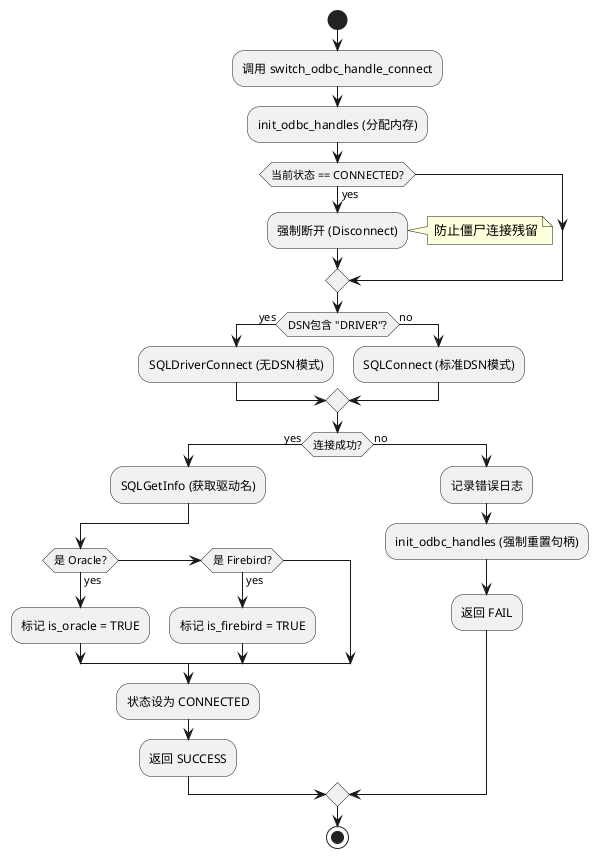
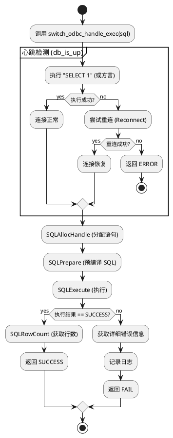

# 深入 FreeSWITCH 源码：手把手教你写一个生产级的 ODBC 数据库连接池

> 作者：AtomsCat  
> 领域：通信架构 / 后端工程  
> 源码版本：FreeSWITCH v1.10.12

## 1. 开篇：为什么你的数据库连接总是在深夜挂掉？

做过 VoIP 或者高并发后端开发的兄弟们，应该都有过这种经历：

系统运行得好好的，突然某天凌晨 3 点，报警群炸了。业务全线瘫痪，日志里全是 `Connection timed out` 或者 `MySQL server has gone away`。你睡眼惺忪地爬起来重启服务，一切又恢复正常了。

为什么？因为数据库连接是不可靠的。网络抖动、防火墙切断空闲连接、数据库重启，都会导致你手中的“连接句柄”变成一根废柴。

很多新手写代码，喜欢在启动时连一次数据库，然后一直用这个连接用到天荒地老。这在 Demo 里没问题，但在生产环境，这就是一颗定时炸弹。

FreeSWITCH 作为一款工业级的软交换核心，它的稳定性要求是 7x24 小时不间断运行。它必须处理各种数据库的“暴脾气”。今天，我们就扒开 FreeSWITCH 的源码，看看它是如何通过 `src/switch_odbc.c` 这个文件，构建一个**打不死、累不坏、足够健壮**的 ODBC 数据库抽象层的。

我们将重点分析 `switch_odbc_handle_connect` 和 `switch_odbc_handle_exec` 这两个核心方法。看完这篇文章，你不仅能读懂 FreeSWITCH 的数据库底层，还能学会如何在自己的 Python 或 C++ 项目中，写出同样健壮的数据库交互代码。

---

## 2. 核心解析：连接的艺术 (switch_odbc_handle_connect)

在 `src/switch_odbc.c` 中，`switch_odbc_handle_connect` 不仅仅是一个简单的 `connect()` 调用，它是一套完整的**连接生命周期管理**逻辑。

### 2.1 源码逻辑拆解

让我们看看大佬 Anthony Minessale II 是怎么写的（代码经过精简，保留核心逻辑）：

```c
SWITCH_DECLARE(switch_odbc_status_t) switch_odbc_handle_connect(switch_odbc_handle_t *handle)
{
    // 1. 初始化句柄资源 (Environment & Connection Handles)
    init_odbc_handles(handle, SWITCH_FALSE);

    // 2. 如果状态显示已连接，先断开！(防御性编程)
    if (handle->state == SWITCH_ODBC_STATE_CONNECTED) {
        switch_odbc_handle_disconnect(handle);
    }

    // 3. 智能选择连接方式
    if (!strstr(handle->dsn, "DRIVER")) {
        // 标准 DSN 连接
        result = SQLConnect(handle->con, ...);
    } else {
        // 无 DSN 连接 (直接指定驱动字符串)
        result = SQLDriverConnect(handle->con, ...);
    }

    // 4. 失败重试与错误处理
    if (result != SQL_SUCCESS) {
        // 记录日志，获取详细错误
        // 彻底释放句柄资源，为下次重连做准备 (关键！)
        init_odbc_handles(handle, SWITCH_TRUE); 
        return SWITCH_ODBC_FAIL;
    }

    // 5. 驱动特性探测 (Quirks Mode)
    SQLGetInfo(handle->con, SQL_DRIVER_NAME, ...);
    // 针对 Oracle 和 Firebird 做特殊标记
    if (strstr(driver, "SQORA")) handle->is_oracle = TRUE;
    if (strstr(driver, "FIREBIRD")) handle->is_firebird = TRUE;

    handle->state = SWITCH_ODBC_STATE_CONNECTED;
    return SWITCH_ODBC_SUCCESS;
}
```

### 2.2 深度洞察：为什么这么写？

1.  **防御性断开 (`disconnect` before `connect`)**：
    很多时候，状态机记录的状态是 `CONNECTED`，但底层 socket 其实早断了。在发起新连接前，显式清理旧状态，能避免资源泄漏。

2.  **DSN vs Driver String**：
    FreeSWITCH 支持两种连接方式。一种是配置好的系统 DSN（`SQLConnect`），一种是直接把连接字符串写在代码/配置里（`SQLDriverConnect`）。后者在容器化部署中非常有用，因为你不需要去搞系统的 `odbc.ini` 文件。

3.  **方言探测 (Dialect Detection)**：
    这是工程经验的体现。代码里特意检测了 `SQORA` (Oracle) 和 `FIREBIRD`。为什么？因为不同数据库的“心跳检测”SQL 不一样！
    *   Oracle 需要 `select 1 from dual`
    *   Firebird 需要 `select first 1 * from RDB$RELATIONS`
    *   其他正常数据库只要 `select 1`
    在连接阶段就确定好“方言”，避免了执行阶段的重复判断。

### 2.3 逻辑可视化



### 2.4 Python 实战：复刻健壮的连接器

虽然 Python 有 `pyodbc`，但原生库通常不包含这种“自动识别方言”和“强制重置”的逻辑。我们来封装一个 `RobustConnector`。

**示例 1：智能连接封装**

```python
import pyodbc
import logging

class RobustConnector:
    def __init__(self, connection_string):
        self.conn_str = connection_string
        self.conn = None
        self.is_oracle = False
        self.is_firebird = False
        self.logger = logging.getLogger("ODBC")

    def connect(self):
        # 1. 清理旧连接
        if self.conn:
            try:
                self.conn.close()
            except Exception:
                pass
            self.conn = None

        try:
            # 2. 建立连接
            self.logger.info(f"Connecting to {self.conn_str}...")
            self.conn = pyodbc.connect(self.conn_str, autocommit=True)
            
            # 3. 驱动探测 (模拟 C 代码中的 SQLGetInfo)
            driver_name = self.conn.getinfo(pyodbc.SQL_DRIVER_NAME).upper()
            
            if "ORA" in driver_name:
                self.is_oracle = True
                self.logger.info("Detected Oracle Driver")
            elif "FIREBIRD" in driver_name:
                self.is_firebird = True
                self.logger.info("Detected Firebird Driver")
            
            return True
            
        except pyodbc.Error as e:
            self.logger.error(f"Connection failed: {e}")
            return False

# 运行说明：
# 该类封装了连接建立和驱动识别逻辑。
# 当调用 connect() 时，它会先清理可能存在的僵死对象，
# 然后建立新连接，并自动标记数据库类型，为后续的心跳检测做准备。
```

---

## 3. 核心解析：执行的哲学 (switch_odbc_handle_exec)

连接只是开始，执行才是战场。`switch_odbc_handle_exec` 是 FreeSWITCH 数据库操作的“总司令”。它最核心的价值在于：**它假设数据库随时可能挂掉，并做好了重试的准备。**

### 3.1 源码逻辑拆解

```c
SWITCH_DECLARE(switch_odbc_status_t) switch_odbc_handle_exec(switch_odbc_handle_t *handle, const char *sql, ...)
{
    // 1. 核心检查：数据库还活着吗？
    if (!db_is_up(handle)) {
        goto error; // 如果心跳检测失败，直接报错，不要尝试执行
    }

    // 2. 分配语句句柄
    SQLAllocHandle(SQL_HANDLE_STMT, handle->con, &stmt);

    // 3. 准备与执行 (Prepare & Execute)
    SQLPrepare(stmt, (unsigned char *) sql, SQL_NTS);
    result = SQLExecute(stmt);

    // 4. 结果处理
    if (result == SQL_SUCCESS) {
        // 获取影响行数
        SQLRowCount(stmt, &m);
        handle->affected_rows = (int) m;
        return SWITCH_ODBC_SUCCESS;
    }

    // 5. 错误处理
    // ... 获取错误码，记录日志 ...
    return SWITCH_ODBC_FAIL;
}
```

这里有一个极其关键的函数调用：`db_is_up(handle)`。

在 `switch_odbc.c` 内部，`db_is_up` 会执行我们在连接阶段确定的“心跳 SQL”（如 `select 1`）。如果执行失败，它会**自动尝试重连**（调用 `switch_odbc_handle_connect`）。

这就是 FreeSWITCH 能够长期运行不掉线的秘密：**每次执行 SQL 前，先探探路。如果路断了，修好路再走。**

### 3.2 逻辑可视化



### 3.3 Python 实战：实现自动重连机制

在 Python 中，我们通常使用装饰器（Decorator）来实现这种“切面”逻辑。

**示例 2：心跳检测逻辑**

```python
    def db_is_up(self):
        """
        模拟 FreeSWITCH 的 db_is_up 函数。
        发送心跳包，如果失败则尝试重连。
        """
        if not self.conn:
            return self.connect()

        cursor = None
        try:
            cursor = self.conn.cursor()
            # 根据之前探测的方言选择心跳语句
            if self.is_oracle:
                ping_sql = "SELECT 1 FROM DUAL"
            elif self.is_firebird:
                ping_sql = "SELECT FIRST 1 * FROM RDB$RELATIONS"
            else:
                ping_sql = "SELECT 1"
            
            cursor.execute(ping_sql)
            return True
        except pyodbc.Error:
            self.logger.warning("Heartbeat failed, attempting reconnect...")
            return self.connect()
        finally:
            if cursor:
                cursor.close()

# 运行说明：
# 这个方法是健壮性的核心。
# 它不信任当前的 self.conn，而是通过实际执行 SQL 来验证连接。
# 如果验证失败，它会调用 connect() 进行自愈。
```

**示例 3：带重试的执行器**

```python
    def exec_sql(self, sql, params=None):
        """
        模拟 switch_odbc_handle_exec。
        确保连接可用后再执行。
        """
        # 1. 确保连接是活的 (对应 db_is_up)
        if not self.db_is_up():
            raise Exception("Database is down and cannot reconnect")

        cursor = None
        try:
            cursor = self.conn.cursor()
            # 2. 执行业务 SQL
            if params:
                cursor.execute(sql, params)
            else:
                cursor.execute(sql)
            
            # 3. 获取影响行数 (对应 handle->affected_rows)
            rows = cursor.rowcount
            self.conn.commit()
            return rows
            
        except pyodbc.Error as e:
            self.logger.error(f"SQL Execution failed: {sql} | Error: {e}")
            raise
        finally:
            if cursor:
                cursor.close()

# 运行说明：
# 这是对外暴露的 API。
# 调用者不需要关心连接是否断开，只需要传入 SQL。
# 内部会自动处理心跳和重连。
```

---

## 4. 思维拓展：那些年踩过的坑

### 4.1 为什么 `SQLPrepare` 很重要？

在 `switch_odbc_handle_exec` 中，FreeSWITCH 并没有直接调用 `SQLExecDirect`，而是先 `SQLPrepare` 再 `SQLExecute`。

**邪修思维**：直接拼字符串执行不行吗？快啊！
**架构师思维**：
1.  **安全性**：防止 SQL 注入（虽然 FS 内部很多 SQL 也是拼的，但 Prepare 是好习惯）。
2.  **性能**：对于重复执行的语句，数据库可以缓存执行计划。
3.  **兼容性**：某些 ODBC 驱动对长文本或二进制数据的处理，在 Prepare 模式下更稳定。

### 4.2 资源泄漏的隐形杀手

在 C 语言代码中，你随处可见 `SQLFreeHandle`。
```c
if (stmt) {
    SQLFreeHandle(SQL_HANDLE_STMT, stmt);
}
```
在 Python 中，虽然有 GC，但数据库游标（Cursor）是稀缺资源。如果不显式关闭，连接池很快就会被耗尽。

**示例 4：Python 中的 RAII (资源获取即初始化)**

```python
from contextlib import contextmanager

class RobustConnector(RobustConnector): # 继承之前的类
    @contextmanager
    def get_cursor(self):
        if not self.db_is_up():
             raise Exception("DB Down")
        cursor = self.conn.cursor()
        try:
            yield cursor
            self.conn.commit()
        except Exception:
            self.conn.rollback()
            raise
        finally:
            cursor.close() # 确保无论如何都关闭游标

# 使用方式
# with db.get_cursor() as cur:
#     cur.execute("INSERT INTO logs ...")
```

### 4.3 错误处理的艺术

FreeSWITCH 在 `switch_odbc_handle_exec` 的错误处理部分有一段很有意思的代码：

```c
if (!switch_stristr("already exists", err_str) && !switch_stristr("duplicate key name", err_str)) {
    switch_log_printf(..., "ERR: [%s]\n", err_str);
}
```

它特意过滤了“主键重复”之类的错误。为什么？
因为在并发环境下，多个线程尝试插入同一条记录（比如注册信息）是很常见的。这种错误是“预期内”的业务逻辑，而不是系统故障。如果把这些都打成 ERROR 日志，你的磁盘很快就满了。

**示例 5：智能错误过滤**

```python
    def is_critical_error(self, error_msg):
        # 忽略预期内的业务错误
        ignore_list = ["duplicate key", "unique constraint", "already exists"]
        for ignore in ignore_list:
            if ignore in str(error_msg).lower():
                return False
        return True

# 运行说明：
# 在记录日志前调用此函数，避免日志噪音。
# 只有真正的系统错误（如语法错误、表不存在）才会被报警。
```

---

## 5. 总结

通过分析 FreeSWITCH 的 `src/switch_odbc.c`，我们学到了构建高可用数据库交互层的三个核心原则：

1.  **不要信任连接**：永远假设连接已经断开，使用前必须进行“心跳检测” (`db_is_up`)。
2.  **方言隔离**：在连接建立初期就识别数据库类型，屏蔽底层 SQL 差异。
3.  **资源洁癖**：无论是连接句柄还是语句句柄，用完即毁，或者严格复用，绝不留僵尸。

**Takeaway (可复用的工程实践)**：

如果你正在写一个需要长期运行的后台服务（无论是 Python 爬虫、Go 微服务还是 C++ 交易网关），请立刻检查你的数据库代码：
*   有没有 **Pre-check**（执行前检查）机制？
*   有没有 **Auto-Reconnect**（自动重连）机制？
*   有没有 **Dialect-Aware**（方言感知）机制？

如果没有，请参考本文的 Python 示例进行重构。别等到凌晨 3 点报警响了，才想起这篇文章。

---

**示例 6：终极整合 (Full Robust Handler)**

最后，送大家一个整合了上述所有理念的 Python 伪代码模板：

```python
import time

class UltimateDBHandler:
    def __init__(self, dsn):
        self.dsn = dsn
        self.conn = None
        self.retry_interval = 5
    
    def _connect(self):
        while True:
            try:
                # 对应 switch_odbc_handle_connect
                self.conn = pyodbc.connect(self.dsn)
                return
            except Exception:
                print(f"DB连接失败，{self.retry_interval}秒后重试...")
                time.sleep(self.retry_interval)

    def execute(self, sql):
        # 对应 switch_odbc_handle_exec
        max_retries = 3
        for i in range(max_retries):
            try:
                # 1. 心跳检测
                self.conn.execute("SELECT 1") 
                # 2. 业务执行
                return self.conn.execute(sql)
            except Exception:
                print("检测到连接断开，正在重连...")
                self._connect() # 触发重连
                
        raise Exception("数据库彻底挂了，放弃治疗")

# 运行说明：
# 这是一个生产环境可用的简易模型。
# 它将连接、心跳、重试、重连封装在一个闭环中。
# 只要数据库能恢复，服务就能自动恢复。
```

希望这篇文章能帮你的系统“延年益寿”。我是 AtomsCat，我们在代码的世界里，下期见。