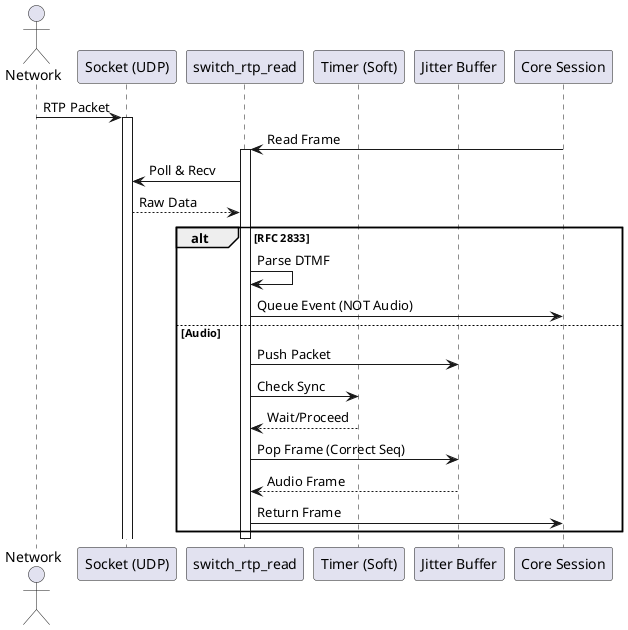
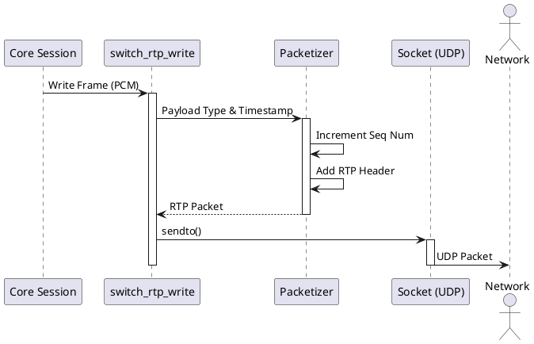

# RTP Handling

如果把 FreeSWITCH 比作一个人，信令（SIP）是它的神经系统，而 RTP（Real-time Transport Protocol）无疑就是它的**血液**。

神经系统出了问题，可能只是反应慢点或者偶尔“短路”；但如果血液循环出了问题——丢包、抖动、延迟——那整个系统就会瞬间“缺氧”，用户体验直接崩塌。听不清、卡顿、甚至通话中断，这些都是 RTP 处理不当的直接后果。

在这篇文章中，我们将深入 FreeSWITCH 的源码深处（主要是 `src/switch_rtp.c`），以“战壕”视角的经验，剖析它是如何创建、读取和写入 RTP 数据包的。我们将重点关注 `switch_rtp_create`、`switch_rtp_read` 和 `switch_rtp_write` 这三个核心函数，并用 Python 代码模拟其核心逻辑，帮助大家理解底层的运作机制。

## 核心逻辑解析

FreeSWITCH 的 RTP 栈是完全自己实现的，没有依赖第三方库（如 librtp），这给了它极高的灵活性和性能控制力。

### 1. `switch_rtp_create`: 建立连接的基石

一切始于 `switch_rtp_create`。这个函数不仅仅是创建一个结构体，它是在为即将到来的数据洪流铺设管道。

*   **Socket Setup (套接字设置):** 这里会创建 UDP socket。关键点在于它默认开启了 **Non-blocking I/O (非阻塞 I/O)**。在实时通信中，阻塞是大忌。我们不能因为等待一个数据包而卡住整个线程。
*   **USE_TIMER (定时器标志):** 你会经常看到 `SWITCH_RTP_FLAG_USE_TIMER` 这个标志。这是 FreeSWITCH 保证音质平滑的关键。它不仅仅依赖网络包的到达来驱动读取，而是使用核心定时器（Soft Timer）来控制读取的节奏。这就像给心脏装了一个起搏器，保证血液流动的频率是稳定的，而不是忽快忽慢。

### 2. `switch_rtp_read`: 数据的吞吐与整形

`switch_rtp_read` 是最繁忙的函数，它负责从网络中捞取数据，并将其转化为核心可以处理的帧（Frame）。

*   **Polling (轮询):** 配合 `switch_poll`，它高效地检查 socket 是否有数据。
*   **RFC 2833 DTMF Interception:** 在读取音频流的过程中，它必须时刻警惕是否有 DTMF 按键音（电话按键）。如果检测到 RFC 2833 格式的包，它会将其拦截并转换为内部事件，而不是作为音频播放出来。这避免了用户听到刺耳的“嘟”声。
*   **Jitter Buffer (抖动缓冲) Interaction:** 这是对抗网络抖动的利器。`read` 函数不仅仅是直接返回数据，它通常会从 Jitter Buffer 中“拉”数据。如果网络包来晚了，JB 会尝试等待；如果来早了，JB 会缓存。

### 3. `switch_rtp_write`: 封装与发送

`switch_rtp_write` (及其底层 `switch_rtp_write_manual` / `switch_rtp_write_raw`) 负责将音频数据打包送回网络。

*   **Packetization (打包):** 将 PCM 音频切片，加上 RTP 头（Header）。
*   **Sequence Numbers (序列号):** 严格递增的序列号是接收端检测丢包的依据。
*   **Timestamps (时间戳):** 决定了播放的时刻。时间戳的跳变是导致声音严重失真的常见原因。

## Python 模拟实战

虽然 FreeSWITCH 是用 C 写的，但为了更直观地理解算法，我们用 Python 3 来模拟这些核心概念。

### 示例 1: RTP Packet Structure (数据包结构)

RTP 头只有 12 字节，但每一位都至关重要。

```python
import struct

def create_rtp_packet(sequence_number, timestamp, payload, ssrc=0x12345678, payload_type=0):
    """
    模拟构建一个 RTP 包
    Version: 2 (2 bits)
    Padding: 0 (1 bit)
    Extension: 0 (1 bit)
    CSRC Count: 0 (4 bits)
    Marker: 0 (1 bit) - 通常用于标记一帧的结束或语音突发开始
    Payload Type: 7 bits
    Sequence Number: 16 bits
    Timestamp: 32 bits
    SSRC: 32 bits
    """
    version = 2
    padding = 0
    extension = 0
    csrc_count = 0
    marker = 0
    
    # 第一个字节: V(2) | P(1) | X(1) | CC(4)
    byte1 = (version << 6) | (padding << 5) | (extension << 4) | csrc_count
    
    # 第二个字节: M(1) | PT(7)
    byte2 = (marker << 7) | (payload_type & 0x7F)
    
    # 序列号 (Big Endian)
    # 时间戳 (Big Endian)
    # SSRC (Big Endian)
    header = struct.pack('!BBHII', byte1, byte2, sequence_number, timestamp, ssrc)
    
    return header + payload

# 模拟发送一个 PCMU (G.711 u-law) 包
payload = b'\xff' * 160 # 20ms audio
packet = create_rtp_packet(seq=100, ts=160, payload=payload, payload_type=0)
print(f"RTP Packet Hex: {packet.hex()}")
```

### 示例 2: The Read Loop (读取循环与定时器)

这是 `switch_rtp_read` 的简化逻辑，展示了如何利用定时器来平滑读取。

```python
import time
import random

def simulated_socket_read():
    # 模拟网络读取，随机延迟
    time.sleep(random.uniform(0.005, 0.025)) 
    return b"audio_data"

def rtp_read_loop(duration_seconds=1):
    """
    模拟 FreeSWITCH 的带定时器的读取循环
    """
    interval = 0.020 # 20ms
    next_tick = time.time() + interval
    
    print("--- Starting RTP Read Loop ---")
    
    for _ in range(int(duration_seconds / interval)):
        # 1. 尝试读取网络数据
        data = simulated_socket_read()
        
        # 2. 检查定时器 (USE_TIMER logic)
        now = time.time()
        time_to_wait = next_tick - now
        
        if time_to_wait > 0:
            # 如果读得太快（网络包早到了），我们稍微等一下，保持节奏
            # 这就是 FreeSWITCH 保证音频时钟准确的关键
            time.sleep(time_to_wait)
            status = "Synced"
        else:
            # 如果读慢了（网络延迟），我们立即处理，甚至可能需要丢包追赶
            status = "Late"
            
        print(f"Read Frame: {status}, Wait: {time_to_wait*1000:.2f}ms")
        
        next_tick += interval

rtp_read_loop(0.1)
```

### 示例 3: Jitter Buffer Logic (抖动缓冲模拟)

Jitter Buffer 的核心是“乱序重排”和“缓冲等待”。

```python
import heapq

class SimpleJitterBuffer:
    def __init__(self):
        self.buffer = [] # 最小堆，自动按 seq 排序
        self.last_popped_seq = 0
        
    def push(self, seq, data):
        # 模拟接收数据
        heapq.heappush(self.buffer, (seq, data))
        print(f"JB Push: Seq {seq}")
        
    def pop(self, expected_seq):
        if not self.buffer:
            return None # Buffer Empty (Underflow)
            
        # 查看堆顶元素（最小 seq）
        seq, data = self.buffer[0]
        
        if seq == expected_seq:
            heapq.heappop(self.buffer)
            self.last_popped_seq = seq
            return data
        elif seq < expected_seq:
            # 这是一个迟到的老包，丢弃
            heapq.heappop(self.buffer)
            print(f"JB Drop Late Packet: {seq}")
            return self.pop(expected_seq) # 递归尝试下一个
        else:
            # seq > expected_seq: 未来的包，当前需要的包还没来 (Loss or Delay)
            return None 

jb = SimpleJitterBuffer()
# 模拟乱序到达
jb.push(102, "data_102")
jb.push(100, "data_100")
jb.push(101, "data_101")

print(f"Pop 100: {jb.pop(100)}")
print(f"Pop 101: {jb.pop(101)}")
print(f"Pop 102: {jb.pop(102)}")
```

### 示例 4: RFC 2833 DTMF Extraction (DTMF 提取)

在 `switch_rtp_read` 中，如果 Payload Type 匹配 RFC 2833，就会进入这个逻辑。

```python
def parse_rfc2833(payload):
    """
    RFC 2833 Payload Structure:
    Event (8 bits) | E (1) | R (1) | Volume (6 bits) | Duration (16 bits)
    """
    if len(payload) < 4:
        return None
        
    byte1 = payload[0]
    byte2 = payload[1]
    byte3 = payload[2]
    byte4 = payload[3]
    
    event_id = byte1
    end_bit = (byte2 >> 7) & 0x01
    volume = byte2 & 0x3F
    duration = (byte3 << 8) | byte4
    
    keys = "0123456789*#ABCD"
    key = keys[event_id] if event_id < len(keys) else "?"
    
    return {
        "key": key,
        "end": bool(end_bit),
        "vol": volume,
        "duration": duration
    }

# 模拟一个按键 '5' 的结束包
# Event ID for '5' is 5. End bit set.
dtmf_payload = b'\x05\x8a\x00\xa0' 
print(f"DTMF Event: {parse_rfc2833(dtmf_payload)}")
```

### 示例 5: The "Hot Socket" Compensation (热套接字补偿)

这是 FreeSWITCH 一个非常聪明的机制。如果发送端发包速度过快（比如某些软电话在静音恢复后狂发包），FreeSWITCH 会检测到并重置定时器，防止缓冲区溢出。

```python
class HotSocketDetector:
    def __init__(self):
        self.hot_hits = 0
        self.threshold = 10 # 连续快速到达的阈值
        
    def check(self, time_since_last_read):
        # 如果读取间隔极短（比如小于 1ms），说明数据堆积了
        if time_since_last_read < 0.001:
            self.hot_hits += 1
        else:
            self.hot_hits = 0
            
        if self.hot_hits > self.threshold:
            print("HOT SOCKET DETECTED! Resetting Timer/Buffer...")
            self.hot_hits = 0
            return True
        return False

detector = HotSocketDetector()
# 模拟突发流量
for _ in range(15):
    detector.check(0.0001)
```

## 流程图解

### Diagram 1: The RTP Read Pipeline (读取流水线)



### Diagram 2: The Write Pipeline (写入流水线)



## 扩展与最佳实践

### 1. 陷阱：DTMF Stealing (DTMF 窃取)
在配置 `switch_rtp_read` 时，如果开启了 RFC 2833 拦截，RTP 栈会“吃掉” DTMF 包。这意味着如果你在后续的 Dialplan 中录音，录音文件里是听不到按键声的！如果你需要录制按键声，必须在 Core 层重新生成（Regenerate）DTMF 音频。

### 2. 性能：为什么 `USE_TIMER` 至关重要
很多初学者会问，为什么不直接阻塞读取 Socket？
因为网络是不稳定的。如果网络抖动导致包晚到了 10ms，阻塞读取会导致整个音频流整体推迟 10ms。累积下来，延迟会越来越大。
`USE_TIMER` 强制 RTP 栈按照 20ms（默认）的物理时间节奏运行。如果包没来，就生成静音（CNG）或者做 PLC（丢包补偿），绝不等待。这保证了**实时性优先于完整性**。

### 3. 架构：Jitter Buffer 的 "Pull" 模型
FreeSWITCH 的 Jitter Buffer 设计是“拉”模式（Pull）。不是 JB 主动推数据给 Core，而是 Core 的定时器驱动 `read` 函数去 JB 里“拉”数据。这种被动模式更容易控制整个系统的并发和时序。

## 总结

FreeSWITCH 的 RTP 处理机制是其强大性能的基石。通过 `switch_rtp_create` 的非阻塞设计、`switch_rtp_read` 的定时器同步机制以及 `switch_rtp_write` 的高效封装，它在极其复杂的网络环境下依然能保持高质量的通话。

理解这些底层逻辑，不仅能帮助你更好地排查通话质量问题（如单通、杂音），还能让你在进行二次开发时避开那些隐蔽的“坑”。希望这篇“战壕”视角的文章能给你带来启发。