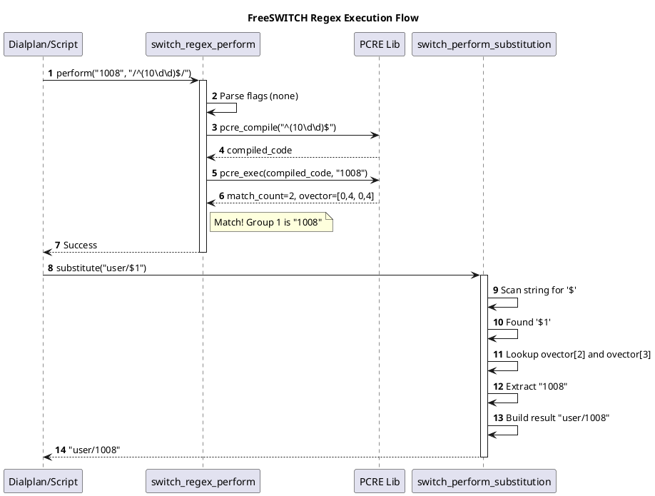

# Regular Expressions

## 1. 开篇：FreeSWITCH 的黑魔法

在 FreeSWITCH 的世界里，有一种语言比 C 语言更通用，比 Lua 更精炼，那就是 **正则表达式 (Regular Expression)**。

从 Dialplan 的路由匹配，到 ACL 的黑白名单，再到各种模块的参数解析，Regex 无处不在。你写下的每一行 `<extension>`，本质上都在调用底层的正则引擎。

但是，你真的理解 FreeSWITCH 是如何处理正则的吗？
*   为什么有时候要加 `/i`，有时候又不用？
*   `$1` 是怎么被替换成真实的号码的？
*   为什么你的正则在在线测试工具里能过，放进 FreeSWITCH 就报错？

今天，我们拆解 `src/switch_regex.c`，看看这个基于 PCRE 的黑魔法引擎是如何运转的。

**核心观点：FreeSWITCH 的正则引擎是对 PCRE 库的轻量级封装。它不仅支持标准的正则匹配，还通过 `switch_perform_substitution` 实现了高效的变量替换。理解它的编译和执行机制，是写出高性能 Dialplan 的关键。**

---

## 2. 正文解析：PCRE 的封装艺术

### 2.1 核心原理：编译与执行

FreeSWITCH 并没有自己造轮子，而是使用了业界标准的 **PCRE (Perl Compatible Regular Expressions)** 库。

在 `switch_regex_perform` 函数中，我们可以看到完整的生命周期：

1.  **解析语法**：检查字符串是否以 `/` 开头。如果是，它会解析末尾的标志位（如 `i` 代表忽略大小写，`s` 代表点号匹配换行符）。
2.  **编译 (Compile)**：调用 `pcre_compile` 将字符串模式编译成字节码。
3.  **执行 (Execute)**：调用 `pcre_exec` 在目标字符串中查找匹配项。
4.  **输出**：将匹配结果的偏移量存入 `ovector` 数组。

### 2.2 源码实锤：`$1` 的替换逻辑

最让人好奇的是，`<action application="bridge" data="user/$1"/>` 里的 `$1` 是怎么变身的？

答案在 `switch_perform_substitution` 函数里。它不是简单的字符串 `replace`，而是基于指针的高效操作：

```c
// 伪代码逻辑
for (char *p = data; *p; p++) {
    if (*p == '$' && is_digit(*(p+1))) {
        int capture_index = atoi(p+1);
        // 从 ovector 中获取第 N 个捕获组的 start 和 end 偏移量
        // 从原字符串中拷贝这段内容到结果 buffer
    }
}
```

这意味着，FreeSWITCH 不需要把 `$1` 这种占位符先转换成中间对象，而是直接在流式处理中完成了替换，性能极高。

### 2.3 Python 模拟：复刻 FreeSWITCH 正则行为

为了让你更直观地理解，我用 Python 的 `re` 模块模拟了 FreeSWITCH 的处理逻辑。

#### 示例代码：正则匹配与替换模拟器

```python
import re

class FSRegexEngine:
    def __init__(self):
        self.last_match = None
        self.target_string = ""

    def perform(self, field, expression):
        """
        模拟 switch_regex_perform
        支持 /pattern/flags 语法
        """
        flags = 0
        pattern = expression
        
        # 1. 解析 /pattern/flags
        if expression.startswith('/'):
            last_slash = expression.rfind('/')
            if last_slash > 0:
                pattern = expression[1:last_slash]
                opts = expression[last_slash+1:]
                if 'i' in opts:
                    flags |= re.IGNORECASE
                if 's' in opts:
                    flags |= re.DOTALL
        
        try:
            # 2. 编译 & 执行
            regex = re.compile(pattern, flags)
            match = regex.search(field)
            
            if match:
                self.last_match = match
                self.target_string = field
                print(f"✅ Match Found: {match.group(0)}")
                return True
            else:
                print("❌ No Match")
                return False
        except re.error as e:
            print(f"⚠️ Regex Error: {e}")
            return False

    def substitute(self, data):
        """
        模拟 switch_perform_substitution
        支持 $1, $2... 替换
        """
        if not self.last_match:
            return data
            
        def replace_callback(match_obj):
            # 获取 $N 中的 N
            group_idx = int(match_obj.group(1))
            try:
                return self.last_match.group(group_idx)
            except IndexError:
                return "" # 捕获组不存在则返回空

        # 查找所有 $数字 格式
        return re.sub(r'\$(\d+)', replace_callback, data)

# --- 实战演练 ---
engine = FSRegexEngine()

# 场景：Dialplan 匹配
# 目标：呼叫 1000-1019 范围的号码
target = "1008"
expression = r"/^(10[0-1][0-9])$/"

print(f"Testing '{target}' against '{expression}'")
if engine.perform(target, expression):
    # 场景：执行 Action
    # data="user/$1"
    action_data = "user/$1"
    result = engine.substitute(action_data)
    print(f"➡️ Substitution Result: {result}")

# 场景：忽略大小写
target_case = "SofIa/internal/1001"
expression_case = r"/^sofia\/internal\/(\d+)$/i"

print(f"\nTesting '{target_case}' against '{expression_case}'")
if engine.perform(target_case, expression_case):
    print(f"➡️ Captured Group 1: {engine.substitute('$1')}")
```

**运行结果说明：**
你会看到，脚本成功解析了带有 `/i` 标志的正则，并且将 `$1` 替换成了捕获到的号码。这正是 FreeSWITCH 内部每秒钟发生成千上万次的过程。

### 2.4 工程实践：性能优化指南

1.  **避免过度编译**：在 Dialplan XML 中，FreeSWITCH 会缓存编译好的正则。但在 Lua/JS 脚本中，如果你在循环里反复调用 `session:execute("set", "foo=bar")` 且包含正则，可能会导致重复编译。
2.  **锚点的重要性**：永远记得加 `^` 和 `$`。
    *   `^123$`：只匹配 123。
    *   `123`：匹配 0123, 1234, 91230... 这通常不是你想要的，而且扫描全字符串更慢。
3.  **部分匹配 (Partial Matching)**：
    *   FreeSWITCH 支持 `PCRE_PARTIAL`。这在处理用户按键（DTMF）时非常有用。
    *   当用户输入 "12" 时，正则 `^123$` 不匹配，但属于“部分匹配”。系统据此判断“还需要更多输入”，而不是直接报错。

---

## 3. 思维拓展：架构师的视角

### 3.1 为什么不用 C++ std::regex？

FreeSWITCH 诞生时（2005年），C++11 标准还没出来。PCRE 是当时（也是现在）C 语言环境下最强、最快、最标准的正则库。
即使现在，PCRE 的性能通常也优于许多标准库实现。

### 3.2 邪修玩法：利用正则做逻辑判断

Dialplan 的 `condition` 标签不仅能匹配被叫号码，还能匹配各种变量。
你可以写出极其复杂的逻辑：

```xml
<!-- 匹配主叫是 1000 且 时间是周一到周五 -->
<condition field="${caller_id_number}" expression="^1000$">
    <condition field="${strftime(%w)}" expression="^[1-5]$">
        <action application="log" data="INFO Workday Call!"/>
    </condition>
</condition>
```

**架构师警告**：
虽然这样写很爽，但 XML 的可读性极差。如果逻辑超过 3 层嵌套，请立刻转用 Lua 脚本。不要在 XML 里写代码！

### 3.3 PlantUML 流程图解



---

## 4. 总结

FreeSWITCH 的正则模块是连接配置与底层的桥梁。

**Takeaway (带走这几句话)：**

1.  **语法是 PCRE**：遇到不懂的正则，去查 PCRE 文档，不要查 Python 或 JS 的。
2.  **替换是原地的**：`$1` 的替换非常快，放心使用。
3.  **锚点不能忘**：为了安全和性能，Dialplan 里永远加上 `^` 和 `$`。

掌握了正则，你就掌握了 FreeSWITCH 的路由指挥棒。