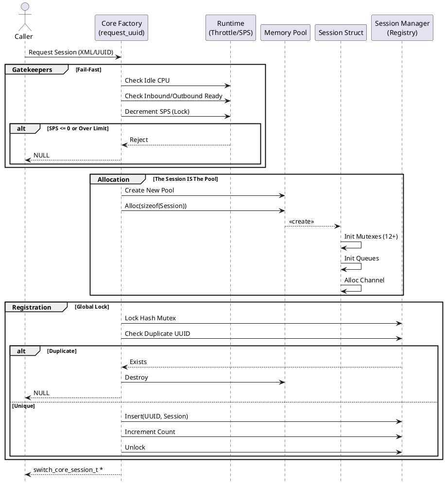
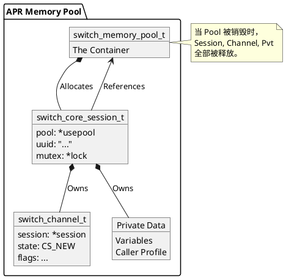

# Session Creation 🚀

在 FreeSWITCH 的浩瀚宇宙中，**Session（会话）** 是最核心的原子单位。每一次通话、每一个 Channel 的建立，背后都伴随着一个 Session 的诞生。

很多开发者习惯将 Session 视为一个简单的 C 结构体（`switch_core_session_t`），但实际上，创建一个 Session 的过程远比 `malloc` 一块内存要复杂得多。它更像是在构建一个微型的操作系统：分配独立的内存池、初始化十几个互斥锁、创建消息队列、状态机，并将其注册到全局的核心哈希表中。

在这篇文章中，我们将深入 `switch_core_session.c` 的源码，特别是 `switch_core_session_request_xml` 和其底层的 `switch_core_session_request_uuid` 函数，以“战壕中”的视角，剖析 Session 诞生的全过程。

## Core Logic: 从 XML 到 内存池 🧠

当我们调用 `switch_core_session_request_xml` 时（通常发生在通过 XML 描述来创建 Channel 的场景，如 `originate`），FreeSWITCH 实际上在执行一系列精密的初始化操作。

### 1. The "Session IS the Pool" Model

这是理解 FreeSWITCH 内存管理的关键。Session 并不是在一个全局堆上随便分配的，而是拥有一个**专属的内存池（Memory Pool）**。

在 `switch_core_session_request_uuid` 中，代码首先做的是创建一个新的内存池：

```c
switch_core_new_memory_pool(&usepool);
session = switch_core_alloc(usepool, sizeof(*session));
session->pool = usepool;
```

注意这里的微妙之处：`session` 结构体本身就是从 `usepool` 中分配的，而 `session->pool` 指针又指向了这个 `usepool`。这意味着 **Session 的生命周期与内存池完全绑定**。当 Session 销毁时，整个内存池被销毁，所有挂载在这个 Session 上的 Channel、变量、私有数据瞬间灰飞烟灭。这种设计极大地简化了内存管理，避免了内存泄漏。

### 2. Throttling & The Gatekeepers (限流与守门人)

在分配内存之前，FreeSWITCH 设置了层层关卡（Gatekeepers）来保护系统的稳定性。

*   **System Ready Checks:** 检查系统是否处于可以处理呼叫的状态（Inbound/Outbound ready）。
*   **Idle CPU Check:** 如果系统负载过高（`runtime.min_idle_time`），拒绝创建新 Session。
*   **SPS (Sessions Per Second) Throttling:** 这是最关键的限流机制。

```c
switch_mutex_lock(runtime.throttle_mutex);
count = session_manager.session_count;
sps = --runtime.sps; // 扣减每秒配额
switch_mutex_unlock(runtime.throttle_mutex);

if (sps <= 0) {
    // Throttle Error!
    return NULL;
}
```

如果当前的 SPS 配额用尽，或者总 Session 数超过限制，创建请求会被立即拒绝。这是一种 **Fail-Fast** 机制，防止系统过载崩溃。

### 3. Global Locking & UUID Registry

Session 创建的最后一步是“上户口”，即注册到全局的 `session_manager.session_table` 中。为了保证 UUID 的全局唯一性，这里必须加全局锁：

```c
switch_mutex_lock(runtime.session_hash_mutex);
if (switch_core_hash_find(session_manager.session_table, use_uuid)) {
    // Duplicate UUID!
    return NULL;
}
switch_core_hash_insert(session_manager.session_table, session->uuid_str, session);
session_manager.session_count++;
switch_mutex_unlock(runtime.session_hash_mutex);
```

这个 `session_hash_mutex` 是 FreeSWITCH 中最繁忙的锁之一。

### 4. The Arsenal of Mutexes (锁的军火库)

一个 Session 被创建时，不仅仅是分配了数据结构，还初始化了极其细粒度的锁机制。看看源码中这一连串的初始化：

*   `session->mutex`: 主锁
*   `session->codec_read_mutex`: 读编解码器锁
*   `session->codec_write_mutex`: 写编解码器锁
*   `session->resample_mutex`: 重采样锁
*   `session->frame_read_mutex`: 帧读取锁
*   ...以及更多

这种设计虽然增加了创建时的系统调用开销（System Call overhead），但换来的是运行时的高并发性能——读音频流的线程不会阻塞写信令的线程。

## Code Examples (Python 3 Simulation) 🐍

由于 FreeSWITCH 是纯 C 编写的，为了更直观地理解上述逻辑，我用 Python 模拟了 Session 创建的核心流程。

### Example 1: The Session Structure

这里模拟了 Session 与 Memory Pool 的关系，以及细粒度锁的初始化。

```python
import uuid
import threading
from dataclasses import dataclass, field

class MemoryPool:
    """模拟 APR Memory Pool"""
    def __init__(self):
        self.allocated_bytes = 0
        self.active = True

    def alloc(self, size):
        if not self.active:
            raise Exception("Pool destroyed")
        self.allocated_bytes += size
        return object() # 返回模拟的内存地址

    def destroy(self):
        self.active = False
        print(f"Pool destroyed. Reclaimed {self.allocated_bytes} bytes.")

class Channel:
    def __init__(self, session):
        self.session = session
        self.state = "CS_NEW"

class Session:
    def __init__(self, pool, uuid_str):
        self.pool = pool
        self.uuid_str = uuid_str
        self.channel = Channel(self)
        
        # 初始化细粒度锁 (The Arsenal)
        self.mutex = threading.RLock()
        self.codec_read_mutex = threading.Lock()
        self.codec_write_mutex = threading.Lock()
        self.io_rwlock = threading.Lock() # 简化为 Lock
        
        # 消息队列
        self.message_queue = []
        self.event_queue = []
        
        print(f"Session {self.uuid_str} initialized with Pool {id(pool)}")
```

### Example 2: The Factory & Throttling

这里模拟了 `switch_core_session_request_uuid` 中的限流和全局注册逻辑。

```python
class Runtime:
    sps = 30  # Sessions Per Second limit
    min_idle_cpu = 20.0
    current_idle_cpu = 80.0
    throttle_mutex = threading.Lock()
    session_hash_mutex = threading.Lock()

class SessionManager:
    session_table = {}
    session_count = 0
    max_sessions = 1000

def switch_core_session_request_uuid(use_uuid=None):
    # 1. System Health Check (Fail-Fast)
    if Runtime.current_idle_cpu < Runtime.min_idle_cpu:
        print("System overloaded (CPU). Rejecting session.")
        return None

    # 2. Throttling (SPS Check)
    with Runtime.throttle_mutex:
        if Runtime.sps <= 0:
            print("Throttle Error! SPS limit reached.")
            return None
        Runtime.sps -= 1
        
        if SessionManager.session_count >= SessionManager.max_sessions:
            print("Over Session Limit!")
            return None

    # 3. Memory Pool Allocation
    pool = MemoryPool()
    
    # 4. UUID Generation
    if not use_uuid:
        use_uuid = str(uuid.uuid4())

    # 5. Global Registry (Critical Section)
    with Runtime.session_hash_mutex:
        if use_uuid in SessionManager.session_table:
            print("Duplicate UUID!")
            pool.destroy()
            return None
            
        # 创建 Session (分配内存)
        session = Session(pool, use_uuid)
        
        # 注册
        SessionManager.session_table[use_uuid] = session
        SessionManager.session_count += 1
        
    return session

# Test the factory
if __name__ == "__main__":
    s1 = switch_core_session_request_uuid()
    if s1:
        print(f"Created session: {s1.uuid_str}")
```

## PlantUML Diagrams 📊

### Diagram 1: The Session Factory Pipeline

这个时序图展示了从请求开始到 Session 最终注册的完整流水线。



### Diagram 2: The Memory Ownership Hierarchy

这张图清晰地展示了 Session、Channel 和 Memory Pool 之间的归属关系。



## Extensions & Best Practices 💡

### 1. XML Parsing Sensitivity
`switch_core_session_request_xml` 极度依赖 XML 的结构。它会查找 `channel_data` 标签下的 `direction`, `flags`, `caps`。如果你的 XML 结构不符合预期（例如手动构造 XML 传给 `originate`），可能会导致 Session 创建出来的状态不正确（例如方向错误，导致权限问题）。

### 2. The Cost of Creation
创建一个 Session 是昂贵的。
*   **Syscalls:** 初始化 12+ 个互斥锁和读写锁意味着大量的系统调用。
*   **Memory:** 虽然 APR Pool 分配很快，但初始化 Channel 及其变量表（Hash Table）仍有内存开销。
*   **Contention:** 全局锁 `session_hash_mutex` 在高并发下是竞争热点。

**最佳实践：** 尽量复用连接（如 SIP 长连接），但在 Session 层面，FreeSWITCH 的模型是“一次性”的，所以优化重点在于**不要无谓地创建 Session**。例如，在 Dialplan 中尽早拒接（Reject）不需要的呼叫，而不是等到 Session 建立并进入 Media 阶段后再挂断。

### 3. Ignoring NULL Returns
在开发模块时，调用 `switch_core_session_request` 后**必须**检查返回值是否为 NULL。如前所述，SPS 限制、系统负载、UUID 冲突都可能导致返回 NULL。忽略这个检查是导致 FreeSWITCH 崩溃（Segfault）的常见原因。

## Conclusion 🏁

FreeSWITCH 的 Session 创建过程是一个精密的工程学奇迹。它通过“Session 即 Pool”的设计解决了复杂的内存生命周期问题，通过多层限流保护了系统的稳定性，通过细粒度的锁机制保证了并发性能。

理解 `switch_core_session_request_xml` 不仅仅是看懂几行 C 代码，更是理解 FreeSWITCH 如何在资源受限的物理世界中，构建出一个个独立的通话宇宙。作为开发者，当我们调用 `originate` 时，应当对这背后发生的“创世”过程心存敬畏。