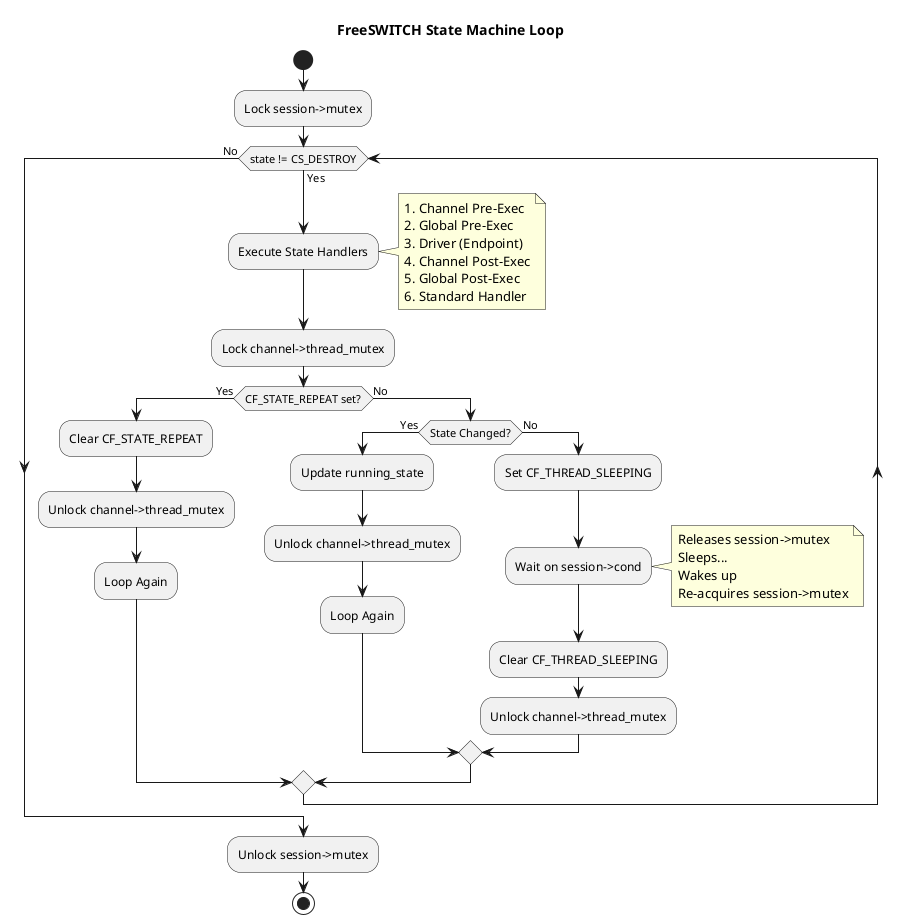
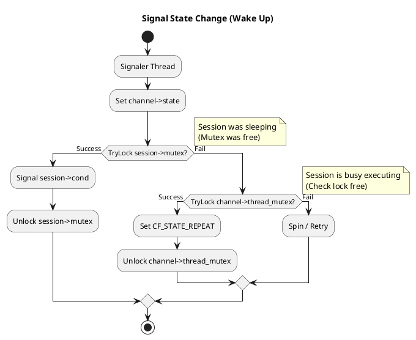

# State Machine

## 前言

如果把 FreeSWITCH 比作一个庞大的生物，那么 Session（会话）就是它的细胞，而 **State Machine（状态机）** 则是驱动这些细胞存活、代谢、消亡的“心跳”。

作为一名 FreeSWITCH 开发者，你可能无数次使用 `switch_channel_set_state`，也可能在日志中看过无数遍 `CS_NEW` -> `CS_INIT` -> `CS_ROUTING` -> `CS_EXECUTE` 的流转。但你是否真正思考过：

*   这个状态流转到底是如何驱动的？
*   为什么有时候状态改变了，代码却没立即执行？
*   在高并发下，FreeSWITCH 如何保证状态切换不丢失，又不让 CPU 空转？

本文将带你深入 `src/switch_core_state_machine.c` 的源码深处，像做外科手术一样剖析这个核心机制。我们将看到一个设计精妙的 **“双锁机制”** 和一个经典的 **“Catch-22” 竞态条件** 处理方案。

## 核心逻辑：The Loop

FreeSWITCH 的状态机本质上是一个死循环，位于 `switch_core_session_run` 函数中。只要 Session 没有销毁（`CS_DESTROY`），这个循环就会一直跑下去。

### 1. 状态机的生命周期

我们可以把状态机的生命周期简化为以下伪代码：

```c
// 伪代码：Session 线程的主循环
lock(session->mutex); // 获取大锁
while (state != CS_DESTROY) {
    // 1. 执行当前状态的 Handler (Pre-Exec -> Driver -> Post-Exec -> Standard)
    execute_state_handlers();

    // 2. 检查是否需要休眠
    lock(channel->thread_mutex); // 获取检查锁
    if (state == running_state && !flag(CF_STATE_REPEAT)) {
        // 没有新状态，且没有被要求重跑 -> 休眠
        set_flag(CF_THREAD_SLEEPING);
        cond_wait(session->cond, session->mutex); // 释放大锁，进入休眠
        clear_flag(CF_THREAD_SLEEPING);
    }
    unlock(channel->thread_mutex); // 释放检查锁
}
unlock(session->mutex);
```

这里有两个关键点：
1.  **Requested State vs Running State**: `switch_channel_set_state` 只是修改了 `Requested State`（期望状态）。状态机循环会检查这个期望状态，如果它和当前 `Running State` 不同，就会执行状态切换逻辑。
2.  **休眠机制**: 如果当前状态处理完了，且没有新的状态变化，线程就会休眠（`cond_wait`），等待被唤醒。这避免了 `while(1)` 导致的 CPU 100% 占用。

### 2. 状态切换与唤醒 (Signal & Wake)

当你调用 `switch_channel_set_state` 时，实际上发生了两件事：
1.  更新 Channel 的 `state` 变量。
2.  调用 `switch_core_session_signal_state_change` 唤醒 Session 线程。

这个“唤醒”过程是本文最精彩的部分。

## 深度解析：The "Catch-22" Race Condition

在多线程编程中，最怕的就是 **“我刚检查完你要睡觉，你就醒了；或者我刚喊你醒来，你却刚睡着”**。

FreeSWITCH 使用了 **双锁机制 (Dual-Locking)** 来解决这个问题。

*   **`session->mutex` (大锁)**: 保护 Session 的整个生命周期，Session 运行时一直持有，只有休眠时才释放。
*   **`channel->thread_mutex` (检查锁)**: 仅在 Session 线程检查“是否该休眠”的短暂时刻持有。

### 唤醒逻辑 (`switch_core_session_wake_session_thread`)

当其他线程想要唤醒 Session 线程时，它会尝试以下步骤：

1.  **尝试获取大锁 (`trylock session->mutex`)**:
    *   **成功**: 说明 Session 线程正在休眠（因为休眠会释放大锁）。
        *   **动作**: 发送信号 (`signal`)，释放锁。Session 线程醒来。
    *   **失败**: 说明 Session 线程正在运行（持有大锁）。

2.  **尝试获取检查锁 (`trylock channel->thread_mutex`)**:
    *   **成功**: 说明 Session 线程正在忙着执行 Handler，还没准备睡觉。
        *   **动作**: 设置 `CF_STATE_REPEAT` 标志。
        *   **效果**: 等 Session 线程忙完，准备检查是否休眠时，会看到这个标志，于是**跳过休眠**，直接进入下一次循环。
    *   **失败**: **这就是 Catch-22！**
        *   说明 Session 线程持有大锁（正在运行），同时也持有检查锁（正在检查是否休眠）。
        *   Session 线程正处于“准备睡觉”的临界区。

3.  **处理 Catch-22**:
    *   此时，Session 线程即将调用 `cond_wait`。如果我们什么都不做，信号可能会丢失（Lost Wakeup）。
    *   **动作**: 循环重试（Spin Retry）。唤醒者会短暂自旋，等待 Session 线程真正进入休眠（释放大锁）或完成检查（释放检查锁）。

## Python 模拟代码

为了更直观地理解，我们用 Python 3 模拟这个机制：

```python
import threading
import time
import random

class Session:
    def __init__(self, name):
        self.name = name
        self.state = "INIT"
        self.running_state = "INIT"
        self.mutex = threading.Lock() # 大锁
        self.thread_mutex = threading.Lock() # 检查锁
        self.cond = threading.Condition(self.mutex) # 基于大锁的条件变量
        self.flags = set()
        self.running = True

    def log(self, msg):
        print(f"[{self.name}] {msg}")

    def run(self):
        self.mutex.acquire()
        self.log("Session thread started, holding Big Lock")
        
        while self.running:
            # 1. 模拟执行状态处理
            self.log(f"Processing state {self.state}...")
            time.sleep(0.5) # 模拟耗时操作

            # 2. 检查是否休眠
            self.log("Acquiring Check Lock...")
            with self.thread_mutex:
                self.log("Check Lock acquired.")
                
                if "STATE_REPEAT" in self.flags:
                    self.log("Found STATE_REPEAT flag, skipping sleep.")
                    self.flags.remove("STATE_REPEAT")
                elif self.state == self.running_state:
                    self.log("No state change, going to sleep (releasing Big Lock)...")
                    self.flags.add("THREAD_SLEEPING")
                    # cond.wait() 会原子性地释放 mutex 并等待
                    self.cond.wait() 
                    self.flags.remove("THREAD_SLEEPING")
                    self.log("Woke up! Re-acquired Big Lock.")
                else:
                    self.running_state = self.state
                    self.log(f"State changed to {self.state}, looping.")
            
            self.log("Released Check Lock.")

        self.mutex.release()

    def signal_state_change(self, new_state):
        print(f"[Signaler] Requesting state change to {new_state}")
        self.state = new_state
        
        # 尝试获取大锁
        if self.mutex.acquire(blocking=False):
            print("[Signaler] Acquired Big Lock (Session was sleeping). Signaling...")
            self.cond.notify()
            self.mutex.release()
        else:
            print("[Signaler] Failed to acquire Big Lock (Session is busy).")
            # 尝试获取检查锁
            if self.thread_mutex.acquire(blocking=False):
                print("[Signaler] Acquired Check Lock. Setting STATE_REPEAT.")
                self.flags.add("STATE_REPEAT")
                self.thread_mutex.release()
            else:
                print("[Signaler] CATCH-22! Failed to acquire both locks.")
                print("[Signaler] Session is in the critical 'check' section.")
                # 在 C 代码中这里会 goto top 重试，Python 简单模拟等待
                time.sleep(0.01) 
                self.signal_state_change(new_state) # 递归重试

# 运行模拟
if __name__ == "__main__":
    session = Session("Call-1")
    t = threading.Thread(target=session.run)
    t.start()

    time.sleep(1)
    # 模拟在 Session 忙碌时改变状态
    session.signal_state_change("ROUTING")

    time.sleep(2)
    # 模拟 Session 销毁
    session.running = False
    session.signal_state_change("DESTROY")
    t.join()
```

## 图解状态机

### 1. 状态机主循环



### 2. 唤醒流程 (Set State)



## 扩展机制 (Extensions)

FreeSWITCH 的强大之处在于其可扩展性。状态机也不例外，它允许开发者通过 **State Handlers** 介入状态流转的每一个环节。

在 `src/switch_core_state_machine.c` 的 `STATE_MACRO` 中，我们可以看到 Handler 的执行顺序是非常严格的：

1.  **Channel Pre-Exec Handlers**: 绑定在特定 Channel 上，且带有 `SSH_FLAG_PRE_EXEC` 标志的 Handler。
2.  **Global Pre-Exec Handlers**: 全局注册，且带有 `SSH_FLAG_PRE_EXEC` 标志的 Handler。
3.  **Driver State Handler**: Endpoint 模块（如 mod_sofia）提供的核心驱动逻辑。
4.  **Channel Post-Exec Handlers**: 绑定在特定 Channel 上的普通 Handler。
5.  **Global Post-Exec Handlers**: 全局注册的普通 Handler。
6.  **Standard Handler**: FreeSWITCH 内核提供的默认行为（如 `switch_core_standard_on_routing`）。

### 如何扩展

*   **全局扩展**: 使用 `switch_core_add_state_handler`。适用于需要监控或干预所有通话的模块（如计费、日志）。
*   **单路扩展**: 使用 `switch_channel_add_state_handler`。适用于只针对特定通话的逻辑（如 IVR 脚本、特定业务流程）。

**注意**: 如果任何一个 Handler 返回了 `SWITCH_STATUS_FALSE`，状态机链条可能会中断，或者阻止后续 Standard Handler 的执行。这是一种强大的控制手段，但也容易导致 Bug。

## 开发者避坑指南 (Gotchas)

理解了底层原理，我们在写模块时就要注意以下几点：

1.  **不要假设状态立即改变**:
    调用 `switch_channel_set_state(channel, CS_ROUTING)` 后，代码并不会阻塞等待状态切换完成。它只是设置了标志并唤醒了 Session 线程。真正的切换要等 Session 线程跑完当前的 Handler 循环。

2.  **Blocking Handler 是性能杀手**:
    因为 Session 线程持有 `session->mutex` 大锁，如果你在 State Handler 里写了阻塞代码（比如同步 HTTP 请求、长耗时数据库查询），不仅卡住了当前通话，还可能影响到想要给这个 Session 发消息的其他线程（因为它们可能也需要获取锁）。

3.  **Handler 的返回值至关重要**:
    如前所述，Handler 的返回值决定了状态机是否继续执行后续的 Handler。除非你明确知道自己在做什么（例如拦截挂机事件），否则请始终返回 `SWITCH_STATUS_SUCCESS`。

## 总结

FreeSWITCH 的状态机不仅仅是一个 `while` 循环，它是一套精心设计的并发控制系统。通过 `session->mutex` 和 `channel->thread_mutex` 的配合，它完美平衡了 **线程安全** 和 **响应速度**。

下次当你看到 `CS_ROUTING` 在日志中闪过时，希望你能想起那个在后台默默持锁、检查、休眠、被唤醒的 Session 线程，以及那个为了防止竞态条件而设计的精妙的 "Catch-22" 逻辑。