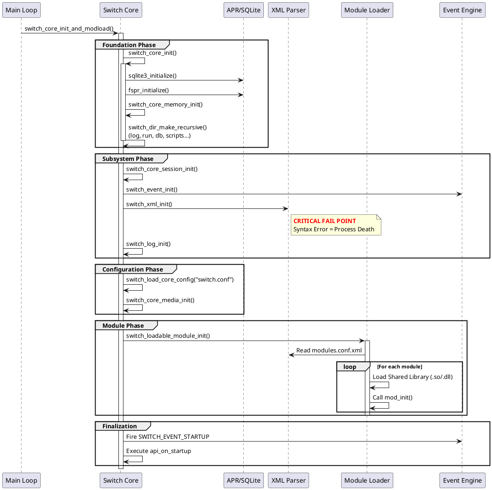

# System Initialization (系统初始化)

> **作者**: AtomsCat  
> **标签**: FreeSWITCH, 源码分析, 生产环境, 架构设计  
> **难度**: ⭐⭐⭐⭐⭐ (源码级)

## 1. 引言：为什么启动过程至关重要？

在生产环境中，运维人员最怕看到的不是报错日志，而是**没有任何日志进程就直接消失了**。FreeSWITCH 的启动过程决定了系统的“根基”是否稳固。很多初学者认为启动就是执行一个 `./freeswitch` 命令，但在源码层面，这是一场精密的、环环相扣的资源编排。

作为架构师，理解 `switch_core_init` 的流程，能帮你解决以下致命问题：
*   为什么修改了 XML 后进程无法启动且无报错？
*   为什么系统启动后某些模块（如 `mod_sofia`）没有加载？
*   为什么双网卡环境下 SIP 绑定了错误的 IP？

本文将基于 `src/switch_core.c` 源码，剥开 FreeSWITCH 启动的黑盒。

## 2. 核心流程深度解析

FreeSWITCH 的启动入口位于 `switch_core_init_and_modload` 函数（`src/switch_core.c`），整个过程可以严谨地划分为四个阶段。

### 2.1 基础建设阶段 (Foundation Phase)

这是系统“盘古开天地”的时刻。如果这一步失败，进程会直接 Panic（崩溃），通常连日志都来不及写。

*   **SQLite3 初始化** (`sqlite3_initialize`): FreeSWITCH 内部大量依赖 SQLite 做核心数据库（注册信息、通道状态）。如果内存不足或库版本冲突，这里直接返回 `SWITCH_STATUS_MEMERR`。
*   **APR 初始化** (`fspr_initialize`): Apache Portable Runtime 是 FreeSWITCH 跨平台的基石。内存池、线程锁都依赖它。
*   **全局内存池创建** (`switch_core_memory_init`): 创建全局 `runtime.memory_pool`。后续所有核心对象的内存分配都源于此。
*   **目录结构构建** (`switch_dir_make_recursive`): 源码中会递归创建 `log`, `run`, `db`, `script` 等目录。
    *   *💡 生产经验*: 确保运行 FreeSWITCH 的用户对这些目录有 `rwx` 权限，否则启动即退出。

### 2.2 子系统构建阶段 (Subsystem Phase)

这一阶段初始化核心引擎，是系统“拥有生命”的开始。

*   **会话表初始化** (`switch_core_session_init`): 分配哈希表用于存储活跃通话（Session）。
*   **事件引擎启动** (`switch_event_init`): **关键点**。FreeSWITCH 是事件驱动的，事件系统是其心脏。
*   **XML 注册表加载** (`switch_xml_init`): 解析 `freeswitch.xml`。
    *   *⚠️ 高危坑点*: 这是新手最容易“踩雷”的地方。如果 `freeswitch.xml` 或其包含的文件存在 XML 语法错误（如标签未闭合），`switch_xml_init` 会失败。除非启动时带了 `-minimal` 参数，否则**进程会立即终止**。
*   **日志与控制台** (`switch_log_init`, `switch_console_init`): 初始化日志系统。在此之前发生的错误通常只能通过 `stderr` 看到。

### 2.3 配置加载阶段 (Configuration Phase)

系统开始读取 `switch.conf`，调整内核参数。

*   **加载核心配置** (`switch_load_core_config`): 读取 `switch.conf`。这里决定了 `max-sessions`（最大并发数）、`sessions-per-second`（SPS 限制）等关键性能指标。
*   **媒体引擎初始化** (`switch_core_media_init`): 初始化编解码器（Codecs）、RTP 栈。
*   **网络检测**: 源码中的 `check_ip` 函数会尝试探测本地 IPv4/IPv6 地址。
    *   *💡 架构提示*: 如果服务器有多张网卡，FreeSWITCH 可能会“猜”错主 IP。建议在 `switch.conf` 中显式指定 `local_ip_v4`。

### 2.4 模块加载阶段 (Module Phase)

这是最耗时的阶段，也是业务逻辑加载的地方。

*   **加载模块** (`switch_loadable_module_init`): 
    1. 读取 `modules.conf.xml`。
    2. 遍历列表，动态加载 `.so` (Linux) 或 `.dll` (Windows) 文件。
    3. 对每个模块调用 `mod_init`。
    4. *注意*: 模块加载顺序很重要。例如，依赖数据库的模块应在数据库驱动模块之后加载。

### 2.5 最终完成 (Finalization)

*   **加载后配置**: 读取 `post_load_switch.conf`（较少使用）。
*   **发送启动事件**: 触发 `SWITCH_EVENT_STARTUP` 事件。外部的 ESL 程序通常监听此事件来确认系统已就绪。
*   **执行启动命令**: 执行 `api_on_startup` 中定义的命令（如自动发起呼叫、加载特定脚本）。

## 3. 启动流程时序图

以下是基于源码分析的 PlantUML 时序图，清晰展示了调用链：



## 4. 生产环境三大“深坑” (The "Evil" Parts)

### 4.1 XML 语法陷阱 (The XML Trap)
这是导致 FreeSWITCH 启动失败最常见的原因。
*   **现象**: 运行 `freeswitch` 后，进程立即退出，控制台可能只打印了一行 "Error parsing XML"。
*   **原理**: `switch_xml_init` 解析失败时，核心认为配置不可用，为了保护系统不以错误状态运行，选择直接自杀。
*   **对策**: 永远不要在生产环境直接手写 XML。使用 `xmllint` 或 IDE 插件进行预校验。

### 4.2 数据库锁死 (The DB Lock)
*   **现象**: 启动过程卡在 `switch_core_sqldb_start` 或某个模块初始化阶段，CPU 占用极低，但进程不往下走。
*   **原理**: FreeSWITCH 默认使用 SQLite。如果 `db` 目录位于 NFS（网络文件系统）上，或者有其他进程（如外部脚本）持有了 SQLite 的写锁，FreeSWITCH 会一直等待锁释放。
*   **对策**: 确保 `db` 目录位于本地高性能磁盘（SSD/NVMe），避免使用 NFS。

### 4.3 IP 竞态条件 (The IP Race)
*   **现象**: 系统启动了，但 SIP 消息发不出去，或者 SDP 中的 IP 地址是 `127.0.0.1` 或错误的内网 IP。
*   **原理**: `switch_core.c` 中的 `check_ip` 逻辑会尝试通过 DNS 解析主机名或遍历网卡来猜测 IP。在复杂的网络环境（如 Docker、K8s、多网卡物理机）中，这个猜测往往是错的。
*   **对策**: 显式配置。在 `vars.xml` 或 `switch.conf` 中强制指定 `local_ip_v4` 和 `local_ip_v6`，不要依赖自动探测。

## 5. 实战：编写一个“真·健康检查”脚本

很多监控系统只检查端口（TCP 8021）是否开启，这在 FreeSWITCH 启动过程中是不可靠的。端口开启时，系统可能还在加载模块，无法处理呼叫。

我们需要一个脚本，通过 ESL 协议连接，发送 `api status` 并确认返回 "UP"，这才是真正的 Ready 状态。

以下是一个不依赖 `eventsocket` 库（仅使用标准库）的 Python 3 脚本，适合在任何精简容器环境中运行：

```python
#!/usr/bin/env python3
import socket
import time
import sys

ESL_HOST = '127.0.0.1'
ESL_PORT = 8021
ESL_PASSWORD = 'ClueCon' # 默认密码，生产环境请修改

def check_freeswitch_up():
    try:
        # 1. 建立 TCP 连接
        sock = socket.socket(socket.AF_INET, socket.SOCK_STREAM)
        sock.settimeout(3)
        sock.connect((ESL_HOST, ESL_PORT))
        
        # 2. 接收鉴权请求 (Content-Type: auth/request)
        data = sock.recv(1024).decode('utf-8')
        if "auth/request" not in data:
            print("❌ Unexpected protocol header")
            return False

        # 3. 发送鉴权信息
        sock.send(f"auth {ESL_PASSWORD}\n\n".encode('utf-8'))
        
        # 4. 接收鉴权结果 (+OK accepted)
        auth_response = sock.recv(1024).decode('utf-8')
        if "+OK" not in auth_response:
            print("❌ Auth failed")
            return False

        # 5. 发送 status 命令
        sock.send("api status\n\n".encode('utf-8'))
        
        # 6. 读取响应并判断
        # 响应通常包含 "UP 0 years, 0 days..."
        response = sock.recv(4096).decode('utf-8')
        
        if "UP" in response and "FreeSWITCH" in response:
            print("✅ FreeSWITCH is FULLY UP and Ready!")
            return True
        else:
            print(f"⚠️ Port open but status not UP. Response: {response[:50]}...")
            return False
            
    except Exception as e:
        print(f"❌ Connection failed: {e}")
        return False
    finally:
        sock.close()

if __name__ == "__main__":
    if check_freeswitch_up():
        sys.exit(0)
    else:
        sys.exit(1)
```

## 6. 架构师总结

FreeSWITCH 的启动不仅仅是加载程序，它是**构建上下文（Context）**的过程。

1.  **内存与文件系统**是地基。
2.  **XML 配置**是蓝图。
3.  **模块**是功能组件。

作为架构师，在设计高可用（HA）方案时，必须意识到 `switch_xml_init` 的脆弱性。建议在 CI/CD 流水线中加入 XML 语法校验环节，杜绝因配置错误导致的生产环境“启动即死”事故。

---
*本文基于 FreeSWITCH v1.10.12 源码分析。*