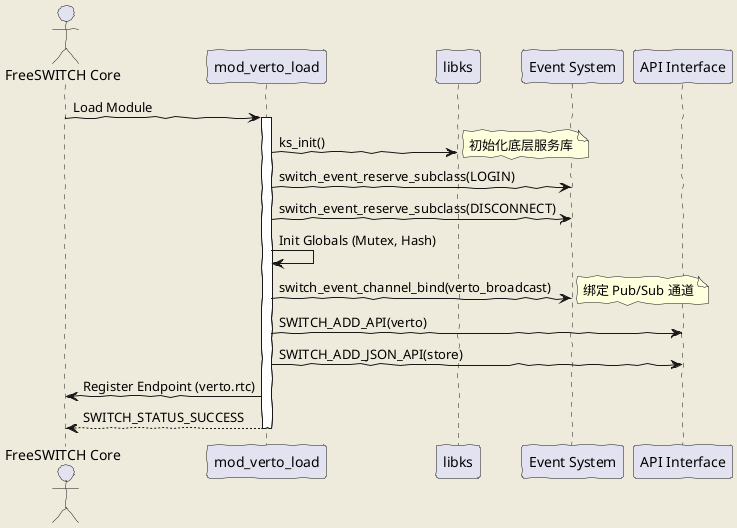
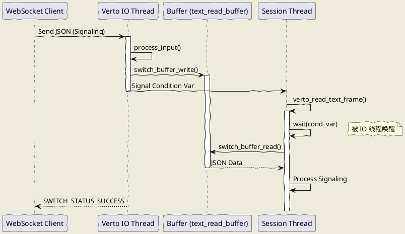

# Web Signaling

## 1. 开篇：WebRTC 的“最后一公里”

做 WebRTC 开发的兄弟们，心里都有个痛：**信令（Signaling）**。

WebRTC 标准定义了媒体怎么传（SRTP）、网络怎么穿（ICE/STUN/TURN）、编解码怎么协商（SDP），唯独把“信令”留白了。这就像给了你一辆法拉利，但没给你车钥匙，告诉你：“钥匙你自己配，长什么样随便你。”

于是，江湖上出现了两派：
1.  **SIP 派**：抱着 SIP over WebSocket 不放，试图用几十年前的协议硬套在现代 Web 上。结果就是庞大的 JS 库、复杂的 XML/SDP 解析，前端兄弟看着 SIP 状态机想打人。
2.  **自定义 JSON 派**：自己造轮子，今天加个字段，明天改个逻辑，文档基本靠口口相传，维护起来全是坑。

FreeSWITCH 的 `mod_verto` 属于第二派，但它是**正规军**。它定义了一套基于 JSON-RPC 2.0 的标准信令协议。

今天，AtomsCat 带大家扒一扒 FreeSWITCH v1.10.12 中 `mod_verto` 的源码，特别是 `mod_verto_load` 和 `verto_read_frame`（其实是 `verto_read_text_frame`，后面会细说），看看这个“Web 信令”到底是怎么在底层跑起来的。

**核心观点**：Verto 的设计哲学是 **“Thin Signaling”**（瘦信令）。它把复杂的 SIP 状态机剥离，只保留最核心的 Call Control 和 Event Bus，这才是 Web 开发该有的样子。

---

## 2. 正文解析：源码里的“邪修”之道

### 2.1 `mod_verto_load`：门派的建立

任何模块的入口都是 `_load` 函数。在 `src/mod/endpoints/mod_verto/mod_verto.c` 中，`mod_verto_load` 干了什么？它不仅仅是注册一个 Endpoint，它其实是在 FreeSWITCH 内部建立了一个**微型的异步服务器**。

```c
// src/mod/endpoints/mod_verto/mod_verto.c : 6770
SWITCH_MODULE_LOAD_FUNCTION(mod_verto_load)
{
    // ... 变量声明 ...

    // 1. 初始化 libks (Kernel Service)，这是 FS 团队自己造的基础库，处理底层 socket/pool
    ks_ssl_init_skip(KS_TRUE);
    ks_init();

    // 2. 注册自定义事件子类，这是 Verto 强大的根源：它是一等公民，拥有自己的事件流
    switch_event_reserve_subclass(MY_EVENT_LOGIN);
    switch_event_reserve_subclass(MY_EVENT_CLIENT_DISCONNECT);
    // ...

    // 3. 初始化全局哈希表和锁，用于管理所有连接 (jsock) 和方法 (method)
    switch_mutex_init(&verto_globals.mutex, SWITCH_MUTEX_NESTED, verto_globals.pool);
    switch_core_hash_init(&verto_globals.method_hash);
    // ...

    // 4. 绑定全局事件通道，实现 Pub/Sub 模型
    switch_event_channel_bind(SWITCH_EVENT_CHANNEL_GLOBAL, verto_broadcast, &verto_globals.event_channel_id, NULL);

    // 5. 加载配置 (verto.conf.xml)
    r = init(); 

    // 6. 注册 API 和 Endpoint 接口
    SWITCH_ADD_API(api_interface, "verto", "Verto API", verto_function, "syntax");
    verto_endpoint_interface = (switch_endpoint_interface_t *) switch_loadable_module_create_interface(*module_interface, SWITCH_ENDPOINT_INTERFACE);
    verto_endpoint_interface->io_routines = &verto_io_routines; // 关键 IO 路由

    // ...
}
```

**深度解读**：
很多开发者只把 `mod_verto` 当作一个协议转换器。错！从源码看，它引入了 `libks`，这意味着它试图在 FreeSWITCH 的 APR 线程模型之外，构建一套更高效的、基于 Poll/Epoll 的 Socket 处理机制。它注册了 `verto.rtc` 这个 Endpoint，让 Verto 通话在内核中看起来和 SIP 通话（sofia）一模一样，这就是架构师的高明之处：**协议不同，模型统一**。

### 2.2 `verto_read_frame` 的真相：消失的函数

你可能会在源码里满世界找 `verto_read_frame`，但你会发现：**找不到**，或者说，它被“偷梁换柱”了。

在 `mod_verto.c` 的 `verto_io_override` 结构体中：

```c
// src/mod/endpoints/mod_verto/mod_verto.c : 5880
/*.read_frame */ NULL,  // 注意这里！
/*.write_frame */ NULL,
/*.read_text_frame */ verto_read_text_frame,
/*.write_text_frame */ verto_write_text_frame,
```

FreeSWITCH 的核心在调度媒体时会调用 `read_frame`。但 Verto 是 WebRTC，媒体通常是 SRTP 直接透传或者解密，而**信令是文本**。所以，Verto 重写了 `read_text_frame`。

让我们看看 `verto_read_text_frame` 是怎么实现的，这才是 Verto 信令交互的核心：

```c
// src/mod/endpoints/mod_verto/mod_verto.c : 5888
static switch_status_t verto_read_text_frame(switch_core_session_t *session, switch_frame_t **frame, switch_io_flag_t flags, int stream_id)
{
    // ... 获取 pvt ...

    // 1. 经典的生产者-消费者模型：如果缓冲区没数据，就等待
    switch_mutex_lock(tech_pvt->text_cond_mutex);
    switch_thread_cond_timedwait(tech_pvt->text_cond, tech_pvt->text_cond_mutex, 100000); // 等 100ms
    switch_mutex_unlock(tech_pvt->text_cond_mutex);

    *frame = &tech_pvt->text_read_frame;

    // 2. 从 Buffer 中读取数据
    switch_mutex_lock(tech_pvt->text_read_mutex);
    if (switch_buffer_inuse(tech_pvt->text_read_buffer)) {
        status = SWITCH_STATUS_SUCCESS;
        // 真正读取数据
        tech_pvt->text_read_frame.datalen = switch_buffer_read(tech_pvt->text_read_buffer, tech_pvt->text_read_frame.data, 100);
    } else {
        // 3. 没数据？发送 CNG (Comfort Noise Generation) 标志，告诉核心“我很健康，只是没话说是”
        (*frame)->flags |= SFF_CNG;
        status = SWITCH_STATUS_BREAK;
    }
    switch_mutex_unlock(tech_pvt->text_read_mutex);

    return status;
}
```

**架构师视角**：
这里展示了 FreeSWITCH 处理异步信令的经典模式。WebSocket 线程（生产者）收到 JSON 数据，写入 `text_read_buffer` 并触发条件变量；Session 线程（消费者）在 `verto_read_text_frame` 中被唤醒并读取数据。
这种**Buffer + Condition Variable** 的设计，完美解耦了网络 IO 线程和业务逻辑线程。

---

### 2.3 逻辑流程图 (PlantUML)

为了更清晰地展示 Verto 的加载和信令读取流程，我们来看两张图。

#### 2.3.1 模块加载流程



#### 2.3.2 信令读取流程 (Producer-Consumer)



---

## 3. 实战代码：Python 3 复刻核心逻辑

为了让大家深刻理解 Verto 的协议细节，我用 Python 3 模拟了 Verto 的 6 个核心交互场景。这些代码可以直接拿去测试你的 Verto 服务端。

### 示例 1：构建登录包 (Login Payload)
这是连接 Verto 的第一步，JSON-RPC 2.0 标准。

```python
import json
import uuid

def create_login_payload(user, password, sessid=None):
    """
    构建 Verto 登录信令
    运行结果：生成符合 JSON-RPC 2.0 的登录 JSON 字符串
    """
    msg_id = str(uuid.uuid4())
    if not sessid:
        sessid = str(uuid.uuid4())
        
    payload = {
        "jsonrpc": "2.0",
        "method": "login",
        "id": msg_id,
        "params": {
            "login": user,
            "passwd": password,
            "sessid": sessid,
            "loginParams": {},
            "userVariables": {}
        }
    }
    return json.dumps(payload, indent=2)

# 使用示例
print(create_login_payload("1000@192.168.1.1", "1234"))
```

### 示例 2：发起呼叫 (Invite)
模拟 `verto.invite`，这是最复杂的信令，包含 SDP。

```python
def create_invite_payload(sessid, destination, sdp_offer):
    """
    构建 Verto 呼叫信令
    运行结果：生成带有 SDP 的 invite JSON
    """
    call_id = str(uuid.uuid4())
    payload = {
        "jsonrpc": "2.0",
        "method": "verto.invite",
        "id": str(uuid.uuid4()),
        "params": {
            "callID": call_id,
            "sessid": sessid,
            "sdp": sdp_offer,
            "dialogParams": {
                "remote_caller_id_name": "AtomsCat",
                "remote_caller_id_number": "1000",
                "destination_number": destination,
                "callID": call_id
            }
        }
    }
    return json.dumps(payload, indent=2)

# 模拟 SDP
fake_sdp = "v=0\r\no=- 123456 123456 IN IP4 127.0.0.1..."
print(create_invite_payload("sess-uuid-123", "9196", fake_sdp))
```

### 示例 3：模拟缓冲区读取 (Buffer Pattern)
这是 `verto_read_text_frame` 的 Python 简化版，展示线程同步逻辑。

```python
import threading
import time
import queue

class VertoBufferMock:
    """
    模拟 mod_verto 中的 switch_buffer 和条件变量机制
    运行结果：消费者线程会等待生产者写入数据后才被唤醒
    """
    def __init__(self):
        self.buffer = queue.Queue()
        self.cond = threading.Condition()

    def write_frame(self, data):
        with self.cond:
            print(f"[Producer] Writing: {data}")
            self.buffer.put(data)
            self.cond.notify() # 唤醒消费者

    def read_frame(self):
        with self.cond:
            if self.buffer.empty():
                print("[Consumer] Buffer empty, waiting...")
                self.cond.wait(timeout=1.0) # 模拟 timedwait
            
            if not self.buffer.empty():
                data = self.buffer.get()
                print(f"[Consumer] Read: {data}")
                return data
            else:
                print("[Consumer] Timeout/CNG")
                return None

# 测试
buf = VertoBufferMock()
threading.Thread(target=lambda: (time.sleep(0.5), buf.write_frame("LOGIN_ACK"))).start()
buf.read_frame()
```

### 示例 4：事件订阅 (Subscribe)
Verto 的强大之处在于 Pub/Sub。

```python
def create_subscribe_payload(sessid, channels):
    """
    构建订阅信令
    运行结果：生成订阅指定频道的 JSON
    """
    payload = {
        "jsonrpc": "2.0",
        "method": "verto.subscribe",
        "id": str(uuid.uuid4()),
        "params": {
            "sessid": sessid,
            "eventChannel": channels # 数组，例如 ["event_channel_1"]
        }
    }
    return json.dumps(payload, indent=2)

print(create_subscribe_payload("sess-123", ["demo_channel"]))
```

### 示例 5：处理服务器响应 (Response Handling)
客户端必须能处理 `result` 和 `error`。

```python
def parse_verto_response(json_str):
    """
    解析 Verto 响应
    运行结果：打印响应类型（成功/失败）及内容
    """
    try:
        data = json.loads(json_str)
        if "result" in data:
            print(f"Success! Result: {data['result']}")
        elif "error" in data:
            print(f"Error {data['error']['code']}: {data['error']['message']}")
        else:
            print("Unknown packet type")
    except json.JSONDecodeError:
        print("Invalid JSON")

# 测试成功响应
parse_verto_response('{"jsonrpc":"2.0","id":"1","result":{"message":"Logged in"}}')
# 测试错误响应
parse_verto_response('{"jsonrpc":"2.0","id":"2","error":{"code":-32601,"message":"Method not found"}}')
```

### 示例 6：心跳保活 (Ping/Pong)
源码中 `client_run` 里有 `#SPU` 这种特殊的保活机制，但标准 JSON-RPC 也有 ping。

```python
def create_ping_payload(sessid):
    """
    构建 Ping 信令
    运行结果：生成 Ping JSON
    """
    payload = {
        "jsonrpc": "2.0",
        "method": "verto.ping",
        "id": str(uuid.uuid4()),
        "params": {
            "sessid": sessid
        }
    }
    return json.dumps(payload, indent=2)

print(create_ping_payload("sess-123"))
```

---

## 4. 思维拓展：架构师的“邪修”笔记

### 4.1 常见误区与坑点
1.  **不要在 Verto 回调里做耗时操作**：`mod_verto` 的线程模型是基于回调的，如果你在 `verto_read_text_frame` 或者事件处理里查数据库（且没用异步），整个 WebSocket 服务可能会卡顿。
2.  **Session ID 的一致性**：Verto 的 `sessid` 是客户端生成的 UUID，这与 FreeSWITCH 内部的 `session_uuid` 是两码事。在做业务逻辑映射时，千万别搞混了。
3.  **WSS 是必须的**：虽然开发环境可以用 WS，但生产环境必须上 WSS。WebRTC 获取麦克风权限在 Chrome 下必须是 HTTPS/WSS 环境。

### 4.2 架构层面的思考
Verto 的设计其实非常适合**微服务架构**。
*   **传统 SIP**：FS 是核心，所有状态都在 FS 里。
*   **Verto**：FS 只是一个媒体引擎和事件总线。你可以把业务逻辑完全剥离到外部的 Node.js 或 Python 服务中，通过 Verto 的 Event Bus (Pub/Sub) 来控制通话。

**邪修思维**：
既然 Verto 是 JSON-RPC，我们完全可以“劫持”它。在 FS 前面挡一层 Nginx 或者 Go 写的网关，解析 JSON，做鉴权、路由分发，甚至修改 SDP，然后再转发给 FS。这样 FS 就彻底沦为纯粹的媒体服务器，业务灵活性爆炸。

---

## 5. 总结

读完 `mod_verto` 的源码，你会发现它并不神秘。它就是把 FreeSWITCH 强大的 C 语言内核，通过 JSON-RPC 暴露给了 Web 世界。

**Takeaway (带走知识点)**：
1.  `mod_verto_load` 搭建了基于 `libks` 的异步服务框架。
2.  `verto_read_text_frame` 利用 Buffer + Condition Variable 实现了异步 IO 到同步 Session 的桥接。
3.  Verto 协议本质是 JSON-RPC 2.0，轻量、灵活、易于扩展。

别再死磕 SIP over WebSocket 了，拥抱 Verto，或者至少拥抱 Verto 背后的“瘦信令”思想，你的 WebRTC 之路会好走很多。

---
*作者：AtomsCat，知乎高级技术作者，专注 FreeSWITCH/Kamailio 硬核源码分析与生产实践。*
