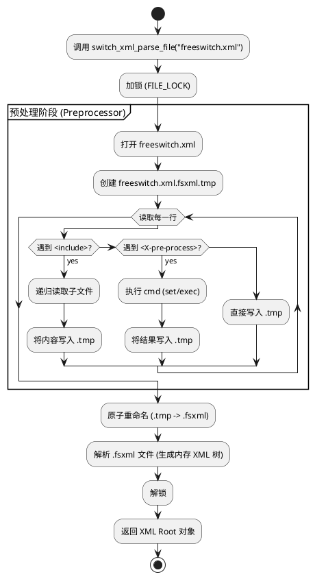
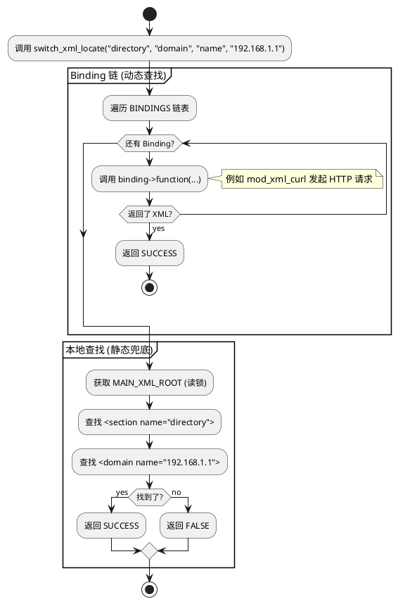

# 深入 FreeSWITCH 源码：XML 配置文件的“魔法”解析与动态检索

> 作者：AtomsCat  
> 领域：通信架构 / 后端工程  
> 源码版本：FreeSWITCH v1.10.12

## 1. 开篇：为什么你的配置改了不生效？

做过 FreeSWITCH 开发的兄弟们，一定经历过这种“灵异事件”：

你明明修改了 `dialplan/default.xml`，甚至重启了服务，但呼叫路由依然走的是老逻辑。或者，你试图用 `reloadxml` 命令热加载配置，结果控制台报错一堆 XML 语法错误，但你用浏览器打开 XML 文件看却一切正常。

这时候，你可能会怀疑人生：是文件权限问题？是缓存问题？还是 FreeSWITCH 有 Bug？

其实，FreeSWITCH 的 XML 配置系统远比你想象的复杂。它不是简单地读取一个文件，而是通过一套**动态预处理（Preprocessor）**和**实时检索（Real-time Retrieval）**机制，将成百上千个分散的 XML 文件“缝合”成一个巨大的内存对象树。

今天，我们就深入 `src/switch_xml.c`，扒一扒 `switch_xml_parse_file` 和 `switch_xml_locate` 这两个核心函数的底裤，看看 FreeSWITCH 是如何把一堆静态文件变成动态配置的。

---

## 2. 核心解析：配置文件的“缝合怪” (switch_xml_parse_file)

在 FreeSWITCH 中，XML 解析不仅仅是 XML 解析，它更像是一个**编译器**。`switch_xml_parse_file` 负责将入口文件（通常是 `freeswitch.xml`）及其引用的所有子文件，编译成一个完整的 XML 树。

### 2.1 源码逻辑拆解

让我们看看 `src/switch_xml.c` 中的核心逻辑（代码经过精简）：

```c
SWITCH_DECLARE(switch_xml_t) switch_xml_parse_file(const char *file)
{
    // 1. 锁定文件操作，防止并发冲突
    switch_mutex_lock(FILE_LOCK);

    // 2. 构造临时文件路径 (.fsxml.tmp)
    new_file_tmp = switch_mprintf("%s%s%s.fsxml.tmp", log_dir, separator, abs_filename);

    // 3. 执行预处理 (Preprocessor)
    // 这是最关键的一步！它会处理 <include>, <X-pre-process> 等标签
    if (preprocess(conf_dir, file, write_fd, 0) > -1) {
        
        // 4. 原子替换：将 .tmp 文件重命名为 .fsxml
        rename(new_file_tmp, new_file);

        // 5. 解析生成的 .fsxml 大文件
        if ((fd = open(new_file, O_RDONLY, 0)) > -1) {
            xml = switch_xml_parse_fd(fd);
        }
    }

    switch_mutex_unlock(FILE_LOCK);
    return xml;
}
```

### 2.2 深度洞察：预处理器的魔法

你可能注意到了 `preprocess` 函数。这才是 FreeSWITCH 配置系统的灵魂。它不是标准的 XML 解析器，而是一个**文本宏处理器**。

它支持以下“黑魔法”：
*   **`<include file="..."/>`**：支持 Glob 通配符（如 `conf/sip_profiles/*.xml`），将多个文件内容直接插入当前位置。
*   **`<X-pre-process cmd="set" data="foo=bar"/>`**：定义全局变量。
*   **`<X-pre-process cmd="exec" data="..."/>`**：执行 Shell 命令，并将输出结果作为 XML 内容插入！

**生产场景案例**：
很多高级用户会用 `<X-pre-process cmd="exec" data="curl http://config-server/get_dialplan"/>`。这样，FreeSWITCH 启动时会从远程 HTTP 服务器拉取配置，而不是读取本地文件。这就是**配置中心**的雏形。

### 2.3 逻辑可视化



### 2.4 Python 实战：实现简易 XML 预处理器

我们可以用 Python 模拟这个过程，实现一个支持 `<include>` 的配置合并器。

**示例 1：支持 Include 的 XML 合并器**

```python
import os
import glob
import re

class XMLPreprocessor:
    def __init__(self, root_dir):
        self.root_dir = root_dir
        # 匹配 <include file="pattern"/>
        self.include_pattern = re.compile(r'<include\s+file="([^"]+)"\s*/>')

    def process(self, file_path):
        full_path = os.path.join(self.root_dir, file_path)
        output = []
        
        try:
            with open(full_path, 'r') as f:
                for line in f:
                    match = self.include_pattern.search(line)
                    if match:
                        # 递归处理 include
                        pattern = match.group(1)
                        glob_path = os.path.join(self.root_dir, pattern)
                        for sub_file in glob.glob(glob_path):
                            # 递归调用
                            output.append(self.process(os.path.relpath(sub_file, self.root_dir)))
                    else:
                        output.append(line)
        except Exception as e:
            print(f"Error processing {file_path}: {e}")
            
        return "".join(output)

# 运行说明：
# 这个类模拟了 FreeSWITCH 的 include 机制。
# 它会递归地读取文件，将 <include> 标签替换为目标文件的实际内容。
# 最终生成一个巨大的 XML 字符串。
```

---

## 3. 核心解析：大海捞针 (switch_xml_locate)

配置解析完只是第一步，FreeSWITCH 运行时需要频繁查询配置（比如“用户 1001 的密码是多少？”）。如果每次都遍历那个几百兆的 XML 树，CPU 早就爆炸了。

`switch_xml_locate` 是 FreeSWITCH 的**动态检索引擎**。它支持从内存 XML 树查找，也支持通过 **XML Binding** 机制从外部数据源（如数据库、HTTP）实时获取。

### 3.1 源码逻辑拆解

```c
SWITCH_DECLARE(switch_status_t) switch_xml_locate(const char *section,
                                                  const char *tag_name,
                                                  const char *key_name,
                                                  const char *key_value,
                                                  switch_xml_t *root,
                                                  switch_xml_t *node,
                                                  switch_event_t *params)
{
    // 1. 优先检查 XML Bindings (外部数据源)
    // 比如 mod_xml_curl, mod_xml_rpc 注册的钩子
    for (binding = BINDINGS; binding; binding = binding->next) {
        if (binding->sections & current_section) {
            // 调用外部模块的查找函数
            xml = binding->function(section, tag_name, key_name, key_value, params...);
            if (xml) {
                return SWITCH_STATUS_SUCCESS; // 找到了！直接返回
            }
        }
    }

    // 2. 如果外部没找到，回退到本地内存 XML 树 (MAIN_XML_ROOT)
    if (!xml) {
        xml = switch_xml_root(); // 获取全局 XML 读锁
    }

    // 3. 在 XML 树中遍历查找
    // 路径：section -> tag_name -> key_name=key_value
    if ((conf = switch_xml_find_child(xml, "section", "name", section)) &&
        (tag = switch_xml_find_child(conf, tag_name, key_name, key_value))) {
        *node = tag;
        return SWITCH_STATUS_SUCCESS;
    }

    return SWITCH_STATUS_FALSE;
}
```

### 3.2 深度洞察：Binding 机制的威力

`switch_xml_locate` 的设计体现了**责任链模式 (Chain of Responsibility)**。

1.  **动态优先**：它先问 `mod_xml_curl`：“你那儿有这个用户的配置吗？”
2.  **静态兜底**：如果 `mod_xml_curl` 说没有（或者挂了），它才去查本地的 XML 文件。

这就是为什么你可以把一部分用户放在 MySQL 里（通过 Web 接口动态生成 XML），另一部分用户写在本地文件里，两者可以完美共存。

**架构师思维**：
这种设计极大地提高了系统的扩展性。你可以编写自己的 C 模块，注册一个 XML Binding，从 Redis、LDAP 甚至区块链中读取配置，而 FreeSWITCH 核心逻辑完全不需要修改。

### 3.3 逻辑可视化



### 3.4 Python 实战：模拟责任链查找

我们可以用 Python 模拟这个 Binding 机制，实现一个混合配置源的查找器。

**示例 2：配置查找责任链**

```python
class ConfigFinder:
    def __init__(self):
        self.bindings = []
        self.local_config = {} # 模拟本地 XML

    def register_binding(self, func):
        self.bindings.append(func)

    def locate(self, section, key, value):
        # 1. 责任链查找
        for binding in self.bindings:
            result = binding(section, key, value)
            if result:
                print(f"Found in binding: {binding.__name__}")
                return result
        
        # 2. 本地查找
        print("Fallback to local config")
        return self.local_config.get(section, {}).get(value)

# 模拟外部数据源 (如 Redis)
def redis_binding(section, key, value):
    if section == "user" and value == "1001":
        return {"id": "1001", "password": "123"}
    return None

# 模拟外部数据源 (如 HTTP)
def http_binding(section, key, value):
    if section == "dialplan" and value == "default":
        return "<extension name='echo'>...</extension>"
    return None

# 运行说明：
# 这是一个微型的 switch_xml_locate 实现。
# 你可以注册任意多个查找函数。
# 系统会按顺序询问，直到找到配置或回退到本地。
```

---

## 4. 思维拓展：那些年踩过的坑

### 4.1 巨大的 `.fsxml` 文件

FreeSWITCH 启动后，会在 `log` 目录下生成一个 `freeswitch.xml.fsxml` 文件。这个文件包含了所有 `include` 展开后的内容。
**坑点**：如果你的配置非常庞大（比如有 10 万个用户文件），这个文件可能达到几百兆。每次 `reloadxml` 都会导致巨大的磁盘 I/O 和 CPU 峰值，甚至导致通话卡顿。
**优化建议**：对于海量用户，**千万不要**用本地 XML 文件！请使用 `mod_xml_curl` 按需加载。

### 4.2 XML 内存泄漏

在 C 语言中，`switch_xml_t` 对象是需要手动释放的。
```c
switch_xml_t xml;
if (switch_xml_locate(..., &xml, ...) == SWITCH_STATUS_SUCCESS) {
    // 使用 xml ...
    switch_xml_free(xml); // 必须释放！
}
```
很多新手写模块时忘记调用 `switch_xml_free`，导致服务器运行几天后内存耗尽。

**示例 3：Python 中的 Context Manager (自动释放)**

```python
from contextlib import contextmanager

class XMLHandle:
    def __init__(self, node):
        self.node = node

    def free(self):
        print("Freeing XML memory...")
        self.node = None

@contextmanager
def locate_config(section, key, value):
    # 模拟 switch_xml_locate
    finder = ConfigFinder()
    xml = finder.locate(section, key, value)
    
    handle = XMLHandle(xml)
    try:
        yield handle
    finally:
        # 模拟 switch_xml_free
        handle.free()

# 使用方式
# with locate_config("user", "id", "1001") as xml:
#     print(xml.node)
# 离开作用域自动释放
```

### 4.3 线程安全与读写锁

`switch_xml.c` 中使用了大量的锁（`B_RWLOCK`, `XML_LOCK`, `FILE_LOCK`）。
特别是 `B_RWLOCK`（Binding 读写锁）。当你执行 `reloadxml` 时，FreeSWITCH 会获取写锁，这会阻塞所有正在进行的 `switch_xml_locate` 调用（读锁）。
**邪修思维**：如果你的 `mod_xml_curl` 响应很慢（比如 HTTP 超时 10 秒），并且你频繁 reload，整个系统的呼叫处理线程都会被卡死在 `switch_xml_locate` 上等待锁释放。

---

## 5. 总结

通过分析 `src/switch_xml.c`，我们揭示了 FreeSWITCH 配置系统的三大支柱：

1.  **预处理 (Preprocessor)**：通过 `include` 和 `glob` 将文件系统扁平化，生成单一的 XML 树。
2.  **动态绑定 (Bindings)**：通过责任链模式，允许外部数据源（HTTP, SQL）介入配置查找过程。
3.  **分层检索 (Locate)**：优先动态源，本地文件兜底，实现了灵活性与稳定性的平衡。

**Takeaway (可复用的工程实践)**：

*   **配置中心化**：不要依赖本地文件，尽早引入 `mod_xml_curl`。
*   **监控 .fsxml**：定期检查 `log/freeswitch.xml.fsxml` 的大小，它是系统配置复杂度的“体检报告”。
*   **慎用 Reload**：在生产环境，尽量避免频繁执行 `reloadxml`，特别是在高并发时段。

希望这篇文章能帮你解开 FreeSWITCH 配置文件的谜团。我是 AtomsCat，我们在代码的世界里，下期见。

---

**示例 4：XML 属性提取器 (工具函数)**

```python
def xml_attr(node, attr_name, default=None):
    """
    模拟 switch_xml_attr_soft
    安全地获取 XML 属性，防止 AttributeError
    """
    if node is None:
        return default
    return node.get(attr_name, default)
```

**示例 5：XML 子节点查找器**

```python
def xml_child(node, tag_name):
    """
    模拟 switch_xml_child
    查找第一个匹配的子标签
    """
    if node is None:
        return None
    for child in node:
        if child.tag == tag_name:
            return child
    return None
```

**示例 6：XML 路径查找器**

```python
def xml_find(root, path):
    """
    模拟 switch_xml_find_child 多层查找
    path: "section/configuration/settings"
    """
    current = root
    for tag in path.split('/'):
        current = xml_child(current, tag)
        if current is None:
            return None
    return current