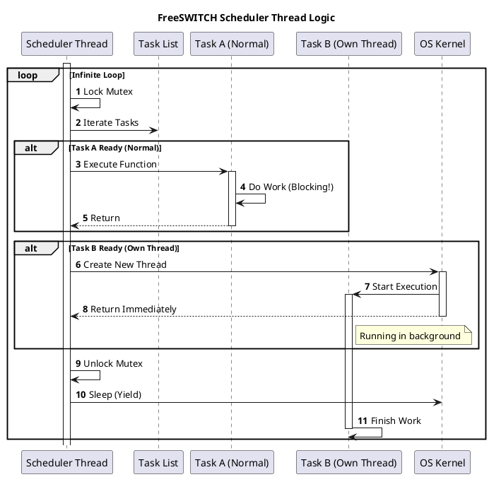

# XML Task Scheduling

## 1. 开篇：时间就是生命

在实时通信（RTC）的世界里，时间不仅仅是金钱，它是生命线。

心跳包（Heartbeat）晚了 500ms，连接可能被断开；会议结束的定时任务（Scheduled Hangup）卡住了，计费系统就会多算钱；注册过期的清理任务（Expire Registration）没跑，数据库就会被僵尸用户撑爆。

很多 FreeSWITCH 开发者只关注 SIP 信令、媒体流，却往往忽略了那个在后台默默滴答作响的“心脏” —— **Scheduler（任务调度器）**。

你是否在日志里见过这样的警告？
`[WARNING] Task was executed late by 5 seconds`

这行黄色的警告字眼，往往是系统崩塌的前兆。它意味着你的调度器被阻塞了，原本该准时执行的任务被迫排队。今天，我们就深入 FreeSWITCH v1.10.12 的源码，扒一扒这个调度器是如何工作的，以及如何避免让它“迟到”。

**核心观点：FreeSWITCH 的调度器是一个单线程的链表轮询器。它的轻量级设计决定了它极其高效，但也极其脆弱。任何在调度线程中的阻塞操作，都是对整个系统的谋杀。**

---

## 2. 正文解析：单线程的精妙与脆弱

### 2.1 核心原理：链表与轮询

FreeSWITCH 的调度器并没有使用复杂的时间轮（Time Wheel）或最小堆（Min-Heap）算法，而是使用了一个极其朴素的**单向链表**。

在 `src/switch_scheduler.c` 中，我们可以看到任务容器的定义：

```c
struct switch_scheduler_task_container {
    switch_scheduler_task_t task;
    int64_t executed;
    int in_thread;
    // ...
    struct switch_scheduler_task_container *next; // 单向链表
};
```

而调度器的核心线程 `switch_scheduler_task_thread` 做的事情也非常简单：

1.  **上锁** (`switch_mutex_lock`)。
2.  **遍历链表**：从头扫到尾。
3.  **检查时间**：如果 `now >= task.runtime`，说明任务该跑了。
4.  **执行任务**：
    *   **模式 A（默认）**：直接在当前线程执行回调函数。
    *   **模式 B（SSHF_OWN_THREAD）**：创建一个新线程去跑任务，当前线程继续扫下一个。
5.  **解锁** (`switch_mutex_unlock`)。
6.  **处理事件**：处理 `ADD_SCHEDULE` / `DEL_SCHEDULE` 等事件。

这个逻辑简单到令人发指，但也正因为简单，它的 Overhead 极低。

### 2.2 致命的阻塞 (The Blocking Trap)

问题出在 **模式 A**。

默认情况下，任务是在调度器线程中同步执行的。如果你的任务函数里写了一个 `sleep(5)` 或者发起了一个耗时的 HTTP 请求，整个调度线程就会暂停 5 秒。

在这 5 秒内：
*   后面的所有任务都无法执行。
*   新的任务无法添加（因为锁被持有了）。
*   整个 FreeSWITCH 的定时功能瘫痪。

这就是日志里 `Task was executed late` 的来源。

### 2.3 源码实战：Python 模拟调度器

为了让你更直观地理解，我用 Python 复刻了一个简化版的 FreeSWITCH 调度器。

#### 示例 1：基础调度器实现

```python
import time
import threading
import uuid

# 模拟 switch_scheduler_task_container_t
class Task:
    def __init__(self, task_id, runtime, func, args=(), own_thread=False):
        self.task_id = task_id
        self.runtime = runtime
        self.func = func
        self.args = args
        self.own_thread = own_thread
        self.executed = 0

# 全局任务链表
task_list = []
lock = threading.Lock()
running = True

def scheduler_thread():
    global task_list
    print("✅ Scheduler Thread Started")
    
    while running:
        now = time.time()
        
        with lock:
            # 遍历链表 (模拟 task_thread_loop)
            for task in task_list:
                if now >= task.runtime and task.executed == 0:
                    # 检查是否迟到
                    diff = now - task.runtime
                    if diff > 1.0:
                        print(f"⚠️ [WARNING] Task {task.task_id} executed late by {diff:.2f} seconds!")
                    
                    task.executed = now
                    
                    if task.own_thread:
                        # 模式 B: 独立线程执行
                        t = threading.Thread(target=task.func, args=task.args)
                        t.start()
                    else:
                        # 模式 A: 阻塞执行 (危险!)
                        task.func(*task.args)
        
        time.sleep(0.1) # 避免 CPU 100%

def my_task(name, duration):
    print(f"▶️ Task {name} starting...")
    time.sleep(duration)
    print(f"⏹️ Task {name} finished.")

# 启动调度器
t = threading.Thread(target=scheduler_thread)
t.start()

# 添加任务
with lock:
    # 任务 1: 耗时 3 秒，将在 1 秒后运行
    task_list.append(Task(1, time.time() + 1, my_task, ("Blocker", 3), own_thread=False))
    # 任务 2: 耗时 0 秒，将在 2 秒后运行
    task_list.append(Task(2, time.time() + 2, my_task, ("Victim", 0), own_thread=False))

time.sleep(6)
running = False
t.join()
```

**运行结果说明：**
你会看到 `Victim` 任务被 `Blocker` 任务拖累了。虽然 `Victim` 应该在第 2 秒运行，但因为 `Blocker` 霸占了调度线程 3 秒（从第 1 秒到第 4 秒），`Victim` 只能等到第 4 秒才运行，导致迟到了 2 秒，触发 `WARNING`。

#### 示例 2：使用 SSHF_OWN_THREAD 救命

如果我们把 `Blocker` 任务的 `own_thread` 设为 `True`：

```python
# 修改任务 1 为独立线程模式
task_list.append(Task(1, time.time() + 1, my_task, ("Blocker", 3), own_thread=True))
```

**运行结果说明：**
调度器发现 `Blocker` 需要独立线程，于是 `start()` 一个新线程后立即返回。调度器继续轮询，准时在第 2 秒执行了 `Victim`。世界和平。

### 2.4 工程实践：何时使用 Own Thread？

在 FreeSWITCH 模块开发中，调用 `switch_scheduler_add_task` 时，`flags` 参数至关重要。

*   **必须使用 `SSHF_OWN_THREAD` 的场景**：
    *   数据库查询（MySQL/PostgreSQL）。
    *   HTTP 请求（Curl）。
    *   文件 I/O（写日志除外，因为日志通常是异步的）。
    *   复杂的逻辑计算。
*   **可以使用默认模式的场景**：
    *   设置一个简单的标志位。
    *   发送一个 Event（`switch_event_fire` 通常是异步的）。
    *   快速的状态检查。

---

## 3. 思维拓展：架构师的视角

### 3.1 为什么不用 OS 的 Cron？

很多初学者会问：“为什么不直接用 Linux 的 Crontab？”

1.  **精度**：Crontab 最小粒度是分钟，RTC 需要毫秒级。
2.  **上下文**：FreeSWITCH 的 Scheduler 运行在进程内存空间内，可以直接访问 Session、Channel、Memory Pool。Crontab 启动的是外部脚本，无法直接操作内存对象。
3.  **生命周期**：FreeSWITCH 退出时，内部 Scheduler 自动停止。Crontab 需要额外的管理成本。

### 3.2 架构层面的“邪修”玩法

既然 Scheduler 是个链表，如果任务数达到 10 万级会怎样？
**会死。** 遍历 10 万个节点的链表本身就会消耗大量 CPU，而且锁竞争会非常激烈。

**架构建议**：
不要把 FreeSWITCH 当作通用的定时任务系统。
*   **正确用法**：调度与通话紧密相关的短期任务（如：30秒后挂断、5秒后重试）。
*   **错误用法**：调度海量的业务层定时任务（如：10万个用户的会员过期检查）。这种任务应该剥离到外部系统（如 Celery, Quartz, K8s CronJob），通过 ESL 或者是 HTTP 通知 FreeSWITCH。

### 3.3 PlantUML 逻辑图解

为了更清晰地展示调度线程的逻辑，我们来看这个序列图：



---

## 4. 总结

FreeSWITCH 的 Scheduler 是一个典型的“简单即是美”的设计，但它假设所有的任务都是“乖孩子”（执行快、不阻塞）。

**Takeaway (带走这几句话)：**

1.  **警惕 `Task was executed late`**：这是系统阻塞的早期预警。
2.  **不要在回调里 Sleep**：任何耗时操作，请务必加上 `SSHF_OWN_THREAD` 标志。
3.  **各司其职**：FreeSWITCH 负责通信调度，业务调度请交给专业的任务队列。

掌握了 Scheduler，你就掌握了 FreeSWITCH 的时间维度。别让你的系统，输在时间管理上。